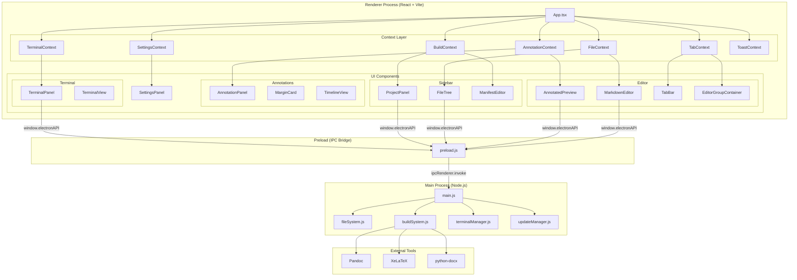
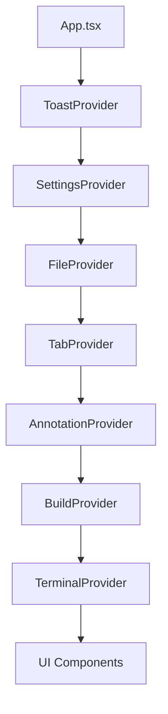
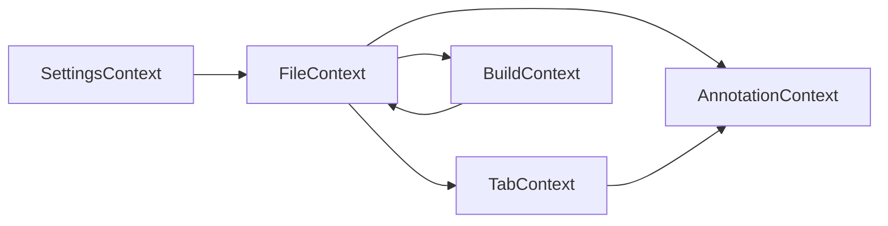

# 全体アーキテクチャ概要

## 概要

Marginalia は、Markdown 校閲エディタとして設計された Electron デスクトップアプリケーションである。注釈・校閲機能と報告書ビルドシステムに特化した独自の強みを持ち、CodeMirror 6 ベースのエディタ、リアルタイムプレビュー、Pandoc/LaTeX 連携によるドキュメントビルドを統合している。

## 技術スタック

| カテゴリ | 技術 | バージョン |
|---------|------|-----------|
| フレームワーク | Electron | 28.x |
| UI | React | 18.x |
| 言語 | TypeScript | 5.9 |
| ビルドツール | Vite | 6.4 |
| エディタエンジン | CodeMirror 6 | 6.x |
| Markdown レンダリング | react-markdown | 9.x |
| 数式 | KaTeX | 0.16.x |
| 図表 | Mermaid | 11.x |
| ターミナル | xterm.js 5.5 + node-pty 1.0 |
| パッケージング | electron-builder | 26.x |
| 自動更新 | electron-updater | 6.x |

## アーキテクチャ全体図



## ディレクトリ構成

```
marginalia/
├── electron/                    # Electron メインプロセス
│   ├── main.js                  # (432行) アプリ初期化、IPC ハンドラ登録、メニュー
│   ├── preload.js               # (106行) contextBridge による IPC ブリッジ
│   ├── fileSystem.js            # ファイルシステム操作ヘルパー
│   ├── buildSystem.js           # (400行) Pandoc/LaTeX ビルド実行
│   ├── terminalManager.js       # (~200行) node-pty セッション管理
│   └── updateManager.js         # electron-updater 統合
│
├── src/                         # Renderer プロセス (React)
│   ├── App.tsx                  # ルートコンポーネント、Provider ツリー
│   ├── index.tsx                # エントリーポイント
│   ├── index.html               # HTML テンプレート
│   │
│   ├── types/                   # TypeScript 型定義
│   │   ├── index.ts             # (303行) メイン型定義、ElectronAPI インターフェース
│   │   ├── tabs.ts              # (31行) タブ・エディタグループ型
│   │   └── annotations.ts       # 注釈 V2 型定義
│   │
│   ├── contexts/                # React Context (状態管理層)
│   │   ├── FileContext.tsx       # (724行) ディレクトリ、ファイル読み書き
│   │   ├── TabContext.tsx        # (750行) タブ、分割エディタ、レイアウト
│   │   ├── AnnotationContext.tsx # (606行) 注釈 CRUD、履歴、フィルタ
│   │   ├── BuildContext.tsx      # (322行) ビルド設定、テンプレート
│   │   ├── SettingsContext.tsx   # (465行) ユーザー設定、テーマ
│   │   ├── TerminalContext.tsx   # (~300行) ターミナルセッション管理
│   │   └── ToastContext.tsx      # トースト通知
│   │
│   ├── components/              # UI コンポーネント
│   │   ├── Editor/
│   │   │   ├── MarkdownEditor.tsx      # (1573行) CodeMirror 6 エディタ本体
│   │   │   ├── AnnotatedPreview.tsx    # (1720行) Markdown プレビュー + 注釈
│   │   │   ├── TabBar.tsx              # (447行) タブ UI
│   │   │   ├── TabContent.tsx          # (92行) タブコンテンツ切替
│   │   │   ├── EditorArea.tsx          # (98行) エディタレイアウト
│   │   │   ├── EditorGroupContainer.tsx# (152行) グループ管理
│   │   │   ├── EditorGroupPane.tsx     # (233行) ペイン表示
│   │   │   ├── FileScopedProvider.tsx  # ファイル単位 Context
│   │   │   ├── BuildConfigCard.tsx     # ビルド設定カード
│   │   │   ├── FrontmatterCard.tsx     # Frontmatter 表示
│   │   │   ├── MermaidBlock.tsx        # Mermaid 図レンダリング
│   │   │   ├── YamlEditor.tsx          # YAML 編集
│   │   │   ├── TemplateGallery.tsx     # テンプレート一覧
│   │   │   ├── TemplatePreviewPopup.tsx# テンプレートプレビュー
│   │   │   ├── LinkPreviewPopup.tsx    # リンクプレビュー
│   │   │   ├── Minimap.tsx             # ミニマップ
│   │   │   └── annotationDecorations.ts# エディタ内注釈デコレーション
│   │   │
│   │   ├── Annotations/
│   │   │   ├── AnnotationPanel.tsx     # 注釈パネル
│   │   │   ├── MarginCard.tsx          # マージン注釈カード
│   │   │   ├── MarginCardContainer.tsx # マージンカードコンテナ
│   │   │   ├── CommentThread.tsx       # コメントスレッド
│   │   │   ├── CommentItem.tsx         # コメントアイテム
│   │   │   ├── AnnotationHoverCard.tsx # ホバーカード
│   │   │   ├── TimelineView.tsx        # タイムライン
│   │   │   ├── DiffPanel.tsx           # 差分パネル
│   │   │   ├── DiffViewer.tsx          # 差分ビューア
│   │   │   ├── HistoryItem.tsx         # 履歴アイテム
│   │   │   ├── BackupPanel.tsx         # バックアップ管理
│   │   │   └── OrphanedAnnotations.tsx # 孤立注釈管理
│   │   │
│   │   ├── Sidebar/
│   │   │   ├── FileTree.tsx            # ファイルツリー
│   │   │   ├── FileTreeItem.tsx        # (345行) ツリーアイテム
│   │   │   ├── ProjectPanel.tsx        # (862行) ビルドプロジェクトパネル
│   │   │   └── ManifestEditor.tsx      # マニフェスト編集
│   │   │
│   │   ├── Terminal/
│   │   │   ├── TerminalPanel.tsx       # ターミナルパネル
│   │   │   └── TerminalView.tsx        # xterm.js ビュー
│   │   │
│   │   ├── Settings/
│   │   │   └── SettingsPanel.tsx       # 設定画面
│   │   │
│   │   ├── common/
│   │   │   ├── SplitPane.tsx           # 分割ペイン
│   │   │   ├── Toast.tsx               # トースト
│   │   │   ├── ToastContainer.tsx      # トーストコンテナ
│   │   │   └── ExternalChangeWarning.tsx# 外部変更警告
│   │   │
│   │   └── PdfViewer.tsx              # PDF ビューア
│   │
│   ├── codemirror/              # CodeMirror 6 拡張
│   │   ├── completions/
│   │   │   ├── index.ts               # 補完統合
│   │   │   ├── citations.ts           # BibTeX 引用補完
│   │   │   ├── crossReferences.ts     # 相互参照補完
│   │   │   ├── filePaths.ts           # ファイルパス補完
│   │   │   ├── markdownSyntax.ts      # Markdown 構文補完
│   │   │   ├── mermaid.ts             # Mermaid 補完
│   │   │   └── templateVariables.ts   # テンプレート変数補完
│   │   └── parsers/
│   │       └── bibtex.ts              # BibTeX パーサー
│   │
│   ├── hooks/                   # カスタムフック (レガシー)
│   │   ├── useAnnotations.js
│   │   └── useFileSystem.js
│   │
│   ├── utils/                   # ユーティリティ
│   │   ├── diff.ts                    # テキスト差分
│   │   ├── migration.ts               # 注釈データマイグレーション
│   │   ├── scrollSync.ts              # スクロール同期
│   │   ├── selectorUtils.ts           # 注釈セレクタユーティリティ
│   │   └── w3cConverter.ts            # W3C アノテーション変換
│   │
│   └── constants/
│       └── annotationTypes.ts         # 注釈タイプ定数
│
├── docs/                        # ドキュメント
│   ├── SPEC-MARG-2026-001.md   # 初期仕様書
│   └── specs/                   # 機能別設計書 (本ドキュメント群)
│
└── report-build-system/         # ビルドシステムテンプレート・スクリプト
```

## 状態管理アーキテクチャ

### Context Provider 構成



### 各 Context の役割

| Context | 主要 State | 概要 |
|---------|-----------|------|
| **FileContext** | `projectPath`, `fileTree`, `selectedFile`, `fileContent` | ディレクトリの選択・読み込み、ファイルの読み書き、ファイルツリー管理 |
| **TabContext** | `tabs`, `activeTabId`, `editorGroups`, `tabLayout` | タブの CRUD、分割エディタ（水平/垂直）、タブ間移動 |
| **AnnotationContext** | `annotations`, `history`, `filter`, `pendingSelection` | 注釈の CRUD、スレッド返信、ステータス管理、履歴・フィルタ |
| **BuildContext** | `manifests`, `templates`, `buildStatus`, `dependencies` | マニフェスト管理、テンプレート選択、ビルド実行・進捗 |
| **SettingsContext** | `settings`, `activeUsers` | エディタ/プレビュー/UI設定、テーマ切替、ユーザー管理 |
| **TerminalContext** | `sessions`, `activeSessionId` | ターミナルセッションの作成・破棄、リサイズ |
| **ToastContext** | `toasts` | 通知メッセージの表示・自動消去 |

### Context 間依存関係



- **FileContext → TabContext**: ファイル選択時にタブを自動作成
- **FileContext → AnnotationContext**: ファイル内容変更時に注釈位置を再計算
- **FileContext → BuildContext**: プロジェクトディレクトリの検出
- **SettingsContext → FileContext**: 隠しファイル表示設定の反映

## Electron IPC マップ

### ファイルシステム (`fs:*`)

| チャネル | 方向 | 概要 |
|---------|------|------|
| `dialog:openDirectory` | Renderer → Main | ディレクトリ選択ダイアログ |
| `fs:readDirectory` | Renderer → Main | ディレクトリ内容一覧 |
| `fs:readFile` | Renderer → Main | ファイル読み込み |
| `fs:writeFile` | Renderer → Main | ファイル書き込み |
| `fs:readMarginalia` | Renderer → Main | `.marginalia` ファイル読み込み |
| `fs:writeMarginalia` | Renderer → Main | `.marginalia` ファイル書き込み |
| `fs:exists` | Renderer → Main | ファイル存在確認 |
| `fs:getFileStats` | Renderer → Main | ファイル情報取得 |
| `fs:moveFile` | Renderer → Main | ファイル移動 |
| `fs:renameFile` | Renderer → Main | ファイルリネーム |
| `fs:readFileAsBase64` | Renderer → Main | バイナリファイル読み込み (PDF等) |

### バックアップ (`fs:*Backup*`)

| チャネル | 方向 | 概要 |
|---------|------|------|
| `fs:listBackups` | Renderer → Main | バックアップ一覧 |
| `fs:restoreBackup` | Renderer → Main | バックアップ復元 |
| `fs:previewBackup` | Renderer → Main | バックアッププレビュー |
| `fs:deleteBackup` | Renderer → Main | バックアップ削除 |
| `fs:createBackup` | Renderer → Main | バックアップ作成 |
| `fs:listMarginaliaBackups` | Renderer → Main | 注釈バックアップ一覧 |
| `fs:restoreMarginaliaBackup` | Renderer → Main | 注釈バックアップ復元 |

### ビルドシステム (`build:*`)

| チャネル | 方向 | 概要 |
|---------|------|------|
| `build:check-dependencies` | Renderer → Main | 依存ツール確認 (pandoc, xelatex 等) |
| `build:detect-project` | Renderer → Main | プロジェクト検出 |
| `build:run` | Renderer → Main | ビルド実行 |
| `build:list-templates` | Renderer → Main | テンプレート一覧 |
| `build:read-manifest` | Renderer → Main | マニフェスト読み込み |
| `build:write-manifest` | Renderer → Main | マニフェスト書き込み |
| `build:list-manifests` | Renderer → Main | マニフェスト一覧 |
| `build:read-catalog` | Renderer → Main | テンプレートカタログ読み込み |
| `build:list-source-files` | Renderer → Main | ソースファイル一覧 |
| `build:list-bib-files` | Renderer → Main | BibTeX ファイル一覧 |
| `build-progress` | Main → Renderer | ビルド進捗通知 |
| `trigger-build` | Main → Renderer | ビルドトリガー (Cmd+Shift+B) |

### ターミナル (`terminal:*`)

| チャネル | 方向 | 概要 |
|---------|------|------|
| `terminal:create` | Renderer → Main | セッション作成 |
| `terminal:write` | Renderer → Main | 入力送信 |
| `terminal:resize` | Renderer → Main | リサイズ |
| `terminal:destroy` | Renderer → Main | セッション破棄 |
| `terminal:data-{id}` | Main → Renderer | 出力データ |
| `terminal:exit-{id}` | Main → Renderer | 終了通知 |
| `new-terminal` | Main → Renderer | 新規ターミナル要求 |

### アップデート (`update:*`)

| チャネル | 方向 | 概要 |
|---------|------|------|
| `update:check` | Renderer → Main | アップデート確認 |
| `update:download` | Renderer → Main | ダウンロード開始 |
| `update:install` | Renderer → Main | インストール実行 |
| `app:getVersion` | Renderer → Main | バージョン取得 |
| `update-progress` | Main → Renderer | 進捗通知 |

### UI イベント

| チャネル | 方向 | 概要 |
|---------|------|------|
| `close-active-tab` | Main → Renderer | タブ閉じ (Cmd+W) |
| `shell:openPath` | Renderer → Main | 外部アプリで開く |
| `shell:openPdfViewer` | Renderer → Main | PDF ビューア起動 |

## 機能マップ

| # | 設計書 | ステータス | 概要 |
|---|--------|-----------|------|
| [01](01-editor-core.md) | エディタコア | 実装済 | CodeMirror 6 ベースエディタ、構文ハイライト、補完 |
| [02](02-file-management.md) | ファイル管理 | 実装済 | ディレクトリ選択、ファイルツリー、CRUD |
| [03](03-tab-system.md) | タブシステム | 実装済 | マルチタブ、分割エディタ、グループ管理 |
| [04](04-preview.md) | プレビュー | 実装済 | Markdown リアルタイムプレビュー、数式・Mermaid |
| [05](05-annotations.md) | 注釈システム | 実装済 | テキスト選択注釈、スレッド、履歴 |
| [06](06-build-system.md) | ビルドシステム | 実装済 | Pandoc/LaTeX 連携、テンプレート、マニフェスト |
| [07](07-terminal.md) | ターミナル | 実装済 | xterm.js + node-pty 統合ターミナル |
| [08](08-settings.md) | 設定 | 実装済 | エディタ/プレビュー/UI 設定、テーマ |
| [09](09-search-replace.md) | 検索・置換 | **未実装** | ファイル内/プロジェクト全体の検索・置換 |
| [10](10-command-palette.md) | コマンドパレット | **未実装** | Cmd+Shift+P コマンド、Cmd+P ファイルオープン |
| [11](11-git-integration.md) | Git 統合 | **未実装** | 差分表示、コミット、ブランチ管理 |
| [12](12-plugin-system.md) | プラグイン | **未実装** | 拡張 API、プラグインマネージャ |
| [13](13-performance.md) | パフォーマンス | **未実装** | 大規模ファイル、仮想スクロール、メモリ最適化 |
| [14](14-keybindings.md) | キーバインド | 部分実装 | ショートカット体系、カスタマイズ |

## 技術的意思決定

### なぜ CodeMirror 6 か

- **拡張性**: Extension API による柔軟なカスタマイズ（補完、デコレーション、キーバインド）
- **パフォーマンス**: 仮想化スクロール、差分更新による効率的なレンダリング
- **TypeScript**: 型安全な API
- **Markdown 対応**: `@codemirror/lang-markdown` による高品質な構文解析
- **独立性**: フレームワーク非依存で React との統合が容易

### なぜ React Context か

- **シンプルさ**: Redux/Zustand 等の外部ライブラリ不要
- **Provider ツリー**: 機能別の Context 分離で関心の分離を実現
- **Electron 統合**: IPC 呼び出しを Context 内にカプセル化
- **トレードオフ**: 大規模化した場合のパフォーマンス（不要な再レンダリング）が課題

### なぜ Electron か

- **ファイルシステムアクセス**: ネイティブ FS 操作が必須
- **外部ツール連携**: Pandoc, XeLaTeX, node-pty の実行
- **デスクトップ統合**: メニューバー、ウィンドウ管理、自動更新
- **クロスプラットフォーム**: macOS / Windows / Linux 対応

## 開発ガイド

### 新機能追加の手順

1. **型定義**: `src/types/` に TypeScript interface を追加
2. **Context 作成**: `src/contexts/` に新規 Context Provider を追加
3. **IPC 追加** (Electron 連携が必要な場合):
   - `electron/main.js` に `ipcMain.handle()` を追加
   - `electron/preload.js` の `contextBridge` に API を追加
   - `src/types/index.ts` の `ElectronAPI` interface に型を追加
4. **コンポーネント作成**: `src/components/` に UI コンポーネントを追加
5. **Provider ツリーに組み込み**: `src/App.tsx` で Provider をネスト

### 開発サーバー起動

```bash
npm run dev           # Vite + Electron 同時起動
npm run dev:vite      # Vite のみ (ブラウザ開発)
```

### ビルド・パッケージング

```bash
npm run build:prod          # プロダクションビルド
npm run package:mac         # macOS パッケージ
npm run package:win         # Windows パッケージ
npm run publish:mac         # macOS + GitHub Release
```

## ロードマップ概要

### Phase 1: 基本機能の強化 (短期)

- **検索・置換** (09): CodeMirror 内蔵検索の UI 改善 + プロジェクト全体検索
- **キーバインド体系** (14): ショートカットの整理・カスタマイズ機能
- **パフォーマンス** (13): 大規模ファイルの基本的な対応

### Phase 2: エディタ機能の拡充 (中期)

- **コマンドパレット** (10): Cmd+Shift+P / Cmd+P の実装
- **Git 統合** (11): 基本的な差分表示・コミット機能
- **設定強化** (08): 設定のインポート/エクスポート

### Phase 3: エコシステムの構築 (長期)

- **プラグインシステム** (12): 拡張 API とプラグインマネージャ
- **高度な Git 統合** (11): ブランチ管理、マージ、履歴
- **高度なパフォーマンス** (13): Worker Thread、仮想化の全面適用

## VSCode / Obsidian との比較

| 機能 | Marginalia | VSCode | Obsidian |
|------|-----------|--------|----------|
| Markdown 編集 | CodeMirror 6 | Monaco Editor | CodeMirror 6 |
| 注釈・校閲 | **強み** (W3C準拠) | 拡張機能依存 | Community Plugin |
| ビルドシステム | **強み** (Pandoc統合) | Task Runner | Pandoc Plugin |
| 検索・置換 | 未実装 | 高機能 | 高機能 |
| コマンドパレット | 未実装 | 標準装備 | 標準装備 |
| Git 統合 | 未実装 | 標準装備 | Community Plugin |
| プラグイン | 未実装 | Extension API | Plugin API |
| ターミナル | 実装済 | 高機能 | なし |
| 分割エディタ | 実装済 | 高機能 | 基本的 |

Marginalia の差別化ポイントは **注釈・校閲システム** と **報告書ビルドシステム** であり、これらを核としつつ、汎用エディタ機能を段階的に強化していく戦略をとる。
