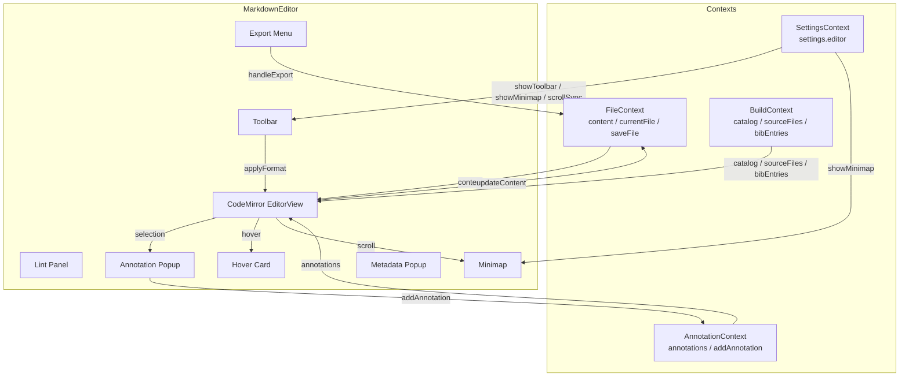
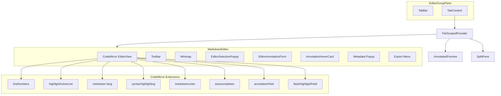

# エディタコア (Editor Core)

## ステータス
実装済

## 概要
CodeMirror 6 ベースの Markdown エディタ。シンタックスハイライト、Lint、オートコンプリート、ツールバー、注釈ハイライト、ミニマップ、スクロール同期、エクスポート機能を統合し、Marginalia の中核的な編集体験を提供する。

## 現状 (As-Is)

### 実装済みの機能一覧
- CodeMirror 6 によるフル機能 Markdown 編集
- One Dark 風カスタムシンタックスハイライト (h1-h6, 強調, リンク, コード, 引用, リスト, メタ情報)
- カスタム Markdown Lint (見出しレベル飛び検出, 空リンク検出, 未閉じコードフェンス検出)
- Markdown ツールバー (20 種類のフォーマットボタン: 太字, 斜体, 取消線, 見出し1-3, 箇条書き, 番号リスト, タスク, 引用, コード, コードブロック, リンク, 画像, 表, 数式, 数式ブロック, 色)
- 6 種類のオートコンプリートソース (Markdown 構文, Mermaid 図形, テンプレート変数, ファイルパス, BibTeX 引用, 相互参照)
- テキスト選択時の注釈作成ポップアップ (4 タイプ: コメント, 校閲, 保留, 議論)
- 注釈ハイライトデコレーション (StateField ベース, タイプ別カラーリング)
- フラッシュハイライト (2.5 秒間の一時的ハイライト、スクロールジャンプ時に使用)
- ミニマップ (設定で ON/OFF 切替可能)
- エディタ - プレビュー間双方向スクロール同期 (設定で ON/OFF 切替可能, デバウンス 50ms)
- ファイルメタデータ表示 (ファイル名, サイズ, 行数, 単語数, 文字数, 作成日, 更新日, パス)
- エクスポート機能 (Markdown, Markdown+注釈, HTML の 3 形式)
- 注釈ホバーカード (エディタ内の注釈テキストにホバーで詳細表示, 遅延表示 200ms, 閉じ遅延 300ms)
- キーボードショートカット (Cmd+S 保存, Cmd+B 太字, Cmd+I 斜体)
- EditorView の Context 共有 (scrollToLine, getVisibleLine, getVisibleRange)

### 使用ライブラリ・バージョン
| ライブラリ | バージョン | 用途 |
|---|---|---|
| `@codemirror/state` | ^6.4.0 | エディタ状態管理 |
| `@codemirror/view` | ^6.23.0 | エディタ描画・UI |
| `@codemirror/lang-markdown` | ^6.2.3 | Markdown 言語サポート |
| `@codemirror/language-data` | ^6.4.1 | コードブロック内言語サポート |
| `@codemirror/lint` | ^6.9.3 | Lint フレームワーク |
| `@codemirror/autocomplete` | ^6.18.0 | オートコンプリート |
| `@lezer/highlight` | ^1.2.3 | シンタックスハイライト定義 |
| `codemirror` | ^6.0.1 | CodeMirror コアバンドル |
| React | ^18.2.0 | UI フレームワーク |

### 関連ファイル一覧

| ファイルパス | 行数 | 責務 |
|---|---|---|
| `src/components/Editor/MarkdownEditor.tsx` | 1573 | エディタ本体コンポーネント (CodeMirror 初期化, ツールバー, 注釈UI, エクスポート) |
| `src/codemirror/completions/index.ts` | 39 | オートコンプリート統合エントリポイント (`createMarkdownCompletions`) |
| `src/codemirror/completions/markdownSyntax.ts` | 51 | Markdown 構文のオートコンプリート (18 種類の補完候補) |
| `src/codemirror/completions/mermaid.ts` | 44 | Mermaid コードブロック内の図形タイプ補完 (14 種類) |
| `src/codemirror/completions/templateVariables.ts` | 59 | YAML フロントマター内のテンプレート変数補完 (13 キー + カタログパラメータ) |
| `src/codemirror/completions/filePaths.ts` | 39 | リンク・画像リンク内のファイルパス補完 |
| `src/codemirror/completions/citations.ts` | 48 | BibTeX 引用キー補完 (`@cite{...}` パターン) |
| `src/codemirror/completions/crossReferences.ts` | 44 | 相互参照ラベル補完 (`{@fig:...}` 等 5 タイプ) |
| `src/codemirror/parsers/bibtex.ts` | 36 | BibTeX ファイルパーサー |
| `src/contexts/FileContext.tsx` | 724 | ファイル読み書き・キャッシュ管理 (エディタの content 供給元) |
| `src/contexts/AnnotationContext.tsx` | - | 注釈データ管理 (エディタの annotations 供給元) |
| `src/contexts/SettingsContext.tsx` | - | 設定管理 (ツールバー表示, ミニマップ, スクロール同期 の ON/OFF) |
| `src/contexts/BuildContext.tsx` | - | ビルド設定管理 (カタログ, ソースファイル, BibTeX の供給元) |

### データフロー図



## 仕様 (Specification)

### 機能要件

#### CodeMirror エディタ初期化
- `currentFile` が変更されるたびに EditorView を破棄・再生成 (L640-721)
- 拡張機能: `lineNumbers`, `highlightActiveLine`, `highlightActiveLineGutter`, `drawSelection`, `history`, `markdown`, `syntaxHighlighting`, `keymap`, `theme`, `lineWrapping`, `annotationField`, `flashHighlightField`, `markdownLinter`, `lintGutter`, `completionCompartment`
- コンテンツの外部更新はトランザクションで全置換 (L724-737)

#### シンタックスハイライト
- `HighlightStyle.define` で One Dark 風カラースキーム (L47-77)
- 見出しレベル別フォントサイズ (h1: 1.4em, h2: 1.25em, h3: 1.1em)
- カスタムダークテーマ (CSS 変数ベース) (L79-149)

#### Markdown Lint
- 見出しレベルの飛び検出 (例: h2 から h4 に飛ぶと warning)
- 空リンク `[text]()` の検出 (warning)
- 未閉じコードフェンス ``` の検出 (error)
- コードフェンス内はスキップ

#### オートコンプリート
- `Compartment` で動的再設定可能 (カタログ・ソースファイル・BibTeX 変更時にホットリロード)
- 6 つのソースを `autocompletion({ override: sources })` で統合
- トリガー条件はソースごとに個別実装 (行頭の `#`, Mermaid ブロック内, YAML フロントマター内, リンク括弧内, `@cite{` パターン, `{@fig:` パターン)

#### ツールバー
- 20 種類のフォーマットボタン (`TOOLBAR_ITEMS` 配列 L226-250)
- 4 つの挿入モード: 選択テキストを囲む / 行頭挿入 / ブロック挿入 / テンプレート挿入
- `settings.editor.showToolbar` で表示/非表示切替

#### 注釈作成フロー
1. ユーザーがテキストを選択 → `handleMouseUp` (L897-943)
2. V2 セレクタ (TextQuoteSelector / TextPositionSelector / EditorPositionSelector) を同時生成
3. `EditorSelectionPopup` が表示 (4 タイプ選択)
4. タイプ選択 → `EditorAnnotationForm` でコメント入力
5. `addAnnotation` で AnnotationContext に保存

#### スクロール同期
- エディタ → プレビュー: `scroll` イベントをデバウンス (50ms) して `onEditorScrollCallback` を呼び出し
- プレビュー → エディタ (ジャンプ): `triggerEditorScroll` でフラッシュハイライト付きジャンプ
- プレビュー → エディタ (穏やか): `triggerScrollSync` でフラッシュなしスクロール同期
- 設定 `scrollSync` が OFF の場合は同期無効 (ref で追跡してクロージャ問題を回避)

### データ構造

#### EditorViewContext
```typescript
{
  view: EditorView | null;
  scrollToLine: (line: number) => void;
  getVisibleLine: () => number;
  getVisibleRange: () => { startLine: number; endLine: number };
}
```

#### TOOLBAR_ITEMS (各アイテム)
```typescript
{
  id: string;
  label: string;        // 日本語ラベル
  icon: string;         // アイコン文字
  before: string;       // 挿入テキスト（前）
  after: string;        // 挿入テキスト（後）
  shortcut?: string;    // ショートカット表示
  line?: boolean;       // 行頭挿入モード
  block?: boolean;      // ブロック挿入モード
  template?: string;    // テンプレートテキスト
}
```

#### CompletionConfig
```typescript
{
  catalog: CatalogData | null;
  sourceFiles: string[];
  fileTree: string[];
  bibEntries: BibEntry[];
  crossRefLabels: CrossRefLabel[];
}
```

### API / インターフェース

#### エクスポート関数
| 関数 | 用途 |
|---|---|
| `setEditorScrollCallback(cb)` | エディタ→プレビューのスクロールコールバック設定 |
| `setPreviewScrollCallback(cb)` | プレビュー→エディタのジャンプコールバック設定 |
| `setScrollSyncCallback(cb)` | プレビュー→エディタの穏やかなスクロール同期コールバック設定 |
| `triggerEditorScroll(line)` | プレビューからエディタへジャンプ (フラッシュ付き) |
| `triggerScrollSync(line)` | プレビューからエディタへスクロール同期 (穏やか) |
| `useEditorView()` | EditorViewContext フック |
| `createMarkdownCompletions(config)` | オートコンプリート Extension 生成 |

### キーボードショートカット
| ショートカット | アクション | 実装箇所 |
|---|---|---|
| `Cmd+S` / `Ctrl+S` | ファイル保存 | MarkdownEditor.tsx L977-996 |
| `Cmd+B` / `Ctrl+B` | 太字 (`**text**`) | MarkdownEditor.tsx L983-986 |
| `Cmd+I` / `Ctrl+I` | 斜体 (`*text*`) | MarkdownEditor.tsx L988-991 |
| `Tab` | インデント (CodeMirror 組み込み `indentWithTab`) | MarkdownEditor.tsx L659 |
| `Cmd+Z` / `Ctrl+Z` | Undo (CodeMirror history) | CodeMirror 標準 |
| `Cmd+Shift+Z` / `Ctrl+Y` | Redo (CodeMirror history) | CodeMirror 標準 |

## アーキテクチャ

### コンポーネント図



### 状態管理の流れ

1. **ファイル内容**: `FileContext.content` → CodeMirror `doc` → `updateContent` で双方向同期
2. **注釈**: `AnnotationContext.annotations` → `dispatchAnnotations` で StateField に反映 → デコレーションとして描画
3. **設定**: `SettingsContext.settings.editor` → ツールバー / ミニマップ / スクロール同期の ON/OFF
4. **ビルドデータ**: `BuildContext.catalog/sourceFiles/bibEntries` → `completionCompartment.reconfigure` でオートコンプリート更新
5. **スクロール同期**: モジュールレベルのコールバック変数 (`onEditorScrollCallback` 等) で管理。React の状態とは独立。

### Electron IPC の構造
エディタコア自体は Electron IPC を直接使用しない。`FileContext` および `BuildContext` を介して間接的に IPC を利用する。

## 既知の課題・制約

- **EditorView の再生成**: `currentFile` 変更時に EditorView を全破棄・再生成するため、タブ切替時に Undo 履歴が失われる
- **スクロール同期精度**: 行番号ベースの同期のため、長い段落や画像を含む場合にプレビューとのズレが発生しうる
- **Lint ルール**: 現在 3 ルールのみ。markdownlint 相当の包括的な Lint は未実装
- **ツールバーのレスポンシブ**: `flex-wrap` で折り返すが、小さいビューポートでは見切れる可能性
- **VSCode との差分**: マルチカーソル、Find & Replace、括弧ペアリング、Emmet は未実装
- **Obsidian との差分**: WYSIWYG モード、バックリンク、グラフビュー、プラグインシステムは未実装

## ロードマップ (To-Be)

### Phase 1: 最小限の改善
- Undo 履歴のタブ間永続化 (EditorState のシリアライズ/デシリアライズ)
- Find & Replace の実装 (`@codemirror/search`)
- Lint ルールの拡充 (重複リンク検出, 画像 alt テキスト必須チェック)

### Phase 2: 本格的な実装
- マルチカーソルサポート
- 括弧ペアリング / オートクローズ
- Vim / Emacs キーバインドモード
- ドラッグ&ドロップによる画像挿入 (Base64 or ローカルコピー)
- Markdown テーブルの WYSIWYG 編集

### Phase 3: 高度な機能
- リアルタイム共同編集 (CRDT / OT ベース)
- AI アシスタント統合 (インライン補完, 文章校正)
- カスタム Lint ルールプラグイン API
- スニペット管理システム
- 音声入力 → Markdown 変換
