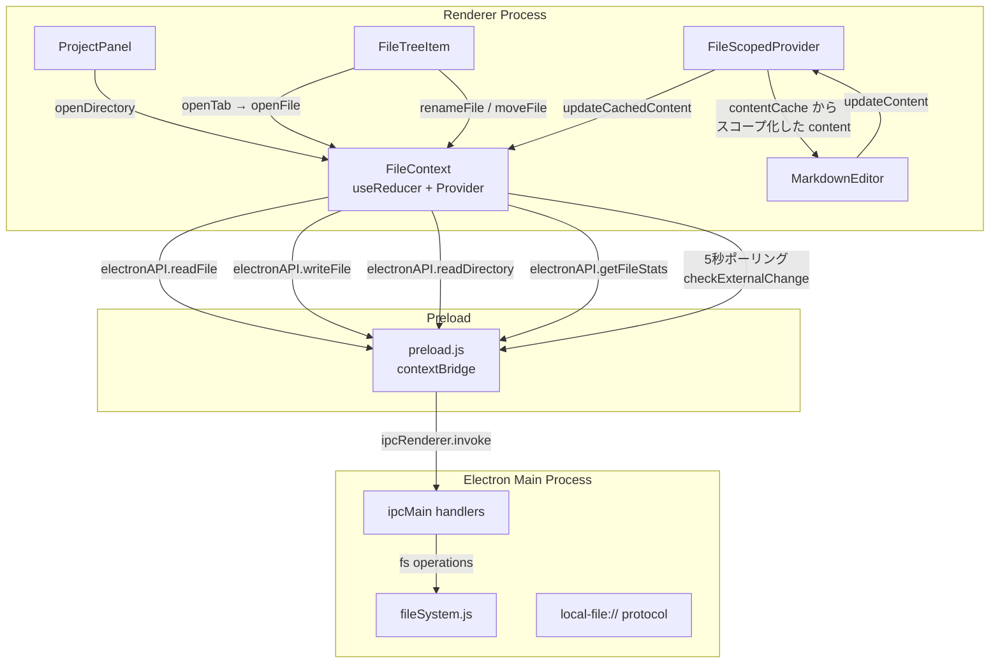
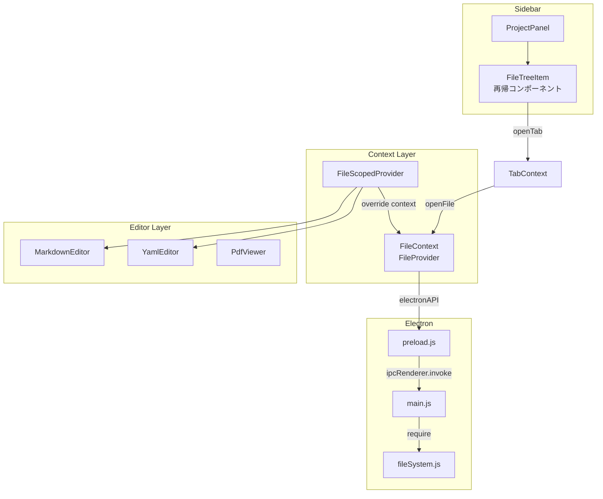
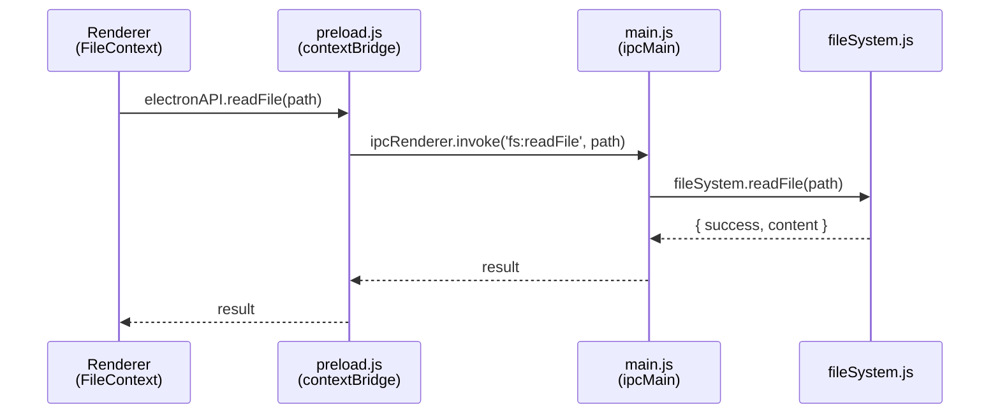

# ファイル管理 (File Management)

## ステータス
実装済

## 概要
Electron IPC を介したローカルファイルシステムの読み書き、ファイルツリー表示、コンテンツキャッシュ、外部変更検出、孤立ファイル管理を統合的に提供するファイル管理サブシステム。

## 現状 (As-Is)

### 実装済みの機能一覧
- ディレクトリ選択ダイアログ (`dialog.showOpenDialog`)
- ファイルツリーの再帰的読み込み・表示
- 隠しファイルの表示/非表示切替 (`showHiddenFiles` 設定連動)
- ファイル読み込み・書き込み (`readFile` / `writeFile`)
- Marginalia 注釈ファイル (`.marginalia`) の読み書き (`readMarginalia` / `writeMarginalia`)
- ファイルコンテンツキャッシュ (`contentCache`: タブ間での内容保持)
- 変更検出 (`isModified` フラグ: 元のコンテンツとの差分比較)
- 外部変更検出 (5 秒ポーリングで mtime を比較)
- ファイルリネーム (注釈 `.marginalia` ファイルの自動追従)
- ファイル移動 (注釈ファイルの自動追従)
- 孤立ファイル検出 (`.marginalia` ファイルのみ存在し対応する `.md` が無い場合)
- 孤立ファイルの注釈エクスポート (JSON)
- 孤立ファイルの別ファイルへの再割当
- 孤立ファイルの削除
- 最近開いたフォルダ (localStorage, 最大 5 件)
- ファイルメタデータ取得 (ファイル名, サイズ, 行数, 単語数, 文字数, 作成日, 更新日)
- 開発モード自動ロード (`DEV_SAMPLES_PATH` をスタートアップで自動展開)
- バックアップ操作 (作成, 一覧, 復元, プレビュー, 削除)
- ローカル画像プロトコル (`local-file://` カスタムプロトコル)
- ファイルツリー内注釈件数バッジ表示

### 使用ライブラリ・バージョン
| ライブラリ | バージョン | 用途 |
|---|---|---|
| Electron | ^28.1.0 | デスクトップアプリ基盤・IPC |
| React | ^18.2.0 | UI フレームワーク |
| Node.js fs | (Electron 内蔵) | ファイルシステム操作 |

### 関連ファイル一覧

| ファイルパス | 行数 | 責務 |
|---|---|---|
| `src/contexts/FileContext.tsx` | 724 | ファイル状態管理 (Reducer + Provider), キャッシュ, 外部変更検出, 孤立ファイル管理 |
| `src/components/Sidebar/FileTreeItem.tsx` | 344 | ファイルツリーの個別アイテム表示, リネーム UI, コンテキストメニュー |
| `src/components/Sidebar/ProjectPanel.tsx` | - | サイドバーのプロジェクトパネル (ファイルツリーのルート) |
| `src/components/Editor/FileScopedProvider.tsx` | 56 | タブごとに FileContext をスコープ化するラッパー |
| `src/types/index.ts` | 303 | 型定義 (FileTreeNode, OrphanedFileData, ElectronAPI 等) |
| `electron/main.js` | 432 | Electron メインプロセス (IPC ハンドラ登録, カスタムプロトコル) |
| `electron/preload.js` | 106 | contextBridge でレンダラーに公開する API 定義 |
| `electron/fileSystem.js` | - | ファイルシステム操作の実装 (readDirectory, readFile, writeFile 等) |

### データフロー図



## 仕様 (Specification)

### 機能要件

#### ディレクトリ管理
- `openDirectory()`: Electron の `dialog.showOpenDialog` でフォルダ選択ダイアログを表示
- `openDirectoryByPath(dirPath)`: 指定パスのディレクトリを直接オープン (最近のフォルダから選択時)
- `refreshDirectory()`: 現在のルートパスを再読み込み + 孤立ファイル検出
- ルートパス変更時は全状態をリセット (`SET_ROOT_PATH` アクション: fileTree, currentFile, content, contentCache をクリア)

#### ファイル読み書き
- `openFile(filePath)`: キャッシュ確認 → キャッシュヒット時はディスク読み込みスキップ。ミス時は `readFile` + `getFileStats` を `Promise.all` で並列取得
- `saveFile()`: `writeFile` 後に `MARK_SAVED` + `MARK_CACHED_SAVED` をディスパッチ
- `updateContent(content)`: グローバル state + contentCache の両方を更新
- `reloadFile()`: 現在のファイルをディスクから強制再読み込み

#### コンテンツキャッシュ
- `contentCache`: `Record<string, FileContentCache>` でファイルパスをキーとしてキャッシュ
- `loadFileToCache(filePath)`: キャッシュに無い場合のみディスクから読み込み
- `updateCachedContent(filePath, content)`: 指定ファイルのキャッシュ内容を更新。`currentFile` と同じならグローバル state も連動更新
- `saveCachedFile(filePath)`: 指定ファイルのキャッシュ内容をディスクに保存
- `closeFile(filePath)`: キャッシュからエビクション (`EVICT_CACHE`)

#### 外部変更検出
- 5 秒間隔の `setInterval` で `getFileStats` を呼び出し、`mtime` を `lastKnownMtime` と比較
- 変更検出時は `EXTERNAL_CHANGE_DETECTED` フラグを立てる
- ユーザーが再読み込みまたは無視を選択可能

#### ファイルリネーム・移動
- `renameFileWithAnnotations(filePath, newName)`: `electronAPI.renameFile` → 成功時にタブパス更新 + ファイルツリー更新
- `moveFileWithAnnotations(oldPath, newPath)`: `electronAPI.moveFile` → 同上
- `.marginalia` ファイルの追従は Electron 側 (`fileSystem.js`) で実装

#### 孤立ファイル管理
- `detectOrphanedFiles(dirPath)`: ディレクトリを再帰走査し、`.marginalia` ファイルのうち対応する元ファイルが無いものを検出
- `exportOrphanedFile(orphanedFile)`: JSON としてダウンロード (注釈 + 履歴データ)
- `reassignOrphanedFile(orphanedFile, newFilePath)`: 別ファイルに注釈データを関連付け
- `deleteOrphanedFile(orphanedFile)`: `.marginalia` ファイルを削除

#### FileScopedProvider
- タブごとに `FileContext.Provider` を再提供し、`currentFile`, `content`, `isModified`, `updateContent`, `saveFile` をスコープ化
- `contentCache` から該当ファイルの内容を読み取りオーバーライド
- キャッシュに無い場合は `loadFileToCache` を自動実行

### データ構造

#### FileContext State (Reducer)
```typescript
{
  rootPath: string | null;
  fileTree: FileTreeNode[];
  currentFile: string | null;
  content: string;
  originalContent: string;
  isModified: boolean;
  isLoading: boolean;
  error: string | null;
  externalChangeDetected: boolean;
  lastKnownMtime: string | null;
  orphanedFiles: OrphanedFileData[];
  contentCache: Record<string, FileContentCache>;
}
```

#### FileContentCache
```typescript
{
  content: string;
  originalContent: string;
  isModified: boolean;
  lastKnownMtime: string | null;
}
```

#### FileTreeNode
```typescript
{
  name: string;
  path: string;
  type: 'file' | 'directory';
  isHidden?: boolean;
  children?: FileTreeNode[];
}
```

#### OrphanedFileData
```typescript
{
  filePath: string;
  fileName: string;
  lastModified: string;
  annotations: any[];
  history: any[];
}
```

#### Reducer アクション一覧
| アクション | ペイロード | 説明 |
|---|---|---|
| `SET_ROOT_PATH` | `string` | ルートパス変更 (全状態リセット) |
| `SET_FILE_TREE` | `FileTreeNode[]` | ファイルツリー更新 |
| `SET_CURRENT_FILE` | `string` | 現在のファイルパス設定 |
| `SET_CONTENT` | `{ content, original?, mtime? }` | ファイル内容設定 |
| `UPDATE_CONTENT` | `string` | 編集中のコンテンツ更新 |
| `MARK_SAVED` | - | 保存済みマーク |
| `SET_LOADING` | `boolean` | ローディング状態 |
| `SET_ERROR` | `string` | エラーメッセージ設定 |
| `CLEAR_ERROR` | - | エラークリア |
| `EXTERNAL_CHANGE_DETECTED` | - | 外部変更フラグ設定 |
| `CLEAR_EXTERNAL_CHANGE` | - | 外部変更フラグクリア |
| `UPDATE_MTIME` | `string` | mtime 更新 |
| `SET_ORPHANED_FILES` | `OrphanedFileData[]` | 孤立ファイル一覧設定 |
| `REMOVE_ORPHANED_FILE` | `string` | 孤立ファイル除去 |
| `CACHE_FILE_CONTENT` | `{ filePath, content, mtime }` | キャッシュに追加 |
| `UPDATE_CACHED_CONTENT` | `{ filePath, content }` | キャッシュ内容更新 |
| `MARK_CACHED_SAVED` | `string` | キャッシュ保存済みマーク |
| `EVICT_CACHE` | `string` | キャッシュからエビクション |

### API / インターフェース

#### FileContext が提供する値
```typescript
{
  // State
  rootPath, fileTree, currentFile, content, originalContent,
  isModified, isLoading, error, externalChangeDetected,
  lastKnownMtime, orphanedFiles, contentCache,

  // ディレクトリ操作
  openDirectory, openDirectoryByPath, refreshDirectory,

  // ファイル操作
  openFile, updateContent, saveFile, clearError,
  closeFile, loadFileToCache, updateCachedContent, saveCachedFile,

  // メタデータ
  fileMetadata, loadFileMetadata,

  // 外部変更
  checkExternalChange, reloadFile, clearExternalChange,

  // リネーム・移動
  renameFileWithAnnotations, moveFileWithAnnotations,

  // 孤立ファイル管理
  detectOrphanedFiles, exportOrphanedFile, reassignOrphanedFile, deleteOrphanedFile,

  // 最近のフォルダ
  recentFolders, clearRecentFolders,
}
```

#### Electron IPC チャネル (ファイル関連)
| チャネル | 方向 | 説明 |
|---|---|---|
| `dialog:openDirectory` | Renderer → Main | ディレクトリ選択ダイアログ |
| `fs:readDirectory` | Renderer → Main | ディレクトリの再帰読み込み |
| `fs:readFile` | Renderer → Main | ファイル読み込み |
| `fs:writeFile` | Renderer → Main | ファイル書き込み |
| `fs:readMarginalia` | Renderer → Main | .marginalia 読み込み |
| `fs:writeMarginalia` | Renderer → Main | .marginalia 書き込み |
| `fs:exists` | Renderer → Main | ファイル存在確認 |
| `fs:getFileStats` | Renderer → Main | ファイル統計情報取得 |
| `fs:renameFile` | Renderer → Main | ファイルリネーム (+ .marginalia 追従) |
| `fs:moveFile` | Renderer → Main | ファイル移動 (+ .marginalia 追従) |
| `fs:readFileAsBase64` | Renderer → Main | バイナリファイル Base64 読み込み |
| `fs:listBackups` | Renderer → Main | バックアップ一覧 |
| `fs:createBackup` | Renderer → Main | バックアップ作成 |
| `fs:restoreBackup` | Renderer → Main | バックアップ復元 |
| `fs:previewBackup` | Renderer → Main | バックアッププレビュー |
| `fs:deleteBackup` | Renderer → Main | バックアップ削除 |

### キーボードショートカット
| ショートカット | アクション | 実装箇所 |
|---|---|---|
| `Cmd+S` / `Ctrl+S` | ファイル保存 | MarkdownEditor.tsx L977-980 (saveFile 呼び出し) |

## アーキテクチャ

### コンポーネント図



### 状態管理の流れ

1. **ファイル選択**: `FileTreeItem.handleClick` → `TabContext.openTab` → `FileContext.openFile` → IPC `fs:readFile` → `SET_CONTENT` + `CACHE_FILE_CONTENT`
2. **編集**: `CodeMirror updateListener` → `FileContext.updateContent` → `UPDATE_CONTENT` + `UPDATE_CACHED_CONTENT`
3. **保存**: `Cmd+S` → `FileContext.saveFile` → IPC `fs:writeFile` → `MARK_SAVED` + `MARK_CACHED_SAVED`
4. **タブ間切替**: `FileScopedProvider` が `contentCache` から該当ファイルのデータを注入。グローバル `currentFile` の変更なしにタブ固有の内容を表示。

### Electron IPC の構造



## 既知の課題・制約

- **外部変更検出がポーリング**: 5 秒間隔の `setInterval` + `getFileStats` で mtime を比較。`fs.watch` / `chokidar` によるイベント駆動に比べてレイテンシが大きく CPU 負荷も高い
- **キャッシュのメモリ管理**: `contentCache` にはファイル数の上限がなく、大量のタブを開くとメモリ消費が増大する
- **ファイルツリーの更新**: ファイルツリーは `refreshDirectory` で全体を再取得。インクリメンタルな差分更新は未実装
- **バイナリファイル**: テキストファイル前提の設計。バイナリファイル (画像等) は Base64 読み込みのみ対応
- **VSCode との差分**: ファイルシステム監視 (fs.watch), Search in Files, SCM 統合, マルチルートワークスペースは未実装
- **Obsidian との差分**: Vault 概念, Daily Notes, テンプレート自動挿入, ワイキリンクは未実装
- **同時書き込み保護**: 排他ロック機構がないため、外部エディタとの同時編集時にデータ競合の可能性あり

## ロードマップ (To-Be)

### Phase 1: 最小限の改善
- `chokidar` によるファイルシステム監視 (ポーリング廃止)
- キャッシュの LRU エビクション (最大タブ数制限)
- ファイルツリーのインクリメンタル更新

### Phase 2: 本格的な実装
- マルチルートワークスペース対応
- ファイル作成・削除 UI (サイドバーから)
- ドラッグ&ドロップによるファイル移動 (ファイルツリー内)
- 大容量ファイル対応 (遅延読み込み / ストリーミング)

### Phase 3: 高度な機能
- ファイル全文検索 (Search in Files)
- Git 統合 (変更ファイルの色分け, Diff ビュー)
- .gitignore 連動のファイルフィルタリング
- クラウドストレージ統合 (Google Drive, Dropbox)
