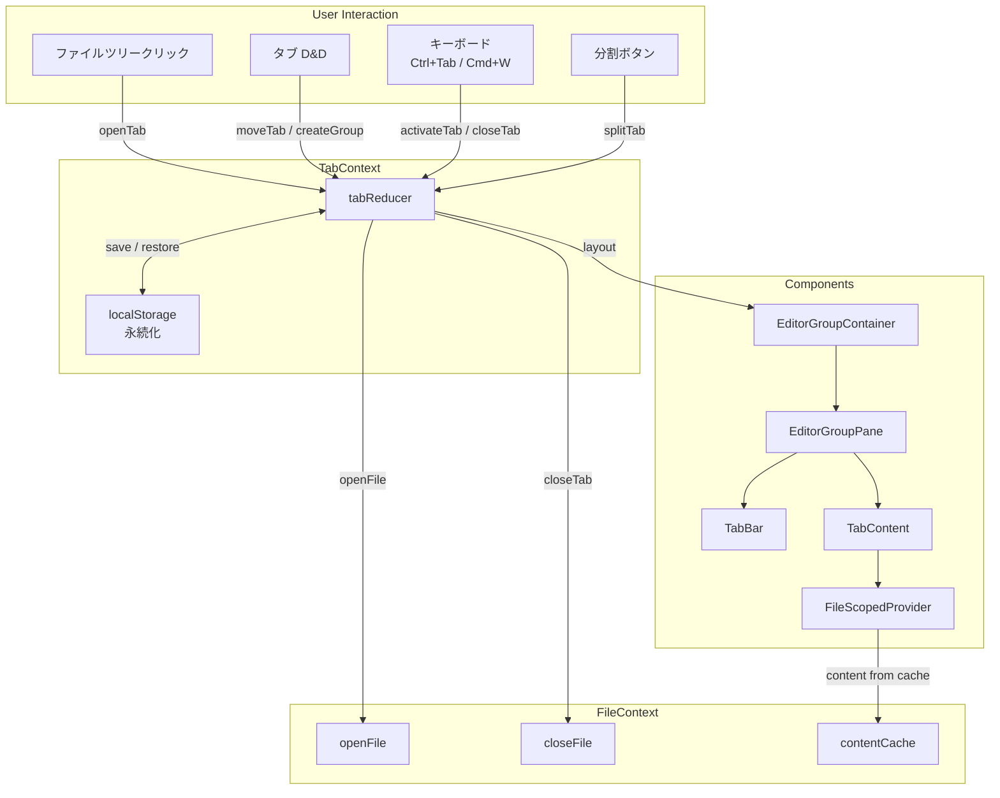
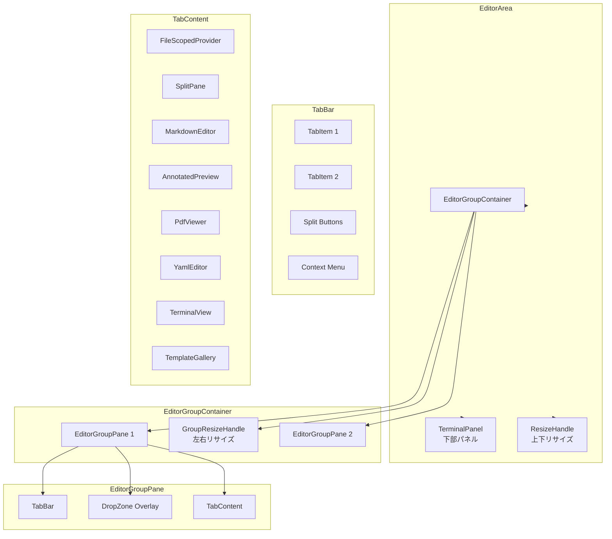
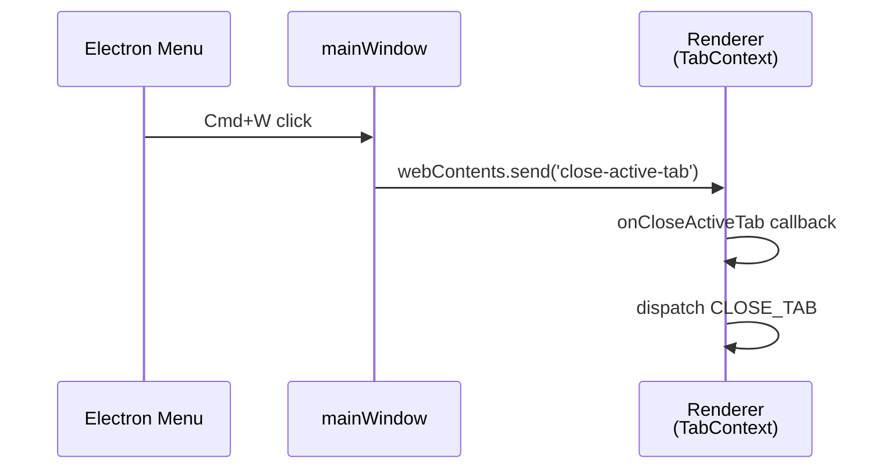

# タブシステム (Tab System)

## ステータス
実装済

## 概要
VSCode ライクなマルチタブ・マルチグループエディタレイアウトシステム。水平/垂直分割、ドラッグ&ドロップによるタブ移動、レイアウトの永続化、および Markdown / PDF / YAML / ターミナル / ギャラリーの各種コンテンツタイプを統合的に管理する。

## 現状 (As-Is)

### 実装済みの機能一覧
- マルチタブ UI (タブバーにファイルアイコン、ファイル名、変更インジケータ、閉じるボタン)
- 最大 6 グループまでのマルチグループレイアウト (水平/垂直分割)
- タブのドラッグ&ドロップ (グループ内並び替え / グループ間移動)
- ドロップゾーン視覚化 (左/右/上/下/中央の 5 ゾーン)
- エディタ領域へのドロップで新グループ自動作成
- タブの分割機能 (右に分割 / 下に分割)
- グループ間のリサイズハンドル (ドラッグで幅/高さ調整)
- ターミナルパネル (下部リサイズ可能パネル)
- 5 種類のファイルタイプ対応: md, pdf, yaml, terminal, gallery
- 6 種類のエディタモード: edit, split, preview, pdf, terminal, gallery
- タブの右クリックコンテキストメニュー (閉じる, 右に分割, 下に分割)
- 中クリックでタブを閉じる
- 未保存確認ダイアログ (タブ閉じ時)
- レイアウトの localStorage 永続化 (300ms デバウンス)
- 起動時のレイアウト復元 (ファイル存在確認付き)
- ルートパス変更時のタブ全クリア
- FileContext の `isModified` とタブの変更インジケータの自動同期
- ファイルリネーム時のタブパス自動更新
- Cmd+W でアクティブタブを閉じる (Electron メニュー連携)
- Ctrl+Tab / Ctrl+Shift+Tab でタブ切替
- ターミナルタブ閉じ時の PTY 破棄
- ギャラリータブのシングルトン制御
- ターミナルパネルの下部表示 (リサイズ可能)

### 使用ライブラリ・バージョン
| ライブラリ | バージョン | 用途 |
|---|---|---|
| React | ^18.2.0 | UI フレームワーク |
| uuid | ^9.0.1 | タブ/グループの一意 ID 生成 |
| Electron | ^28.1.0 | Cmd+W メニューアクセラレータ, PTY 管理 |

### 関連ファイル一覧

| ファイルパス | 行数 | 責務 |
|---|---|---|
| `src/contexts/TabContext.tsx` | 750 | タブ状態管理 (Reducer + Provider), レイアウト永続化, キーバインド |
| `src/types/tabs.ts` | 31 | 型定義 (Tab, EditorGroup, TabLayout, SplitDirection, FileContentCache) |
| `src/components/Editor/TabBar.tsx` | 447 | タブバー UI (タブアイテム, アイコン, 閉じるボタン, 分割ボタン, コンテキストメニュー) |
| `src/components/Editor/TabContent.tsx` | 92 | タブの内容描画 (ファイルタイプに応じたコンポーネント選択) |
| `src/components/Editor/EditorArea.tsx` | 98 | エディタ領域全体のレイアウト (エディタグループ + ターミナルパネル) |
| `src/components/Editor/EditorGroupContainer.tsx` | 151 | グループコンテナ (水平/垂直分割, リサイズハンドル) |
| `src/components/Editor/EditorGroupPane.tsx` | 233 | 個別グループペイン (TabBar + TabContent + ドロップゾーン) |
| `src/components/Editor/FileScopedProvider.tsx` | 56 | タブごとの FileContext スコープ化 |
| `electron/main.js` | 432 | Cmd+W → `close-active-tab` IPC イベント送信 |
| `electron/preload.js` | 106 | `onCloseActiveTab` リスナー公開 |

### データフロー図



## 仕様 (Specification)

### 機能要件

#### タブ管理
- `openTab(filePath, groupId?)`: ファイルを新規タブとして開く。既に開いている場合はそのタブをアクティブ化。ファイル拡張子から `fileType` (`md` / `pdf` / `yaml`) と `editorMode` (`split` / `pdf` / `edit`) を自動判定
- `openTerminalTab(sessionId, groupId?)`: ターミナルタブを開く。`fileType: 'terminal'`, `editorMode: 'terminal'`。`terminalSessionId` を保持
- `openGallery()`: テンプレートギャラリータブをシングルトンで開く。既存ギャラリータブがあればそれをアクティブ化
- `closeTab(tabId, groupId)`: タブを閉じる。未保存の場合は確認ダイアログ表示。ターミナルタブの場合は PTY 破棄。他のタブで同じファイルが開かれていない場合は FileContext のキャッシュからもエビクション
- `activateTab(tabId, groupId)`: タブをアクティブ化。FileContext の `openFile` も同期呼び出し (PDF 以外)

#### グループ管理
- `createGroup(tab?)`: 新グループ作成 (最大 6 グループ)。幅は均等配分に自動調整
- `closeGroup(groupId)`: グループ閉じ (最低 1 グループは残す)。閉じるグループのタブは隣のグループに統合
- `setActiveGroup(groupId)`: アクティブグループ切替
- `setGroupWidths(widths)`: グループ幅の割合配列設定 (合計 100%)
- `setSplitDirection(dir)`: 分割方向切替 (`horizontal` / `vertical`)

#### タブ移動
- `moveTab(tabId, fromGroupId, toGroupId, index?)`: タブをグループ間で移動。同じグループ内の場合は並び替え
- `splitTab(tabId, groupId, direction)`: タブを新グループに複製して分割。元のタブは閉じられる

#### ドロップゾーン
- エディタ領域へのドラッグで 5 つのゾーンを視覚化:
  - `center`: 同グループのタブとして追加
  - `left` / `right`: 水平分割で新グループ作成
  - `top` / `bottom`: 垂直分割で新グループ作成
- ドロップゾーンの判定: エッジから 20% 以内が左右上下、中央が残り

#### 空グループの自動削除
- タブを閉じた結果グループが空になった場合 (グループが 2 つ以上あれば)、空グループを自動削除しグループ幅を再計算

#### レイアウト永続化
- localStorage キー: `marginalia-tab-layout`
- 保存タイミング: `layout` の変更を `useEffect` で検知し 300ms デバウンスで保存
- 保存内容: `version`, `groups` (各グループのタブ情報と activeFilePath), `activeGroupIndex`, `groupWidths`, `splitDirection`
- ターミナルタブとギャラリータブは永続化から除外 (`filter` で除去)
- 復元時: 各タブのファイル存在確認 (`electronAPI.exists`) を行い、存在しないファイルのタブはスキップ

#### FileContext 同期
- `contentCache` の `isModified` フラグをタブの `isModified` に自動同期 (`useEffect` で監視)
- ルートパス変更時に `CLEAR_ALL` で全タブクリア + localStorage 削除

### データ構造

#### Tab
```typescript
{
  id: string;                  // UUID v4
  filePath: string;            // ファイルパス or 特殊URI ("__marginalia://terminal/...", "__marginalia://template-gallery")
  fileName: string;            // 表示名
  fileType: 'md' | 'pdf' | 'yaml' | 'terminal' | 'gallery';
  editorMode: 'edit' | 'split' | 'preview' | 'pdf' | 'terminal' | 'gallery';
  isModified: boolean;
  terminalSessionId?: string;  // ターミナルタブのみ
}
```

#### EditorGroup
```typescript
{
  id: string;         // UUID v4
  tabs: Tab[];
  activeTabId: string | null;
}
```

#### TabLayout
```typescript
{
  groups: EditorGroup[];
  activeGroupId: string;
  groupWidths: number[];      // 各グループの幅 (%) 合計 100
  splitDirection: SplitDirection;  // 'horizontal' | 'vertical'
}
```

#### 永続化フォーマット (localStorage)
```json
{
  "version": 1,
  "groups": [
    {
      "tabs": [
        { "filePath": "/path/to/file.md", "fileName": "file.md", "fileType": "md", "editorMode": "split" }
      ],
      "activeFilePath": "/path/to/file.md"
    }
  ],
  "activeGroupIndex": 0,
  "groupWidths": [50, 50],
  "splitDirection": "horizontal"
}
```

#### Reducer アクション一覧
| アクション | ペイロード | 説明 |
|---|---|---|
| `OPEN_TAB` | `{ tab: Tab, groupId: string }` | タブを開く (既存の場合はアクティブ化のみ) |
| `CLOSE_TAB` | `{ tabId: string, groupId: string }` | タブを閉じる (空グループ自動削除) |
| `ACTIVATE_TAB` | `{ tabId: string, groupId: string }` | タブをアクティブに |
| `SET_TAB_MODE` | `{ tabId, groupId, mode }` | エディタモード変更 |
| `SET_TAB_MODIFIED` | `{ filePath: string, isModified: boolean }` | 変更フラグ設定 (全グループ横断) |
| `CREATE_GROUP` | `{ tab?: Tab }` | 新グループ作成 (最大6) |
| `CLOSE_GROUP` | `{ groupId: string }` | グループ閉じ (タブ統合) |
| `MOVE_TAB` | `{ tabId, fromGroupId, toGroupId, index? }` | タブ移動 |
| `SET_ACTIVE_GROUP` | `string` | アクティブグループ設定 |
| `SET_GROUP_WIDTHS` | `number[]` | グループ幅配列設定 |
| `UPDATE_TAB_PATH` | `{ oldPath, newPath, newName }` | リネーム時のパス更新 |
| `REMOVE_TABS_BY_PATH` | `string` | 指定パスの全タブ除去 |
| `SET_SPLIT_DIRECTION` | `SplitDirection` | 分割方向変更 |
| `RESTORE_LAYOUT` | `TabLayout` | レイアウト復元 |
| `CLEAR_ALL` | - | 全タブ・グループクリア |

### API / インターフェース

#### TabContext が提供する値
```typescript
{
  // State
  layout: TabLayout;
  activeTab: Tab | null;       // アクティブグループのアクティブタブ (導出値)
  activeGroup: EditorGroup | null;  // アクティブグループ (導出値)

  // タブ操作
  openTab, openTerminalTab, openGallery,
  closeTab, activateTab,
  setTabMode, setTabModified,

  // グループ操作
  createGroup, closeGroup,
  setActiveGroup, setGroupWidths, setSplitDirection,

  // 移動・分割
  moveTab, splitTab,

  // パス更新
  updateTabPath, removeTabsByPath,

  // リセット
  clearAll,
}
```

#### TabContent のレンダリングルール
| fileType | editorMode | レンダリングコンポーネント |
|---|---|---|
| `terminal` | `terminal` | `TerminalView` |
| `gallery` | `gallery` | `TemplateGallery` |
| `yaml` | `edit` | `FileScopedProvider` > `YamlEditor` |
| `pdf` | `pdf` | `PdfViewer` |
| `md` | `split` | `FileScopedProvider` > `SplitPane` (MarkdownEditor + AnnotatedPreview) |
| `md` | `edit` | `FileScopedProvider` > `MarkdownEditor` |
| `md` | `preview` | `FileScopedProvider` > `AnnotatedPreview` |

### キーボードショートカット
| ショートカット | アクション | 実装箇所 |
|---|---|---|
| `Ctrl+Tab` | 次のタブに切替 (アクティブグループ内) | TabContext.tsx L671-690 |
| `Ctrl+Shift+Tab` | 前のタブに切替 (アクティブグループ内) | TabContext.tsx L671-690 |
| `Cmd+W` / `Ctrl+W` | アクティブタブを閉じる | TabContext.tsx L694-716 (Electron menu accelerator 経由) |

## アーキテクチャ

### コンポーネント図



### 状態管理の流れ

1. **タブ開く**: `FileTreeItem.handleClick` → `TabContext.openTab` → `OPEN_TAB` アクション → `FileContext.openFile` でコンテンツ読み込み
2. **タブ切替**: `TabBar.TabItem.handleClick` → `TabContext.activateTab` → `ACTIVATE_TAB` → `FileContext.openFile` で currentFile 同期
3. **タブ閉じ**: `TabBar.TabItem.handleClose` → `TabContext.closeTab` → 未保存確認 → `CLOSE_TAB` → 空グループ削除 → `FileContext.closeFile` でキャッシュエビクション
4. **ドラッグ&ドロップ**: `TabItem.handleDragStart` → `EditorGroupPane.handleContentDrop` → ドロップゾーン判定 → `moveTab` or `createGroup`
5. **レイアウト復元**: 起動時 `localStorage` から読み込み → ファイル存在確認 → `RESTORE_LAYOUT`
6. **永続化**: `layout` 変更 → 300ms デバウンス → `localStorage.setItem`

### Electron IPC の構造



## 既知の課題・制約

- **タブの順序固定**: ドラッグ&ドロップで並び替え可能だが、永続化時に復元される順序は保存時の順序。ソート機能は未実装
- **分割方向の制約**: 全グループが同じ分割方向を共有。グリッドレイアウト (混在分割) は未対応
- **最大 6 グループ**: ハードコーディングされた上限。設定での変更は不可
- **レイアウト永続化の粒度**: ルートパス変更時に全タブクリアされるため、プロジェクト切替時にタブ状態が失われる (ルートパスごとの保存は未実装)
- **エディタモード切替**: タブごとの editorMode は保持されるが、split 時の左右比率はリセットされる
- **VSCode との差分**: ピン留めタブ、タブのカラーインジケータ、パンくずリスト、ミニマップ付きタブ切替、最近閉じたタブの復元 (Ctrl+Shift+T) は未実装
- **Obsidian との差分**: リンクによるページ遷移、サイドバーへのタブ移動、ポップアウトウィンドウは未実装
- **パフォーマンス**: 多数のタブ (20+) を開いた場合の TabBar のスクロール UX が最適化されていない

## ロードマップ (To-Be)

### Phase 1: 最小限の改善
- 最近閉じたタブの復元 (`Ctrl+Shift+T`)
- ピン留めタブ (閉じるボタン非表示、左寄せ固定)
- split 時の左右比率の永続化
- プロジェクトごとのタブレイアウト保存

### Phase 2: 本格的な実装
- グリッドレイアウト (水平/垂直混在分割)
- パンくずリスト (ファイルパスの階層表示)
- タブの検索 (Cmd+P でファイル名検索 → 該当タブにジャンプ)
- エディタモード切替ボタンの TabBar 統合

### Phase 3: 高度な機能
- ポップアウトウィンドウ (タブを別ウィンドウに分離)
- タブのカスタムカラーリング
- セッション管理 (名前付きレイアウトプリセット)
- ワークスペース単位の一括タブ操作 (全て閉じる、全て保存 等)
