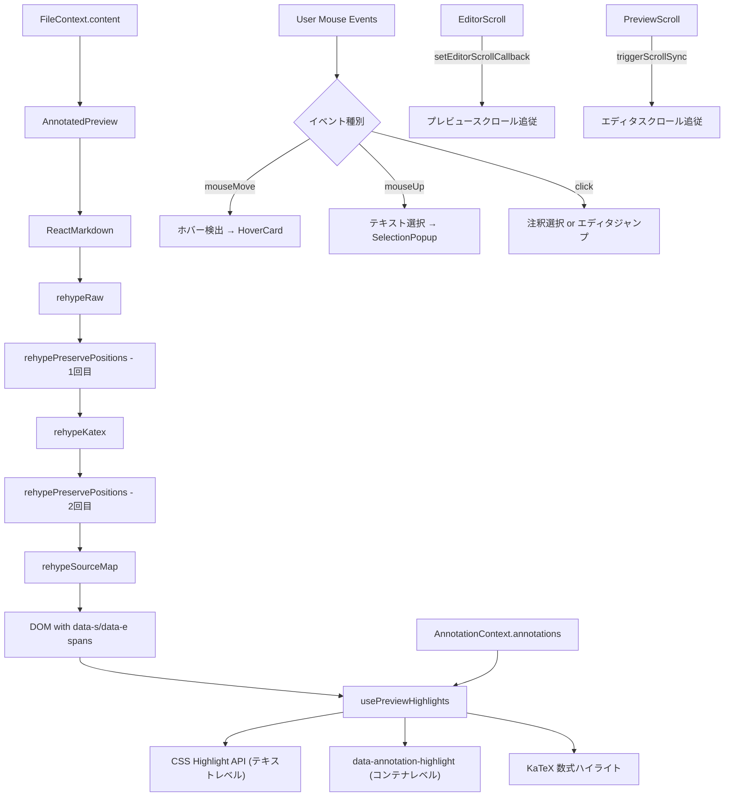
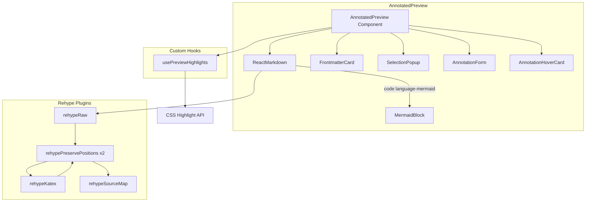

# プレビューシステム

## ステータス
実装済

## 概要
Markdown ドキュメントをリアルタイムレンダリングし、エディタとの双方向スクロール同期・注釈ハイライト表示・テキスト選択による注釈追加を統合的に提供するプレビューコンポーネント。

## 現状 (As-Is)

### 実装済みの機能一覧
- **Markdown レンダリング**: react-markdown による GFM・数式・生 HTML 対応
- **ソースマッピング**: カスタム rehype プラグインで DOM 要素にソース位置情報を埋め込み
- **注釈ハイライト**: CSS Custom Highlight API による4段階ハイライト（テキスト/コンテナ/KaTeX/コードブロック）
- **テキスト選択 → 注釈追加**: プレビュー上のテキスト選択からワンクリックで注釈作成
- **双方向スクロール同期**: エディタ↔プレビュー間のスクロール位置を相互追従
- **ホバーカード**: 注釈ハイライト上のマウスホバーで詳細カードを表示
- **クリック → エディタジャンプ**: プレビュー上のクリックでエディタの対応行にスクロール
- **Frontmatter カード**: YAML frontmatter をテーブル形式で折りたたみ表示
- **Mermaid 図レンダリング**: `mermaid` コードブロックを SVG 図としてレンダリング
- **ローカル画像解決**: `local-file://` プロトコルによるローカル画像の表示

### 使用ライブラリ・バージョン
| ライブラリ | バージョン | 用途 |
|---|---|---|
| react-markdown | ^9.0.1 | Markdown→React変換 |
| remark-gfm | ^4.0.0 | GFM拡張（テーブル、タスクリスト等） |
| remark-math | ^6.0.0 | 数式記法解析 |
| rehype-katex | ^7.0.1 | KaTeX数式レンダリング |
| rehype-raw | ^7.0.0 | 生HTML対応 |
| katex | ^0.16.28 | 数式レンダリングエンジン |
| mermaid | ^11.12.2 | 図表レンダリング |
| js-yaml | ^4.1.1 | Frontmatter YAML パース |

### 関連ファイル一覧
| ファイルパス | 行数 | 役割 |
|---|---|---|
| `src/components/Editor/AnnotatedPreview.tsx` | 1720 | メインプレビューコンポーネント |
| `src/components/Editor/FrontmatterCard.tsx` | 178 | Frontmatter 表示カード |
| `src/components/Editor/MermaidBlock.tsx` | 167 | Mermaid 図レンダリング |
| `src/components/Annotations/AnnotationHoverCard.tsx` | - | ホバーカードUI |
| `src/components/Editor/MarkdownEditor.tsx` | - | スクロール同期コールバック提供元 |

### データフロー図



## 仕様 (Specification)

### 機能要件

#### Markdown レンダリングパイプライン
1. `content` を `ReactMarkdown` に渡す
2. remark プラグイン: `remarkGfm`, `remarkMath`
3. rehype プラグインチェーン（順序が重要）:
   - `rehypeRaw` - 生 HTML を HAST に変換
   - `rehypePreservePositions` (1回目) - HAST 要素に `data-source-s`/`data-source-e` 属性を付与
   - `rehypeKatex` - 数式をレンダリング（位置情報を上書きする可能性あり）
   - `rehypePreservePositions` (2回目) - KaTeX による上書きをリカバリ
   - `rehypeSourceMap` - テキストノードを `<span data-s="offset" data-e="offset">` でラップ

#### ソースマッピング
- `rehypeSourceMap`: HAST テキストノードの `position.start.offset` / `position.end.offset` を `data-s`/`data-e` 属性として DOM に埋め込む
- `rehypePreservePositions`: HAST 要素ノードの位置情報を `data-source-s`/`data-source-e` として保存（KaTeX リカバリ用に2回実行）
- `getSourceOffsetFromNode()`: DOM ノードのカーソル位置からソースオフセットを算出

#### 注釈ハイライト（4段階フォールバック）
`usePreviewHighlights` フックで以下の4パスを順に実行:
1. **パス1 (data-s スパン)**: `[data-s]` スパンの `srcStart`/`srcEnd` と注釈の `start`/`end` の重複範囲から CSS Highlight API の Range を生成
2. **パス2 (コンテナテキストマッチ)**: パス1で見つからない場合、`[data-source-s]` コンテナ内でテキストマッチングを実行（コードブロック対応）
3. **パス3 (コンテナレベル属性)**: CSS Highlight API でカバーできない注釈に `data-annotation-highlight` 属性を付与
4. **パス4 (KaTeX 数式)**: MathML `annotation` 要素から LaTeX ソースを抽出し、注釈範囲とマッチング

ハイライト優先度:
- `priority: 0` - 通常の注釈タイプ別ハイライト（comment/review/pending/discussion）
- `priority: 1` - ホバー中の注釈
- `priority: 2` - 選択中の注釈

#### テキスト選択 → 注釈追加
1. `mouseUp` でテキスト選択を検出
2. `getSourceOffsetFromNode()` でソースオフセットを取得
3. フォールバック: `getContainerSourceRange()` でコンテナ範囲を取得し `indexOf` で精密マッチ
4. 数式ブロックの場合: デリミタ（`$$`/`$`）を除去して LaTeX 本体のみを注釈対象に
5. KaTeX DOM フォールバック: `findMathSourceRange()` で MathML annotation からソース位置特定
6. `SelectionPopup` で注釈タイプを選択
7. `AnnotationForm` で注釈内容を入力
8. セレクタ生成: `TextQuoteSelector` + `TextPositionSelector` + `EditorPositionSelector`

#### 双方向スクロール同期
- **(A) エディタ→プレビュー**: `setEditorScrollCallback` で行番号を受け取り、`lineToOffset` → `[data-s]` スパン検索 → `scrollTo({ behavior: 'smooth' })`
- **(B) プレビュー→エディタ**: `scroll` イベントで最初の可視 `[data-s]` スパンを検出 → `offsetToLine` → `triggerScrollSync`
- フィードバックループ防止: `isScrollingFromEditorRef`/`isScrollingFromPreviewRef` で200msのガード

#### ホバーカード
- `handleMouseMove`: 50ms スロットル → `caretRangeFromPoint` → `rangeMapRef` 走査 → 200ms 遅延でカード表示
- カード上のマウスイン/アウトで閉じるタイミングを制御（300ms/200ms 遅延）
- フォールバック: `[data-annotation-id]` 属性による検出

#### カスタムコンポーネント
- **code**: `language-mermaid` の場合 `MermaidBlock` をレンダリング
- **img**: ローカルパスを `local-file://` プロトコルに変換、エラー時フォールバック表示

### データ構造

#### ソースマップスパン情報
```typescript
interface SourceSpanInfo {
  srcStart: number;   // Markdown ソース内の開始オフセット
  srcEnd: number;     // Markdown ソース内の終了オフセット
  textNode: Text;     // 対応する DOM テキストノード
}
```

#### 選択ポップアップ状態
```typescript
interface SelectionPopupState {
  text: string;           // 選択テキスト
  top: number;            // ポップアップ Y 位置（コンテナ相対）
  left: number;           // ポップアップ X 位置（コンテナ相対）
  srcStart: number | null; // ソースオフセット開始
  srcEnd: number | null;   // ソースオフセット終了
}
```

### API / インターフェース

#### エクスポート (MarkdownEditor.tsx から)
```typescript
setEditorScrollCallback(callback: ((line: number) => void) | null): void
triggerEditorScroll(line: number): void
triggerScrollSync(line: number): void
```

#### コンテキスト依存
- `useFile()` → `content`, `currentFile`
- `useAnnotation()` → `annotations`, `selectedAnnotation`, `selectAnnotation`, `addAnnotation`, `updateAnnotation`, `resolveAnnotation`, `deleteAnnotation`, `addReply`, `scrollToEditorLine`
- `useSettings()` → `settings.editor.scrollSync`

### キーボードショートカット
プレビューパネル固有のキーボードショートカットは現在なし。エディタ側の `Cmd+Shift+P` (プレビュー切替) で表示制御。

## アーキテクチャ

### コンポーネント図



### 状態管理の流れ
1. `FileContext.content` が変更 → `ReactMarkdown` が再レンダリング
2. レンダリング完了 → `usePreviewHighlights` の `useLayoutEffect` が発火
3. DOM の `[data-s]` スパンを走査 → 注釈の Range を計算
4. CSS Custom Highlight API に Range をセット
5. ユーザー操作（ホバー/クリック/選択）→ ローカル state 更新 → 注釈操作は `AnnotationContext` 経由

## 既知の課題・制約

- **CSS Custom Highlight API**: Chromium 系のみサポート（Firefox/Safari 未対応）。Electron 使用のため問題なし
- **rehypeKatex の位置情報上書き**: `rehypePreservePositions` を2回実行するワークアラウンドで対処しているが、完全ではない場合がある
- **コードブロック内ハイライト**: `rehypeRaw` が position を消すため、テキストマッチングによるフォールバックに依存
- **数式内注釈**: レンダリング結果とソースが異なるため、デリミタ除去ロジックや MathML annotation 解析が必要
- **パフォーマンス**: 大規模ドキュメント（1000行超）で `[data-s]` スパンの走査がボトルネックになる可能性
- **スクロール同期精度**: 行番号→オフセット→DOM要素の間接マッピングのため、複雑なブロック（テーブル、数式）で同期がずれることがある
- **画像パス解決**: `local-file://` プロトコルは Electron の `protocol.registerFileProtocol` に依存

### VSCode/Obsidian との差分
| 機能 | Marginalia | VSCode | Obsidian |
|---|---|---|---|
| ソースマッピング | rehype プラグイン | ソース行マーカー | 独自パーサー |
| 注釈ハイライト | CSS Highlight API | デコレーション API | プラグイン依存 |
| Mermaid | 動的インポート | 拡張機能 | ビルトイン |
| 数式 | KaTeX | 拡張機能 | MathJax/KaTeX |
| スクロール同期 | data-s スパン方式 | ソース行方式 | ブロック方式 |

## ロードマップ (To-Be)

### Phase 1: 最小限の改善
- コードブロックのシンタックスハイライト（Shiki/Prism 統合）
- スクロール同期精度の向上（見出しアンカー方式の併用）
- Mermaid レンダリングのキャッシュ（同一コードの再レンダリング防止）

### Phase 2: 本格的な実装
- プレビュー側の検索ハイライト統合
- 印刷プレビューモード（ページ区切り表示）
- カスタム CSS テーマ対応（ユーザー定義スタイルシート）
- テーブルの編集可能プレビュー（クリックでセル編集）

### Phase 3: 高度な機能
- リアルタイム共同編集プレビュー（WebSocket 経由）
- PDF エクスポートプレビュー（Pandoc 出力のインラインプレビュー）
- プラグインによるカスタムブロックレンダラー
- アクセシビリティ対応（スクリーンリーダー、キーボードナビゲーション）
