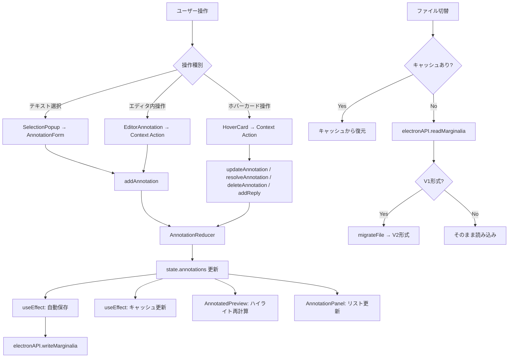
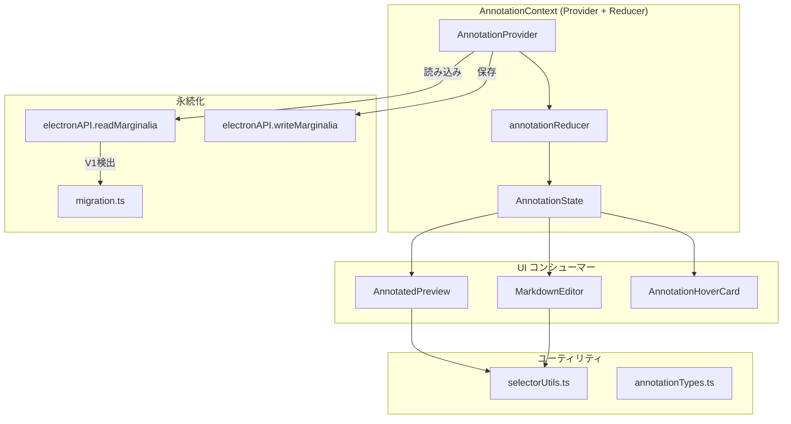

# 注釈システム

## ステータス
実装済

## 概要
W3C Web Annotation 準拠のセレクタモデルに基づく注釈管理システム。テキスト位置・引用・エディタ位置の3重セレクタで堅牢なアンカリングを実現し、ファイル編集に伴う注釈の孤立検出・再アサイン・ステータス管理を提供する。

## 現状 (As-Is)

### 実装済みの機能一覧
- **注釈の CRUD**: 追加・更新・削除・選択
- **4種類の注釈タイプ**: comment, review, pending, discussion
- **5種類のステータス**: active, resolved, archived, orphaned, kept
- **3重セレクタアンカリング**: TextQuoteSelector + TextPositionSelector + EditorPositionSelector
- **返信スレッド**: 注釈への返信チェーン
- **孤立注釈検出**: ドキュメント変更時に未アンカー注釈を自動検出
- **孤立注釈の再アサイン**: 新しいテキスト位置に手動再割当て
- **注釈キャッシュ**: ファイル切替時のインメモリキャッシュ（ディスク読み込み回避）
- **自動保存**: 注釈変更時に `.mrgl` ファイルへ自動永続化
- **V1→V2 マイグレーション**: 旧形式からのシームレス移行
- **ホバーカード**: プレビュー上での注釈詳細ポップアップ（編集・解決・削除・返信・エディタジャンプ）
- **エディタ→注釈ジャンプ**: スクロール位置のクロスパネル同期
- **注釈件数バッジ**: ファイルツリーでのファイル別注釈数表示

### 使用ライブラリ・バージョン
| ライブラリ | バージョン | 用途 |
|---|---|---|
| uuid | ^9.0.1 | 注釈・返信 ID 生成 |
| (内部実装) | - | W3C セレクタ準拠のアンカリング |

### 関連ファイル一覧
| ファイルパス | 行数 | 役割 |
|---|---|---|
| `src/contexts/AnnotationContext.tsx` | 606 | 注釈状態管理 (Context + Reducer) |
| `src/types/annotations.ts` | 201 | 注釈型定義（V2, V1互換, W3C型） |
| `src/components/Editor/AnnotatedPreview.tsx` | 1720 | プレビュー上の注釈ハイライト・操作 |
| `src/components/Annotations/AnnotationHoverCard.tsx` | - | ホバーカード UI |
| `src/utils/selectorUtils.ts` | - | アンカリング・位置計算ユーティリティ |
| `src/utils/migration.ts` | - | V1→V2 マイグレーション |
| `src/constants/annotationTypes.ts` | - | 注釈タイプ定義（アイコン・色・ラベル） |

### データフロー図



## 仕様 (Specification)

### 機能要件

#### 注釈タイプ
| タイプ | 用途 | カラー変数 |
|---|---|---|
| `comment` | 一般的なコメント | `--comment-color` |
| `review` | レビュー指摘 | `--review-color` |
| `pending` | 要対応事項 | `--pending-color` |
| `discussion` | 議論用 | `--discussion-color` |

#### ステータスライフサイクル
```
active → resolved    (解決)
active → orphaned    (テキスト変更でアンカー喪失)
active → kept        (孤立後もユーザーが保持を選択)
orphaned → active    (テキスト復元でアンカー回復)
orphaned → kept      (ユーザーが保持を選択)
resolved → active    (解決取り消し)
```

#### 3重セレクタによるアンカリング
注釈作成時に3種類のセレクタを同時生成し、`target.selectors` に格納:

1. **TextQuoteSelector** (W3C準拠)
   - `exact`: 選択テキスト
   - `prefix`: 選択テキスト直前の最大50文字
   - `suffix`: 選択テキスト直後の最大50文字
   - 用途: テキスト変更後のファジーマッチング

2. **TextPositionSelector** (W3C準拠)
   - `start`: ドキュメント先頭からの文字オフセット
   - `end`: 終了文字オフセット
   - 用途: 高速な直接位置指定

3. **EditorPositionSelector** (Marginalia独自)
   - `startLine`, `endLine`: エディタの行番号
   - `startChar`, `endChar`: 行内の文字位置
   - 用途: エディタへのジャンプ

アンカリング順序 (`anchorAnnotation`):
1. `TextPositionSelector` で直接位置を試行
2. 位置のテキストが `TextQuoteSelector.exact` と一致するか検証
3. 不一致の場合、`TextQuoteSelector` の `prefix`/`suffix` によるファジー検索
4. 全て失敗 → `null` を返し、注釈は `orphaned` 候補

#### 孤立注釈の検出と管理
- `detectOrphanedAnnotations(documentText)`: 全 active 注釈に対して `anchorAnnotation` を実行
  - アンカー失敗 → `orphaned` ステータスに変更
  - `orphaned` だがアンカー成功 → `active` に復帰
  - `kept`/`resolved`/`archived`/`blockId` 付きはスキップ
- `reassignAnnotation(id, newText, occurrenceIndex?)`: 新テキストで `TextQuoteSelector` + `TextPositionSelector` を再生成し、ステータスを `active` に戻す

#### 注釈キャッシュ
- ファイル切替時に現在の注釈を `annotationCache[filePath]` に保存
- 再度同じファイルを開くとキャッシュから即座に復元（ディスクI/O不要）
- `clearAnnotationCache(filePath)` で明示的にキャッシュを削除可能
- `saveMarginalia` 時にもキャッシュを同期更新

#### 自動保存
- `state.annotations` / `state.history` の変更を `useEffect` で検知
- `window.electronAPI.writeMarginalia(currentFile, data)` で `.mrgl` ファイルに永続化
- V2形式: `{ _tool: 'marginalia', _version: '2.0.0', filePath, fileName, lastModified, annotations, history }`

### データ構造

#### AnnotationV2
```typescript
interface AnnotationV2 {
  id: string;                    // UUID v4
  type: AnnotationType;          // 'comment' | 'review' | 'pending' | 'discussion'
  target: AnnotationTarget;      // { source: filePath, selectors: [...] }
  content: string;               // 注釈本文
  author: string;                // 作成者（現在は 'user' 固定）
  createdAt: string;             // ISO 8601
  updatedAt?: string;            // 更新日時
  resolvedAt?: string;           // 解決日時
  status: AnnotationStatus;      // 'active' | 'resolved' | 'archived' | 'orphaned' | 'kept'
  replies: AnnotationReply[];    // 返信スレッド
  blockId?: string;              // ブロック注釈用ID
  _migratedFrom?: { version: '1.0.0'; originalFields: Record<string, unknown> };
}
```

#### AnnotationTarget
```typescript
interface AnnotationTarget {
  source: string;                // 対象ファイルパス
  selectors: AnnotationSelector[]; // 3重セレクタ配列
}
```

#### MarginaliaFileV2 (.mrgl ファイル形式)
```typescript
interface MarginaliaFileV2 {
  _tool: 'marginalia';
  _version: '2.0.0';
  filePath: string;
  fileName: string;
  lastModified: string;          // ISO 8601
  annotations: AnnotationV2[];
  history: HistoryEntryV2[];
}
```

### API / インターフェース

#### AnnotationContext 提供値
```typescript
// 状態
annotations: AnnotationV2[]
history: HistoryEntryV2[]
selectedAnnotation: string | null
isLoading: boolean
pendingSelection: PendingSelectionV2 | null
scrollToLine: { line: number; annotationId: string } | null
documentText: string
annotationCache: Record<string, AnnotationCacheEntry>

// 派生セレクタ
orphanedAnnotations: AnnotationV2[]
keptAnnotations: AnnotationV2[]
activeAnnotations: AnnotationV2[]
resolvedAnnotations: AnnotationV2[]

// アクション
addAnnotation(type: AnnotationType, content: string, selection: PendingSelectionV2): void
updateAnnotation(id: string, updates: Partial<AnnotationV2>): void
deleteAnnotation(id: string): void
selectAnnotation(id: string | null): void
setPendingSelection(selection: PendingSelectionV2 | null): void
addReply(annotationId: string, replyContent: string): void
resolveAnnotation(id: string, resolved?: boolean): void
scrollToEditorLine(line: number, annotationId: string): void
clearScrollToLine(): void
setDocumentText(text: string): void
setAnnotationStatus(id: string, status: AnnotationStatus): void
keepAnnotation(id: string): void
reassignAnnotation(id: string, newText: string, occurrenceIndex?: number): void
detectOrphanedAnnotations(documentText: string): string[]
clearAnnotationCache(filePath: string): void
```

#### Reducer アクション
| アクション | 内容 |
|---|---|
| `LOAD_DATA` | 注釈・履歴をロード |
| `ADD_ANNOTATION` | 注釈を追加 |
| `UPDATE_ANNOTATION` | 注釈を部分更新 |
| `DELETE_ANNOTATION` | 注釈を削除 |
| `SELECT_ANNOTATION` | 注釈を選択 |
| `SET_PENDING_SELECTION` | 保留中の選択を設定 |
| `ADD_HISTORY` | 履歴エントリ追加（最大100件） |
| `SET_LOADING` | ローディング状態設定 |
| `CLEAR` | 全状態をクリア |
| `SET_SCROLL_TO_LINE` | エディタスクロール先を指定 |
| `SET_DOCUMENT_TEXT` | ドキュメントテキストを設定 |
| `UPDATE_ANNOTATION_STATUS` | ステータスを個別更新 |
| `BULK_UPDATE_STATUS` | 複数注釈のステータスを一括更新 |
| `REASSIGN_ANNOTATION` | セレクタを再割当て |
| `CACHE_ANNOTATIONS` | キャッシュにファイルデータを保存 |
| `EVICT_ANNOTATION_CACHE` | キャッシュからファイルデータを削除 |

### キーボードショートカット
注釈システム固有のキーボードショートカットは現在未実装。プレビュー上のテキスト選択 → マウスクリックが主な操作パス。

## アーキテクチャ

### コンポーネント図



### 状態管理の流れ
1. **初回ロード**: `currentFile` 変更 → キャッシュチェック → ディスク読み込み → V1マイグレーション判定 → `LOAD_DATA`
2. **注釈追加**: UI操作 → `addAnnotation()` → `ADD_ANNOTATION` + `ADD_HISTORY` → state更新 → 自動保存
3. **ファイル切替**: 現在の注釈をキャッシュ保存 → 新ファイルの注釈をロード
4. **孤立検出**: エディタの `onChange` → `detectOrphanedAnnotations()` → `BULK_UPDATE_STATUS`

### Electron IPC の構造
| IPC チャネル | 方向 | 内容 |
|---|---|---|
| `readMarginalia` | Renderer → Main | `.mrgl` ファイル読み込み |
| `writeMarginalia` | Renderer → Main | `.mrgl` ファイル書き込み |

`.mrgl` ファイルは対象 Markdown ファイルと同じディレクトリに `.<filename>.mrgl` として保存。

## 既知の課題・制約

- **単一ユーザーモデル**: `author` は `'user'` 固定。マルチユーザー対応は未実装
- **ブロック注釈**: `blockId` による注釈は実装途中。DOM ブロックへのアンカリングロジックが不完全
- **孤立検出のタイミング**: エディタの `onChange` に依存するため、外部でファイルが変更された場合は検出されない
- **キャッシュの無効化**: ファイルの外部変更（他のエディタ等）を検知する仕組みがない
- **履歴制限**: 最大100件でトランケート。長期運用時の履歴管理なし
- **ファジーマッチング精度**: `prefix`/`suffix` 50文字の文脈だけでは、大幅なテキスト変更後のマッチングが失敗する場合がある
- **W3C 準拠レベル**: セレクタ形式は準拠しているが、完全な Web Annotation Protocol は未実装（`@context`, `motivation` 等なし）

### VSCode/Obsidian との差分
| 機能 | Marginalia | VSCode | Obsidian |
|---|---|---|---|
| 注釈モデル | W3C セレクタ準拠 | デコレーション API | プラグイン依存 |
| 永続化 | .mrgl サイドカーファイル | ワークスペース設定 | プラグインデータ |
| 孤立検出 | 自動 (ファジーマッチ) | N/A | N/A |
| 返信スレッド | 実装済 | コメントAPI (拡張) | 未標準 |

## ロードマップ (To-Be)

### Phase 1: 最小限の改善
- キーボードショートカットによる注釈操作（Cmd+Shift+M で注釈追加等）
- エディタガター上の注釈マーカー表示
- 注釈フィルタリング UI の改善（タイプ・ステータス・著者での絞り込み）

### Phase 2: 本格的な実装
- マルチユーザー対応（author フィールドの設定可能化）
- 注釈のエクスポート/インポート（JSON, CSV, W3C Web Annotation JSON-LD）
- ブロック注釈の完全実装（見出し・図表・数式ブロック単位の注釈）
- 差分ビュー（変更前後のテキストと注釈の対応表示）

### Phase 3: 高度な機能
- リアルタイム共同注釈（WebSocket/CRDT）
- AI 支援レビュー（自動コメント生成、品質チェック）
- 注釈のバージョン履歴（Git 連携による注釈の変更追跡）
- プラグインによるカスタム注釈タイプの追加
