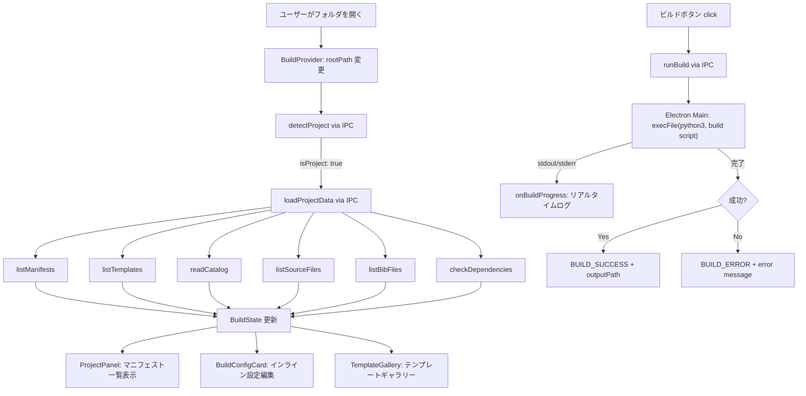
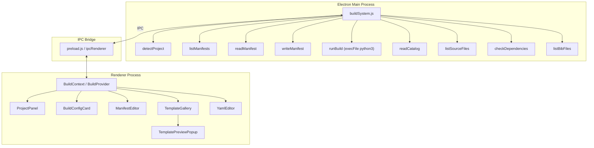
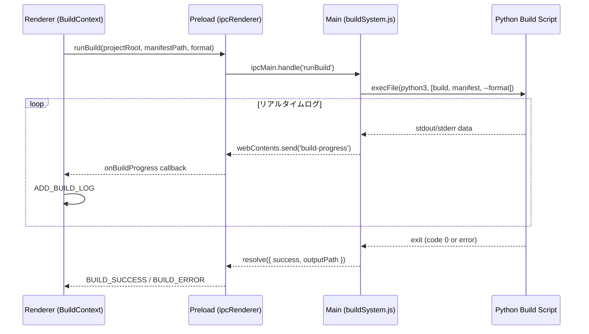

# ビルドシステム

## ステータス
実装済

## 概要
Markdown ドキュメントから PDF/DOCX を生成する報告書ビルドシステム。Electron メインプロセスで Python ビルドスクリプトを実行し、Pandoc + XeLaTeX (PDF) / python-docx (DOCX) によるドキュメント変換パイプラインを GUI から統合的に操作する。

## 現状 (As-Is)

### 実装済みの機能一覧
- **プロジェクト自動検出**: `build` スクリプト + `projects/` + `templates/` の存在でビルドプロジェクトを識別
- **マニフェスト管理**: YAML マニフェスト（`projects/*.yaml`）の一覧表示・読み込み・GUI 編集・保存
- **テンプレートカタログ**: `templates/catalog.yaml` からテンプレート情報を読み込み、ギャラリーUI で表示
- **ビルド実行**: Python ビルドスクリプトを `execFile` で実行、進捗ログのリアルタイムストリーミング
- **依存関係チェック**: `python3`, `pandoc`, `xelatex`, `python-docx`, `lxml` の存在確認
- **出力ファイル管理**: ビルド成果物の存在確認・アプリ内プレビュー（PDF）・外部アプリで開く
- **DOCX エンジン選択**: Pandoc エンジンと python-docx エンジンの切替
- **ソースファイル一覧**: `src/*.md` の再帰走査
- **BibTeX 対応**: `.bib` ファイルの検索・パース
- **テンプレートプレビュー**: PDF サムネイルによるテンプレートプレビュー
- **ビルドショートカット**: Cmd+Shift+B でビルド実行
- **BuildConfigCard**: エディタ上部にマニフェスト設定をインライン表示
- **ManifestEditor**: サイドバーでのマニフェスト詳細編集

### 使用ライブラリ・バージョン
| ライブラリ | バージョン | 用途 |
|---|---|---|
| js-yaml | ^4.1.1 | YAML マニフェストの読み書き |
| child_process (Node.js) | built-in | Python スクリプト実行 |
| @codemirror/lang-yaml | ^6.1.2 | YAML エディタのシンタックスハイライト |
| @codemirror/lint | ^6.9.3 | YAML リアルタイムバリデーション |

### 外部依存（システム要件）
| ツール | 用途 | 必須 |
|---|---|---|
| python3 | ビルドスクリプト実行 | Yes |
| pandoc | Markdown→PDF/DOCX 変換 | PDF/DOCX |
| xelatex | PDF 生成（日本語対応） | PDF のみ |
| python-docx | DOCX 直接生成エンジン | python-docx エンジン時 |
| lxml | python-docx の依存 | python-docx エンジン時 |

### 関連ファイル一覧
| ファイルパス | 行数 | 役割 |
|---|---|---|
| `electron/buildSystem.js` | 400 | Electron メインプロセス: ビルドロジック全体 |
| `src/contexts/BuildContext.tsx` | 322 | React 状態管理 (Context + Reducer) |
| `src/components/Sidebar/ProjectPanel.tsx` | 862 | サイドバーのビルドパネル UI |
| `src/components/Editor/BuildConfigCard.tsx` | 862 | エディタ上部のマニフェスト設定カード |
| `src/components/Editor/YamlEditor.tsx` | 318 | YAML ファイル専用エディタ（CodeMirror） |
| `src/components/Editor/TemplateGallery.tsx` | 338 | テンプレートギャラリー（グリッド表示） |
| `src/components/Editor/TemplatePreviewPopup.tsx` | 110 | テンプレート PDF プレビューポップアップ |
| `src/components/Sidebar/ManifestEditor.tsx` | 485 | サイドバーのマニフェスト詳細エディタ |
| `src/types/index.ts` | 303 | ビルド関連の型定義 |
| `src/codemirror/parsers/bibtex.ts` | - | BibTeX パーサー |

### データフロー図



## 仕様 (Specification)

### 機能要件

#### プロジェクト検出
`detectProject(dirPath)` は以下の条件で報告書ビルドプロジェクトを識別:
1. `dirPath` 直下に `build` (スクリプト) + `projects/` (ディレクトリ) + `templates/` (ディレクトリ) が存在
2. または `dirPath/report-build-system/` 配下に上記が存在（サブディレクトリ対応）

#### マニフェスト管理
- **一覧取得** (`listManifests`): `projects/*.yaml` を走査し、各ファイルをパースして以下を抽出:
  - `title`, `template`, `style`, `output` (配列), `sections` (配列), `sectionCount`
- **読み込み** (`readManifest`): YAML ファイルを `js-yaml.load` でパース
- **書き出し** (`writeManifest`): `js-yaml.dump` で YAML シリアライズ（`lineWidth: -1`, `noRefs: true`）
- **GUI 編集**: `BuildConfigCard` / `ManifestEditor` でインライン編集、変更は `BuildContext.updateManifestData` で即座に反映

#### ビルド実行
`runBuild(projectRoot, manifestPath, format, onProgress)`:
1. venv の Python を優先チェック (`<projectRoot>/.venv/bin/python3`)、なければシステム `python3`
2. `execFile(pythonCmd, [buildScript, manifestPath, --<format>])` を実行
   - `cwd`: projectRoot
   - `maxBuffer`: 10MB
   - `timeout`: 5分（300,000ms）
3. `stdout`/`stderr` を `onProgress` コールバックでリアルタイムストリーミング
4. 出力パス: `<projectRoot>/output/<manifestName>.<format>`
5. ビルド前にメモリ上のマニフェスト変更を自動保存

#### テンプレートカタログ
`readCatalog(dirPath)`: `templates/catalog.yaml` を読み込み、以下の構造を返却:
```yaml
templates:
  template-name:
    description: "テンプレートの説明"
    type: "report" | "paper" | "conference" | "minutes" | "proposal" | "techspec"
    styles: ["style1", "style2"]
    features: ["feature1", "feature2"]
    preview: "preview.pdf"
    bundle:
      pandoc:
        pdf: "template.tex"
        docx: "reference.docx"
      python-docx:
        docx: "template.docx"
```

#### 依存関係チェック
`checkDependencies()`:
- `which` コマンドで `python3`, `pandoc`, `xelatex` の存在を確認
- `python3 -c "import docx"` / `import lxml` で Python モジュールの利用可能性を確認

#### DOCX エンジン選択
マニフェストの `docx-engine` フィールドで切替:
- **pandoc** (デフォルト): Pandoc の `--reference-doc` によるテンプレート適用
- **python-docx**: Python スクリプトで直接 DOCX を生成

python-docx 固有設定 (`docx-direct`):
| フィールド | 型 | 説明 |
|---|---|---|
| `anchor-heading` | string | 注入開始位置の見出し |
| `chapter-prefix` | string/null | 図番号プレフィックス（例: "5" → 図5-1） |
| `crossref-mode` | 'seq'/'text' | 相互参照モード |
| `first-line-indent` | number (pt) | 段落の字下げ |
| `page-break-before-h2` | boolean | H2 前の改ページ |

#### ソースファイル管理
- `listSourceFiles(dirPath)`: `src/` 配下の `.md` ファイルを再帰走査
- `listBibFiles(dirPath)`: プロジェクト全体の `.bib` ファイルを再帰走査（`.git`, `node_modules` 除外）

### データ構造

#### BuildState
```typescript
interface BuildState {
  isProject: boolean;
  projectDir: string | null;
  manifests: ManifestInfo[];
  templates: TemplateInfo[];
  buildStatus: 'idle' | 'building' | 'success' | 'error';
  buildResult: BuildResult | null;
  buildLog: string[];
  dependencies: DependencyStatus | null;
  selectedManifestPath: string | null;
  manifestData: ManifestData | null;
  catalog: CatalogData | null;
  sourceFiles: string[];
  bibEntries: BibEntry[];
}
```

#### ManifestData
```typescript
interface ManifestData {
  title: string;
  subtitle?: string;
  author?: string | string[];
  date?: string;
  template: string;
  style?: string;
  output: string[];            // ['pdf', 'docx']
  sections: string[];          // ['src/chapter1.md', 'src/chapter2.md']
  lang?: string;
  toc?: boolean;
  organization?: string;
  version?: string;
  abstract?: string;
  'docx-engine'?: 'pandoc' | 'python-docx';
  'docx-direct'?: DocxDirectConfig;
}
```

#### BuildResult
```typescript
interface BuildResult {
  success: boolean;
  outputPath?: string;
  error?: string;
  stdout?: string;
  stderr?: string;
}
```

#### DependencyStatus
```typescript
interface DependencyStatus {
  python3: boolean;
  pandoc: boolean;
  xelatex: boolean;
  'python-docx'?: boolean;
  lxml?: boolean;
}
```

### API / インターフェース

#### BuildContext 提供値
```typescript
// 状態
isProject: boolean
projectDir: string | null
manifests: ManifestInfo[]
templates: TemplateInfo[]
buildStatus: BuildStatus
buildResult: BuildResult | null
buildLog: string[]
dependencies: DependencyStatus | null
selectedManifestPath: string | null
manifestData: ManifestData | null
catalog: CatalogData | null
sourceFiles: string[]
bibEntries: BibEntry[]

// アクション
detectProject(dirPath: string): Promise<void>
runBuild(manifestPath: string, format: string): Promise<void>
loadProjectData(dirPath: string): Promise<void>
selectManifest(path: string): Promise<void>
updateManifestData(data: ManifestData): void
saveManifest(path: string, data: ManifestData): Promise<boolean>
clearManifest(): void
refreshFromDisk(): void
```

#### Electron IPC エンドポイント
| チャネル | 方向 | パラメータ | 戻り値 |
|---|---|---|---|
| `detectProject` | R→M | `dirPath: string` | `{ isProject, projectDir }` |
| `listManifests` | R→M | `dirPath: string` | `{ success, manifests[] }` |
| `readManifest` | R→M | `manifestPath: string` | `{ success, data }` |
| `writeManifest` | R→M | `manifestPath, data` | `{ success }` |
| `listTemplates` | R→M | `dirPath: string` | `{ success, templates[] }` |
| `readCatalog` | R→M | `dirPath: string` | `{ success, catalog }` |
| `listSourceFiles` | R→M | `dirPath: string` | `{ success, files[] }` |
| `listBibFiles` | R→M | `dirPath: string` | `{ success, files[] }` |
| `checkDependencies` | R→M | (none) | `DependencyStatus` |
| `runBuild` | R→M | `projectRoot, manifestPath, format` | `BuildResult` |
| `onBuildProgress` | M→R | (event) | `string` (ログ行) |
| `onTriggerBuild` | M→R | (event) | (void) |

### キーボードショートカット
| ショートカット | 動作 |
|---|---|
| `Cmd+Shift+B` | 選択中マニフェストの最初の出力形式でビルド実行 |
| `Cmd+S` (YAML エディタ内) | マニフェスト保存 + BuildContext リフレッシュ |

## アーキテクチャ

### コンポーネント図



### 状態管理の流れ
1. **初期化**: `rootPath` 変更 → `detectProject()` → `SET_PROJECT` → `loadProjectData()` → 各種データ取得 → state更新
2. **マニフェスト選択**: `selectManifest(path)` → IPC `readManifest` → `SET_MANIFEST_DATA`
3. **マニフェスト編集**: UI操作 → `updateManifestData()` → `UPDATE_MANIFEST_DATA` (メモリのみ)
4. **マニフェスト保存**: `saveManifest()` → IPC `writeManifest` → 成功時 `loadProjectData()` で再読み込み
5. **ビルド実行**: `runBuild()` → 自動保存 → `BUILD_START` → IPC `runBuild` → `onProgress` ログ → `BUILD_SUCCESS`/`BUILD_ERROR`

### Electron IPC の構造



## 既知の課題・制約

- **ビルドスクリプト依存**: 外部の Python `build` スクリプトに完全依存。スクリプトの仕様変更で破損の可能性
- **タイムアウト固定**: 5分のハードコードされたタイムアウト。大規模ドキュメントで不足する場合がある
- **エラーメッセージ**: Python/Pandoc/XeLaTeX のエラーはそのまま表示。ユーザーフレンドリーなエラーハンドリングなし
- **並列ビルド非対応**: 同時に1つのビルドしか実行できない（UI で `buildStatus === 'building'` 時にボタンを無効化）
- **venv 検出のみ**: Conda、Poetry 等の仮想環境は未対応
- **出力パス規約**: `output/<manifestName>.<format>` の固定パス。カスタム出力先の指定不可
- **ビルドキャンセル**: 実行中のビルドをキャンセルする機能なし
- **増分ビルド**: 毎回フルビルド。変更されたセクションのみの再ビルドは未対応
- **テンプレートプレビュー**: PDF blob URL 方式のため、メモリリークの可能性（`URL.revokeObjectURL` は実装済みだがタイミング依存）

### VSCode/Obsidian との差分
| 機能 | Marginalia | VSCode | Obsidian |
|---|---|---|---|
| ビルドシステム | 統合型 (Python + Pandoc) | タスクランナー (tasks.json) | Pandoc プラグイン |
| テンプレート管理 | カタログ + ギャラリー UI | なし | なし |
| マニフェスト編集 | GUI (BuildConfigCard) | YAML 手動編集 | YAML 手動編集 |
| ビルドログ | リアルタイムストリーミング | ターミナル出力 | なし |
| DOCX エンジン | Pandoc / python-docx 選択 | Pandoc のみ | Pandoc のみ |

## ロードマップ (To-Be)

### Phase 1: 最小限の改善
- ビルドキャンセル機能（child_process.kill()）
- ビルドエラーの構造化パース（LaTeX エラー行の抽出・リンク）
- 出力ファイルのアプリ内 PDF プレビュー改善（ページナビゲーション）
- テンプレートの新規作成ウィザード

### Phase 2: 本格的な実装
- 増分ビルド（変更セクションの検出と部分再ビルド）
- カスタム出力パスの指定
- ビルドプロファイル（draft/final モード切替）
- Pandoc フィルター・Lua フィルターの GUI 設定
- Docker コンテナでのビルド実行（環境依存の排除）

### Phase 3: 高度な機能
- CI/CD 連携（GitHub Actions ワークフロー生成）
- テンプレートマーケットプレイス（リモートテンプレートのインストール）
- ビルド結果の差分比較（前回ビルドとの PDF diff）
- マルチフォーマット同時ビルド（PDF + DOCX + HTML の並列生成）
- LaTeX 中間ファイルのデバッグビュー
