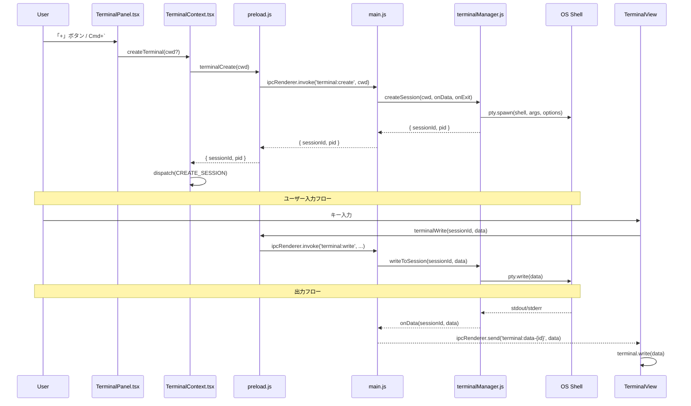
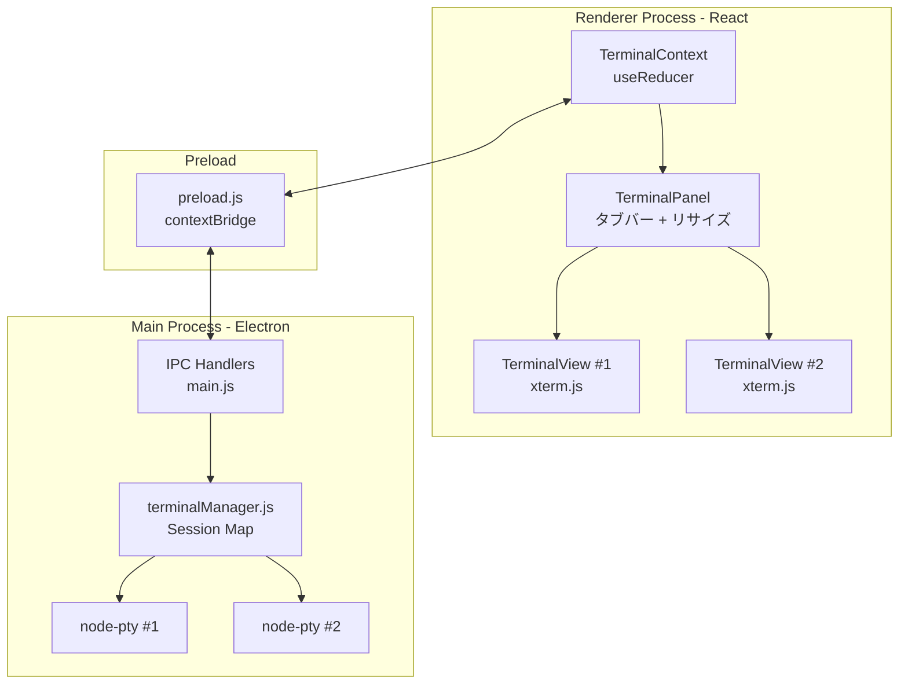

# ターミナル統合

## ステータス
実装済

## 概要
Marginalia に統合されたターミナルエミュレータ。エディタ画面下部にボトムパネルとして表示され、複数セッションをタブ切り替えで運用できる。VSCode のターミナルパネルに類似した UX を提供する。

## 現状 (As-Is)

### 実装済みの機能
- PTY ベースのターミナルセッション（node-pty）
- xterm.js によるターミナルレンダリング（256色対応）
- 複数セッション管理（タブ切り替え）
- セッション作成 / 破棄
- パネルのリサイズ（ドラッグ）
- パネルの表示 / 非表示トグル
- Electron メニューからの新規ターミナル作成 (`Cmd+\``)
- プロセス終了時の自動通知
- ResizeObserver による自動 fit
- URL の自動リンク化（WebLinksAddon）
- アプリ終了時の全セッション一括破棄

### 使用ライブラリ

| パッケージ | バージョン | 役割 |
|---|---|---|
| `node-pty` | ^1.0.0 | 擬似端末プロセス管理 |
| `@xterm/xterm` | ^5.5.0 | ターミナルエミュレータ UI |
| `@xterm/addon-fit` | ^0.10.0 | コンテナサイズへの自動フィット |
| `@xterm/addon-web-links` | ^0.11.0 | URL の自動リンク化 |

### 関連ファイル一覧

| ファイル | 行数 | 役割 |
|---|---|---|
| `electron/terminalManager.js` | 64行 | PTY セッション管理（Electron メインプロセス） |
| `electron/main.js` | 432行 | IPC ハンドラ登録（terminal:create/write/resize/destroy） |
| `electron/preload.js` | 106行 | Renderer に公開する terminal API |
| `src/contexts/TerminalContext.tsx` | 149行 | ターミナル状態管理（React Context + useReducer） |
| `src/components/Terminal/TerminalPanel.tsx` | 176行 | ボトムパネル UI（タブバー + リサイズハンドル） |
| `src/components/Terminal/TerminalView.tsx` | 143行 | 個別セッションの xterm レンダリング |
| `src/types/index.ts` | 303行 | ElectronAPI 型定義（ターミナル関連） |

### データフロー図



## 仕様 (Specification)

### 機能要件

1. **セッション管理**: 任意数のターミナルセッションを同時に開ける
2. **タブ UI**: セッションごとにタブ表示。アクティブタブの切り替え、個別クローズが可能
3. **リサイズ**: パネル上端のドラッグハンドルで高さを 100px〜600px の範囲で変更可能
4. **自動 fit**: ウィンドウリサイズ時に xterm のカラム数・行数が自動調整される
5. **プロセス終了通知**: シェルプロセス終了時に `[Process exited]` メッセージを表示
6. **アプリ終了時クリーンアップ**: `will-quit` イベントで全 PTY を一括 kill

### データ構造

```typescript
// TerminalContext の状態
interface TerminalState {
  sessions: TerminalSession[];    // 全セッション
  activeSessionId: string | null; // アクティブなセッションID
  bottomPanelOpen: boolean;       // パネル表示状態
  bottomPanelHeight: number;      // パネル高さ (px)
}

interface TerminalSession {
  id: string;     // UUID (crypto.randomUUID)
  title: string;  // タブ表示名 (例: "Terminal 1")
  pid: number;    // PTY の OS プロセスID
}
```

### API / インターフェース

#### Electron IPC チャンネル

| チャンネル | 方向 | 引数 | 戻り値 |
|---|---|---|---|
| `terminal:create` | Renderer -> Main | `cwd?: string` | `{ sessionId: string, pid: number }` |
| `terminal:write` | Renderer -> Main | `sessionId: string, data: string` | `void` |
| `terminal:resize` | Renderer -> Main | `sessionId: string, cols: number, rows: number` | `void` |
| `terminal:destroy` | Renderer -> Main | `sessionId: string` | `void` |
| `terminal:data-{id}` | Main -> Renderer | `data: string` | - (イベント) |
| `terminal:exit-{id}` | Main -> Renderer | `exitCode: number, signal: number` | - (イベント) |
| `new-terminal` | Main -> Renderer | - | - (メニューイベント) |

#### TerminalContext API

| メソッド | 引数 | 説明 |
|---|---|---|
| `createTerminal` | `cwd?: string` | 新規セッション作成 |
| `destroyTerminal` | `sessionId: string` | セッション破棄 |
| `setActiveSession` | `sessionId: string` | アクティブセッション切替 |
| `toggleBottomPanel` | - | パネル表示トグル |
| `setBottomPanelHeight` | `h: number` | パネル高さ設定 |
| `setSessionTitle` | `sessionId: string, title: string` | タブタイトル変更 |

### キーボードショートカット

| ショートカット | 動作 | 定義場所 |
|---|---|---|
| `Cmd+\`` (バッククォート) | 新規ターミナル作成 | `electron/main.js:103-109` |

## アーキテクチャ

### コンポーネント図



### 状態管理の流れ

1. `TerminalContext` は `useReducer` パターンを使用
2. アクション: `CREATE_SESSION`, `DESTROY_SESSION`, `SET_ACTIVE_SESSION`, `TOGGLE_BOTTOM_PANEL`, `SET_BOTTOM_PANEL_HEIGHT`, `SET_SESSION_TITLE`
3. セッション作成時に自動で `bottomPanelOpen = true` に設定
4. 最後のセッション破棄時に自動で `bottomPanelOpen = false` に設定
5. アクティブセッション破棄時は残存セッションの末尾に自動切替

### Electron IPC の構造

- **invoke/handle パターン**: `terminal:create`, `terminal:write`, `terminal:resize`, `terminal:destroy`
- **send/on パターン**: `terminal:data-{sessionId}`, `terminal:exit-{sessionId}` (PTY -> Renderer のストリーミング)
- **メニューイベント**: `new-terminal` (メニューバー -> Renderer)

### PTY 設定

```javascript
{
  name: 'xterm-256color',
  cols: 80,
  rows: 24,
  cwd: cwd || process.env.HOME,
  env: { ...process.env, TERM: 'xterm-256color' }
}
```

- macOS/Linux: `process.env.SHELL` または `/bin/zsh`、引数 `['-l']`（ログインシェル）
- Windows: `powershell.exe`、引数なし

### xterm.js 設定

```javascript
{
  fontSize: 13,
  fontFamily: 'Menlo, Monaco, "Courier New", monospace',
  cursorBlink: true,
  allowProposedApi: true,
  theme: { /* VSCode-like dark theme */ }
}
```

## 既知の課題・制約

1. **タイトル自動更新なし**: セッションタイトルは「Terminal N」の連番固定。実行中コマンドやカレントディレクトリの反映がない
2. **検索機能なし**: xterm.js の SearchAddon が未導入
3. **テーマ連動なし**: ターミナルテーマはハードコードで、アプリのライト/ダークテーマと連動しない
4. **コピー&ペースト**: xterm.js デフォルトの選択コピーのみ。明示的なコピー/ペーストボタンなし
5. **シリアライゼーション未対応**: セッション内容はアプリ再起動で消失（SerializeAddon 未導入）
6. **リスナーリーク懸念**: `ipcRenderer.removeAllListeners` でチャンネル全体のリスナーを削除しているため、同一チャンネルに複数リスナーがある場合に問題になりうる
7. **プロファイル設定なし**: シェルやフォントサイズ等をユーザーが設定パネルから変更できない
8. **分割表示なし**: ターミナルの横分割・縦分割は未対応

### VSCode / Obsidian との差分

| 機能 | VSCode | Obsidian | Marginalia |
|---|---|---|---|
| 複数セッション | ○ | - (プラグイン) | ○ |
| タブ UI | ○ | - | ○ |
| 分割ペイン | ○ | - | ✕ |
| テーマ連動 | ○ | - | ✕ |
| 検索 (Cmd+F) | ○ | - | ✕ |
| プロファイル設定 | ○ | - | ✕ |
| シリアライゼーション | ✕ | - | ✕ |
| カスタムシェル指定 | ○ | - | ✕ |

## ロードマップ (To-Be)

### Phase 1: 最小限の改善
- SearchAddon 導入（ターミナル内検索 `Cmd+F`）
- アプリテーマとの連動（ダーク/ライト切替）
- タイトルの自動更新（OSC シーケンスによるカレントディレクトリ表示）

### Phase 2: 本格的な実装
- 設定パネルからのターミナル設定（フォントサイズ、フォントファミリー、デフォルトシェル）
- ターミナル分割表示（水平/垂直）
- Unicode/IME 入力の改善（Unicode11Addon）
- クリップボード操作の明示的 UI

### Phase 3: 高度な機能
- SerializeAddon によるセッション永続化・復元
- シェルプロファイル管理（bash, zsh, fish 等の切替）
- ターミナルから特定ファイル・行へのジャンプ（コンパイラ出力のクリッカブルリンク）
- タスク統合（ビルドタスクの出力をターミナルに統合表示）
