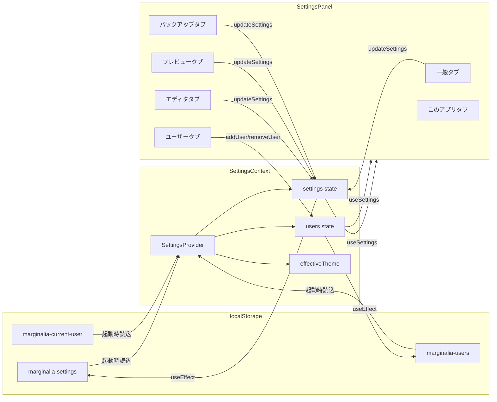
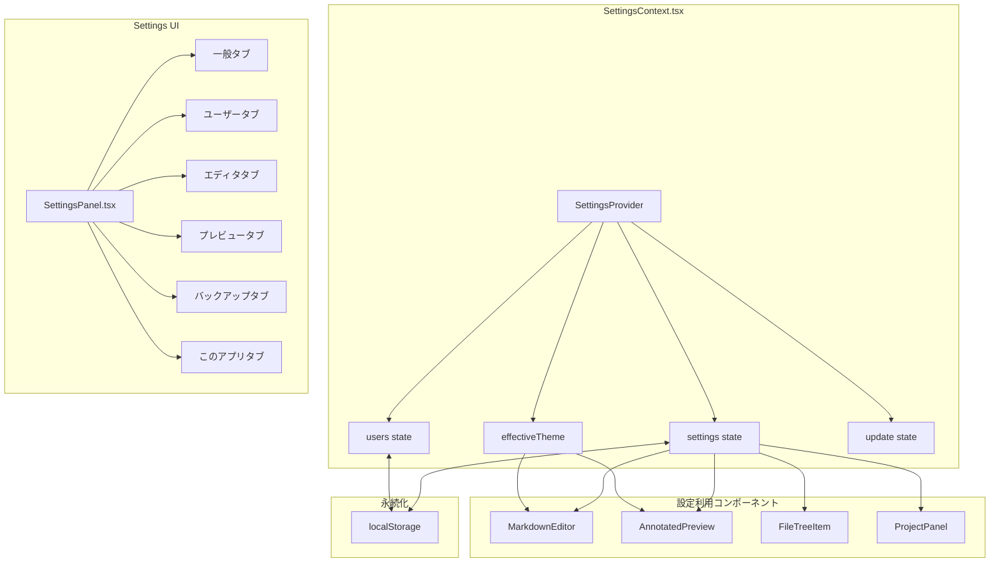

# 設定・テーマ・ユーザー管理

## ステータス
実装済

## 概要
アプリケーション全体の設定管理を提供する。エディタ、プレビュー、バックアップ、UI テーマ、ファイル表示、開発者設定の各カテゴリを localStorage ベースで永続化し、ユーザー管理（マルチユーザー切替、注釈者カラー）と自動アップデート機能を統合する。

## 現状 (As-Is)

### 実装済みの機能

#### 設定管理
- カテゴリ別設定（エディタ / プレビュー / バックアップ / UI / 開発者 / ファイル表示）
- ドットパス記法による更新 API（例: `updateSettings('editor.fontSize', 16)`）
- デフォルト値との深いマージ（新バージョンで追加された設定項目を自動補完）
- 設定のエクスポート（JSON ファイルダウンロード）/ インポート（JSON ファイル読み込み）
- 設定リセット（デフォルト値に戻す）

#### テーマ
- ダーク / ライト / システム連動の 3 モード
- `prefers-color-scheme` メディアクエリの監視による動的テーマ切替
- CSS カスタムプロパティ（`var(--bg-primary)` 等）によるテーマ適用

#### ユーザー管理
- マルチユーザー対応（注釈の作成者を識別）
- ユーザー追加 / 削除 / 切替
- ユーザー名・ハイライトカラーの変更
- 8 色のプリセットカラー
- デフォルトユーザー（削除不可）

#### 自動アップデート
- GitHub Releases ベースのアップデート確認
- アップデートのダウンロード（進捗バー表示）
- ダウンロード完了後のインストール・再起動
- Electron アプリ限定機能の判定

### 使用ライブラリ

| パッケージ | バージョン | 役割 |
|---|---|---|
| `uuid` | ^9.0.1 | ユーザー ID の生成（v4 UUID） |
| `electron-updater` | ^6.7.3 | 自動アップデート基盤 |

### 関連ファイル一覧

| ファイル | 行数 | 役割 |
|---|---|---|
| `src/contexts/SettingsContext.tsx` | 465行 | 設定・テーマ・ユーザー・アップデートの状態管理 |
| `src/components/Settings/SettingsPanel.tsx` | 1109行 | 設定 UI（モーダル、タブ切替） |
| `src/types/index.ts` | 303行 | 設定関連の型定義 |

### 保存形式

全データを **localStorage** に保存。ファイルベースの設定保存は未実装。

| localStorage キー | 内容 | 形式 |
|---|---|---|
| `marginalia-settings` | アプリ設定全体 | JSON 文字列 |
| `marginalia-users` | ユーザー一覧 | JSON 配列 |
| `marginalia-current-user` | 現在のユーザーID | 文字列 |

### データフロー図



## 仕様 (Specification)

### 機能要件

#### 設定カテゴリと項目

##### エディタ設定 (`settings.editor`)

| 項目 | キー | 型 | デフォルト値 | UI コントロール |
|---|---|---|---|---|
| フォントサイズ | `fontSize` | number | 14 | number input (10-24) |
| タブサイズ | `tabSize` | number | 2 | select (2 / 4) |
| 行の折り返し | `wordWrap` | boolean | true | checkbox |
| 行番号表示 | `lineNumbers` | boolean | true | checkbox |
| 自動保存 | `autoSave` | boolean | true | checkbox |
| 自動保存間隔 | `autoSaveInterval` | number (ms) | 30000 | number input (5-300秒) |
| ミニマップ表示 | `showMinimap` | boolean | true | (設定パネル未掲載) |
| スクロール同期 | `scrollSync` | boolean | true | (設定パネル未掲載) |
| ツールバー表示 | `showToolbar` | boolean | false | (設定パネル未掲載) |

##### プレビュー設定 (`settings.preview`)

| 項目 | キー | 型 | デフォルト値 | UI コントロール |
|---|---|---|---|---|
| フォントサイズ | `fontSize` | number | 16 | number input (12-24) |
| 行間 | `lineHeight` | number | 1.6 | select (1.4/1.6/1.8/2.0) |
| 注釈サイドバー表示 | `showAnnotationSidebar` | boolean | true | checkbox |

##### バックアップ設定 (`settings.backup`)

| 項目 | キー | 型 | デフォルト値 | UI コントロール |
|---|---|---|---|---|
| バックアップ有効 | `enabled` | boolean | true | checkbox |
| 最大バックアップ数 | `maxBackups` | number | 20 | number input (5-100) |
| 保存時自動バックアップ | `autoBackupOnSave` | boolean | true | checkbox |

##### UI 設定 (`settings.ui`)

| 項目 | キー | 型 | デフォルト値 | UI コントロール |
|---|---|---|---|---|
| カラーテーマ | `theme` | 'dark' \| 'light' \| 'system' | 'dark' | select |
| サイドバー幅 | `sidebarWidth` | number | 250 | (設定パネル未掲載) |
| 注釈パネル幅 | `annotationPanelWidth` | number | 300 | (設定パネル未掲載) |
| 起動時ウェルカム表示 | `showWelcomeOnStartup` | boolean | true | (設定パネル未掲載) |

##### 開発者設定 (`settings.developer`)

| 項目 | キー | 型 | デフォルト値 | UI コントロール |
|---|---|---|---|---|
| DevTools 有効 | `enableDevTools` | boolean | true | (設定パネル未掲載) |
| 詳細ログ | `verboseLogging` | boolean | false | (設定パネル未掲載) |
| デバッグ情報表示 | `showDebugInfo` | boolean | false | (設定パネル未掲載) |

##### ファイル表示設定 (`settings.files`)

| 項目 | キー | 型 | デフォルト値 | UI コントロール |
|---|---|---|---|---|
| 隠しファイル表示 | `showHiddenFiles` | boolean | false | checkbox |

### データ構造

```typescript
// 設定全体
interface Settings {
  editor: EditorSettings;
  preview: PreviewSettings;
  backup: BackupSettings;
  ui: UISettings;
  developer: DeveloperSettings;
  files: FilesSettings;
}

// ユーザー
interface User {
  id: string;     // UUID v4
  name: string;   // 表示名
  color: string;  // ハイライトカラー (#hex)
}

// プリセットカラー
const USER_COLORS = [
  '#3b82f6', // Blue
  '#ef4444', // Red
  '#22c55e', // Green
  '#f59e0b', // Amber
  '#8b5cf6', // Purple
  '#ec4899', // Pink
  '#06b6d4', // Cyan
  '#f97316', // Orange
];
```

### API / インターフェース

#### SettingsContext 公開 API

| プロパティ/メソッド | 型 | 説明 |
|---|---|---|
| `settings` | `Settings` | 現在の設定値 |
| `updateSettings(path, value)` | `(string, any) => void` | ドットパスで設定を更新 |
| `resetSettings()` | `() => void` | デフォルトにリセット |
| `isSettingsOpen` | `boolean` | 設定パネルの開閉状態 |
| `openSettings()` | `() => void` | 設定パネルを開く |
| `closeSettings()` | `() => void` | 設定パネルを閉じる |
| `exportSettings()` | `() => void` | JSON ファイルとしてダウンロード |
| `importSettings(json)` | `(string) => { success: boolean; error?: string }` | JSON 文字列からインポート |
| `effectiveTheme` | `'dark' \| 'light'` | 実効テーマ（system 解決後） |
| `users` | `User[]` | ユーザー一覧 |
| `currentUser` | `User` | 現在のユーザー |
| `currentUserId` | `string` | 現在のユーザーID |
| `addUser(name, color)` | `(string, string) => User` | ユーザー追加 |
| `removeUser(userId)` | `(string) => boolean` | ユーザー削除 |
| `switchUser(userId)` | `(string) => void` | ユーザー切替 |
| `updateUserName(name)` | `(string) => void` | 現在のユーザー名を更新 |
| `updateUserColor(color)` | `(string) => void` | 現在のユーザーカラーを更新 |
| `checkForUpdates()` | `() => Promise<null>` | アップデート確認 |
| `downloadUpdate()` | `() => Promise<void>` | アップデートダウンロード |
| `installUpdate()` | `() => Promise<void>` | インストール・再起動 |
| `updateStatus` | `string \| null` | アップデートステータス |
| `isDownloading` | `boolean` | ダウンロード中フラグ |
| `downloadProgress` | `number` | ダウンロード進捗 (0-100) |
| `appVersion` | `string` | アプリバージョン |
| `isElectronApp` | `boolean` | Electron 環境かどうか |

#### Electron IPC（アップデート関連）

| チャンネル | 方向 | 説明 |
|---|---|---|
| `update:check` | Renderer -> Main | アップデート確認 |
| `update:download` | Renderer -> Main | ダウンロード開始 |
| `update:install` | Renderer -> Main | インストール実行 |
| `update:restart` | Renderer -> Main | アプリ再起動 |
| `update-progress` | Main -> Renderer | ダウンロード進捗通知 |

### 設定パネル UI タブ

| タブID | ラベル | 含まれる設定 |
|---|---|---|
| `general` | 一般 | 隠しファイル表示、カラーテーマ、データ管理（エクスポート/インポート/リセット） |
| `user` | ユーザー | 現在のユーザー情報、表示名変更、カラー変更、チームメンバー一覧、追加/削除/切替 |
| `editor` | エディタ | フォントサイズ、タブサイズ、行折り返し、行番号、自動保存 |
| `preview` | プレビュー | フォントサイズ、行間、注釈サイドバー |
| `backup` | バックアップ | バックアップ有効/無効、最大数、自動バックアップ |
| `about` | このアプリ | アップデート確認・ダウンロード・インストール、バージョン情報、外部リンク |

## アーキテクチャ

### コンポーネント図



### 状態管理の流れ

1. **起動時**: localStorage から設定・ユーザーを読み込み、`deepMerge` でデフォルト値とマージ
2. **更新時**: `updateSettings(path, value)` がドットパス文字列を分解して深いネストまで不変更新
3. **保存時**: `useEffect` で `settings` / `users` / `currentUserId` の変更を監視し、localStorage に自動保存
4. **テーマ**: `prefers-color-scheme` の MediaQueryList を監視し、`system` テーマ選択時に動的に `effectiveTheme` を切替

### 設定のマージアルゴリズム

```
deepMerge(defaults, saved):
  - 保存済み設定に存在するキーは保存値を採用
  - 保存済み設定に存在しないキーはデフォルト値を補完
  - ネストされたオブジェクトは再帰的にマージ
  - 配列は保存値で完全上書き（マージなし）
```

## 既知の課題・制約

1. **localStorage 依存**: 設定がブラウザストレージに保存されるため、Electron アプリの再インストールや別端末で設定が共有できない
2. **型安全性不足**: `SettingsContext` の `createContext(null)` で型パラメータが未指定。`updateSettings` の `path` と `value` が `any` 型
3. **設定パネル未掲載項目**: `showMinimap`, `scrollSync`, `showToolbar`, `sidebarWidth`, `annotationPanelWidth`, `showWelcomeOnStartup`, 開発者設定 がパネルから変更不可
4. **テーマ選択肢**: 設定パネルでは `dark` / `light` の 2 択のみ（`system` 選択肢がコードには存在するが UI に未表示）
5. **バリデーション不足**: 数値入力に対する範囲チェックは HTML の `min`/`max` 属性のみ。不正な JSON インポートに対するスキーマ検証なし
6. **ユーザー管理の制限**: 現在のユーザーは削除不可。最後の 1 人も削除不可。ユーザー名の重複チェックなし
7. **アップデート機能**: ブラウザ実行時は自動アップデートが利用不可（Electron 限定）

### VSCode / Obsidian との差分

| 機能 | VSCode | Obsidian | Marginalia |
|---|---|---|---|
| 設定保存先 | JSON ファイル | JSON ファイル | localStorage |
| 設定検索 | ○ | ○ | ✕ |
| 設定同期 | ○ (Settings Sync) | ○ (Obsidian Sync) | ✕ |
| カスタムテーマ | ○ (拡張機能) | ○ (CSS) | ✕ |
| キーバインド設定 | ○ (keybindings.json) | ○ (ホットキー設定) | ✕ |
| ワークスペース設定 | ○ | ○ (Vault 単位) | ✕ |
| プロファイル | ○ | ✕ | ✕ |
| ユーザー管理 | ✕ (Live Share) | ✕ | ○ |

## ロードマップ (To-Be)

### Phase 1: 最小限の改善
- 設定パネルに未掲載項目を追加（ミニマップ、スクロール同期、ツールバー表示、テーマの system 選択肢）
- `updateSettings` の型安全化（パス文字列をテンプレートリテラル型に）
- 設定のファイルベース保存（`~/.marginalia/settings.json`）への移行準備

### Phase 2: 本格的な実装
- 設定検索機能（VSCode 風のフィルタリング）
- ワークスペース固有設定（プロジェクトルートに `.marginalia/settings.json`）
- カスタム CSS テーマの読み込み
- キーバインド設定 UI

### Phase 3: 高度な機能
- 設定同期（GitHub Gist / クラウドストレージ経由）
- 設定のプロファイル機能（用途別プリセット切替）
- テーマエディタ（GUI でカスタムテーマを作成）
- プラグインごとの設定スキーマ登録
