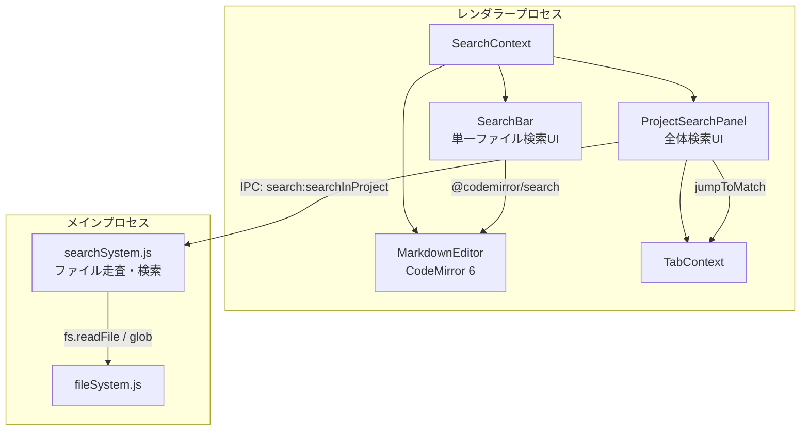

# 検索・置換 (Search & Replace)

## ステータス
未実装

## 概要
エディタ内のテキスト検索・置換と、プロジェクト全体のファイル横断検索を提供する機能。CodeMirror 6 の `@codemirror/search` を単一ファイル検索に活用し、プロジェクト全体検索は Electron メインプロセス側でファイルシステムを走査して実現する。

## 現状 (As-Is)
- CodeMirror 6 を使用中だが、`@codemirror/search` 拡張は未導入
- `@codemirror/state`, `@codemirror/view`, `@codemirror/lang-markdown` 等は既に依存関係に含まれる
- `MarkdownEditor.tsx` にて `EditorState.create` で extensions を構成しているが、検索関連の拡張は含まれていない
- ファイル読み込みは `electron/fileSystem.js` 経由で `fs:readFile` IPC を使用
- ファイルツリーは `FileContext.tsx` の `fileTree: FileTreeNode[]` で管理

## 仕様 (Specification)

### 機能要件

#### 単一ファイル検索 (In-File Search)
- テキスト検索（インクリメンタルサーチ）
- 正規表現検索
- 大文字小文字の区別オプション
- 単語単位の一致オプション
- マッチ件数の表示（例: "3/15"）
- マッチ間のナビゲーション（次へ / 前へ）
- 検索テキストのハイライト表示

#### 単一ファイル置換 (In-File Replace)
- 単一置換（現在のマッチを置換）
- 全置換（すべてのマッチを一括置換）
- 置換プレビュー
- Undo/Redo との統合（置換操作は CodeMirror の history に記録）

#### プロジェクト全体検索 (Project-Wide Search)
- プロジェクトルート配下の全ファイルを対象とした全文検索
- ファイル拡張子フィルタ（例: `.md`, `.yaml` のみ）
- 除外パターン（例: `node_modules`, `.git`, `.marginalia`）
- 検索結果のファイルごとのグループ表示
- 検索結果からのファイルジャンプ（タブで開いて該当行にスクロール）
- マッチ件数の集計表示

#### プロジェクト全体置換 (Project-Wide Replace) - Phase 2
- 全ファイルを対象とした置換
- 変更プレビュー（diff 表示）
- ファイル単位での置換可否選択

### データ構造

```typescript
// src/types/index.ts に追加

// --- 単一ファイル検索 ---

export interface SearchQuery {
  search: string;
  replace: string;
  caseSensitive: boolean;
  regexp: boolean;
  wholeWord: boolean;
}

// --- プロジェクト全体検索 ---

export interface ProjectSearchQuery {
  search: string;
  replace: string;
  caseSensitive: boolean;
  regexp: boolean;
  wholeWord: boolean;
  includePattern: string;   // glob パターン（例: "*.md,*.yaml"）
  excludePattern: string;   // glob パターン（例: "node_modules,.git"）
}

export interface ProjectSearchMatch {
  line: number;
  column: number;
  length: number;
  lineContent: string;      // マッチを含む行の全テキスト
  contextBefore?: string;   // 前の行（コンテキスト表示用）
  contextAfter?: string;    // 後の行（コンテキスト表示用）
}

export interface ProjectSearchFileResult {
  filePath: string;
  fileName: string;
  matches: ProjectSearchMatch[];
  matchCount: number;
}

export interface ProjectSearchResult {
  query: ProjectSearchQuery;
  files: ProjectSearchFileResult[];
  totalMatches: number;
  totalFiles: number;
  searchDurationMs: number;
}

export interface ProjectReplacePreview {
  filePath: string;
  fileName: string;
  replacements: Array<{
    line: number;
    original: string;
    replaced: string;
  }>;
  selected: boolean;        // 置換対象に含めるか
}
```

### API / インターフェース

#### SearchContext (React Context)

```typescript
// src/contexts/SearchContext.tsx

interface SearchContextValue {
  // 単一ファイル検索の状態
  isSearchOpen: boolean;
  isReplaceOpen: boolean;
  searchQuery: SearchQuery;

  // プロジェクト全体検索の状態
  isProjectSearchOpen: boolean;
  projectSearchQuery: ProjectSearchQuery;
  projectSearchResult: ProjectSearchResult | null;
  isSearching: boolean;

  // 単一ファイル検索アクション
  openSearch: () => void;
  openReplace: () => void;
  closeSearch: () => void;
  updateSearchQuery: (query: Partial<SearchQuery>) => void;
  findNext: () => void;
  findPrevious: () => void;
  replaceNext: () => void;
  replaceAll: () => void;

  // プロジェクト全体検索アクション
  openProjectSearch: () => void;
  closeProjectSearch: () => void;
  updateProjectSearchQuery: (query: Partial<ProjectSearchQuery>) => void;
  executeProjectSearch: () => Promise<void>;
  cancelProjectSearch: () => void;
  jumpToMatch: (filePath: string, line: number) => void;
}
```

#### Electron IPC (プロジェクト全体検索)

```typescript
// ElectronAPI に追加
interface ElectronAPI {
  // ... 既存のAPI ...

  // プロジェクト全体検索
  searchInProject: (
    rootPath: string,
    query: ProjectSearchQuery
  ) => Promise<ProjectSearchResult>;

  // プロジェクト全体置換（Phase 2）
  replaceInProject: (
    rootPath: string,
    query: ProjectSearchQuery,
    selectedFiles: string[]
  ) => Promise<{ success: boolean; modifiedFiles: number; error?: string }>;
}
```

```javascript
// electron/main.js に追加する IPC ハンドラ
ipcMain.handle('search:searchInProject', async (event, rootPath, query) => {
  return await searchSystem.searchInProject(rootPath, query);
});

ipcMain.handle('search:replaceInProject', async (event, rootPath, query, selectedFiles) => {
  return await searchSystem.replaceInProject(rootPath, query, selectedFiles);
});
```

```javascript
// electron/preload.js に追加
searchInProject: (rootPath, query) =>
  ipcRenderer.invoke('search:searchInProject', rootPath, query),
replaceInProject: (rootPath, query, selectedFiles) =>
  ipcRenderer.invoke('search:replaceInProject', rootPath, query, selectedFiles),
```

### キーボードショートカット

| 操作 | ショートカット |
|------|---------------|
| ファイル内検索 | `Cmd+F` / `Ctrl+F` |
| ファイル内置換 | `Cmd+H` / `Ctrl+H` |
| 次のマッチ | `Enter` / `Cmd+G` |
| 前のマッチ | `Shift+Enter` / `Cmd+Shift+G` |
| プロジェクト全体検索 | `Cmd+Shift+F` / `Ctrl+Shift+F` |
| 検索を閉じる | `Escape` |

## アーキテクチャ

### コンポーネント図



### 状態管理の流れ

```
[単一ファイル検索]
  Cmd+F → SearchContext.openSearch()
    → CodeMirror openSearchPanel (ビルトイン)
    → @codemirror/search が EditorView 内で検索を処理
    → マッチハイライト・ナビゲーションは CodeMirror 側で完結

[プロジェクト全体検索]
  Cmd+Shift+F → SearchContext.openProjectSearch()
    → ProjectSearchPanel (サイドバー or パネル) を表示
    → ユーザーがクエリ入力 → executeProjectSearch()
    → IPC: search:searchInProject → Electron メインプロセスで走査
    → 結果を SearchContext.projectSearchResult に格納
    → ProjectSearchPanel でファイルごとにグループ表示
    → クリック → jumpToMatch() → TabContext.openTab() + scrollToLine
```

### Electron IPC の構造

```
[プロジェクト全体検索]
Renderer                          Main
   |                               |
   |-- search:searchInProject ---->|
   |   (rootPath, query)           |--- glob でファイル一覧取得
   |                               |--- 各ファイルを読み込み
   |                               |--- 正規表現 / 文字列でマッチ検索
   |                               |--- ProjectSearchResult を構築
   |<-- result ------------------- |
   |                               |
   |-- search:replaceInProject --->| (Phase 2)
   |   (rootPath, query, files)    |--- 対象ファイルを読み書き
   |<-- { success, count } --------|
```

## 既知の課題・制約

### 実装時の注意点
- **CodeMirror の検索パネルのスタイリング**: `@codemirror/search` はデフォルトの検索 UI を提供するが、Marginalia のダークテーマに合わせたカスタム CSS が必要
- **大規模プロジェクトでの性能**: プロジェクト全体検索では数百ファイルを走査する可能性がある。Node.js の `fs.readFile` を並列実行し、結果をストリーミング的に返すことを検討
- **バイナリファイルの除外**: 画像・PDF 等のバイナリファイルを検索対象から除外するロジックが必要
- **文字コード**: UTF-8 以外のファイルへの対応は初期スコープ外
- **マルチタブ環境**: キャッシュ上の未保存コンテンツと、ディスク上のファイルの不一致に注意。未保存の変更がある場合はキャッシュ内容で検索すべき

### VSCode / Obsidian との機能差分
- **VSCode**: ripgrep を内蔵し高速な全体検索を実現。Marginalia では初期は Node.js ベースの走査とし、将来的に ripgrep バイナリの同梱を検討
- **VSCode**: 検索結果のインライン編集が可能。Marginalia では Phase 1 ではクリックジャンプのみ
- **Obsidian**: ファイル名検索と本文検索を統合した Quick Switcher を持つ。Marginalia ではコマンドパレット（10-command-palette.md）で対応

## ロードマップ (To-Be)

### Phase 1: 最小限の実装 (MVP)
- `@codemirror/search` 拡張の導入（ファイル内検索・置換）
- CodeMirror 検索パネルの Marginalia テーマ対応 CSS
- `Cmd+F` / `Cmd+H` ショートカットの設定
- 新規ファイル: なし（CodeMirror ビルトイン機能を有効化するだけ）
- 変更ファイル: `src/components/Editor/MarkdownEditor.tsx`（extensions に search() を追加）

### Phase 2: プロジェクト全体検索
- `electron/searchSystem.js` の新規作成（ファイル走査ロジック）
- `src/contexts/SearchContext.tsx` の新規作成
- `src/components/Search/ProjectSearchPanel.tsx` の新規作成
- サイドバーまたは下部パネルに検索結果一覧を表示
- 検索結果からのファイルジャンプ（TabContext 連携）
- `Cmd+Shift+F` ショートカットの設定
- Electron IPC: `search:searchInProject` ハンドラ追加

### Phase 3: 高度な機能
- プロジェクト全体置換（変更プレビュー付き）
- ripgrep バイナリの同梱による高速検索
- 検索履歴の保持
- 正規表現のリアルタイムバリデーション表示
- 検索結果のエクスポート
- ファイルコンテンツキャッシュとの統合（未保存ファイルの検索）
