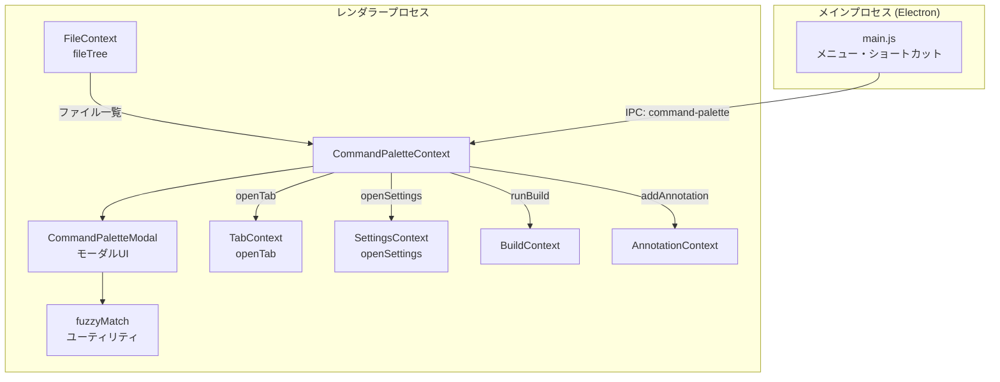

# コマンドパレット・クイックオープン (Command Palette & Quick Open)

## ステータス
未実装

## 概要
VSCode 風の `Cmd+Shift+P` コマンドパレットと、Obsidian 風の `Cmd+P` クイックオープン（ファイルを素早く開く）を提供する統合的なモーダル UI。アプリ内の主要操作をキーボードだけで実行可能にし、ファイル間のナビゲーションを高速化する。

## 現状 (As-Is)
- コマンドパレットに相当する機能は未実装
- ファイルオープンはサイドバーのファイルツリーからのクリックのみ
- キーボードショートカットは個別にハードコードされている（`Cmd+S` で保存、`Ctrl+Tab` でタブ切り替え等）
- `TabContext.tsx` の `openTab()` でファイルをタブとして開く仕組みが存在
- `FileContext.tsx` の `fileTree: FileTreeNode[]` でプロジェクト内のファイル構造を保持
- `SettingsContext.tsx` に `openSettings()` 等のアクションが存在
- Electron メニュー（`electron/main.js`）で一部のショートカットを定義

## 仕様 (Specification)

### 機能要件

#### クイックオープン (Quick Open) - `Cmd+P`
- プロジェクト内の全ファイルをフラットリストで表示
- ファジーマッチによるリアルタイムフィルタリング
- ファイルパスの相対パス表示（ルートからの相対）
- 最近開いたファイルの優先表示
- 上下矢印キーでの候補選択
- Enter で選択ファイルをタブで開く
- プレビューモード: 選択中のファイルを一時的にプレビュー（確定前）

#### コマンドパレット (Command Palette) - `Cmd+Shift+P`
- `>` プレフィックスでコマンドモードに切り替え（クイックオープンで `>` を入力しても同様）
- 登録されたすべてのコマンドをリスト表示
- コマンド名のファジーマッチフィルタリング
- 各コマンドにキーボードショートカットを併記表示
- コマンドカテゴリ: ファイル操作、エディタ操作、表示切替、設定、ビルド、ターミナル

#### 行ジャンプ (Go to Line) - `Ctrl+G`
- `:` プレフィックスで行番号入力モード
- 入力した行番号にエディタをジャンプ

#### シンボル検索 (Go to Symbol) - Phase 2
- `@` プレフィックスでシンボル（見出し）検索モード
- Markdown の見出し（`#`, `##`, `###` ...）をリスト表示
- 選択で該当行にジャンプ

### データ構造

```typescript
// src/types/index.ts に追加

export type CommandCategory =
  | 'file'        // ファイル操作
  | 'edit'        // エディタ操作
  | 'view'        // 表示切替
  | 'search'      // 検索
  | 'build'       // ビルド
  | 'terminal'    // ターミナル
  | 'settings'    // 設定
  | 'annotation'  // 注釈
  | 'navigation'; // ナビゲーション

export interface Command {
  id: string;                       // 一意識別子（例: "file.save"）
  label: string;                    // 表示名（例: "ファイルを保存"）
  category: CommandCategory;
  shortcut?: string;                // キーボードショートカット表示（例: "Cmd+S"）
  execute: () => void;              // 実行関数
  when?: () => boolean;             // 実行可能条件（条件を満たさない場合は非表示）
  icon?: string;                    // アイコン（オプション）
}

export type PaletteMode = 'file' | 'command' | 'line' | 'symbol';

export interface PaletteState {
  isOpen: boolean;
  mode: PaletteMode;
  query: string;
  selectedIndex: number;
}

export interface FileCandidate {
  filePath: string;
  fileName: string;
  relativePath: string;             // ルートからの相対パス
  score: number;                    // ファジーマッチスコア
  lastOpenedAt?: number;            // 最終アクセス時刻（優先順位用）
}

export interface SymbolCandidate {
  label: string;                    // 見出しテキスト
  level: number;                    // 見出しレベル (1-6)
  line: number;                     // 行番号
  score: number;                    // ファジーマッチスコア
}
```

### API / インターフェース

#### CommandPaletteContext (React Context)

```typescript
// src/contexts/CommandPaletteContext.tsx

interface CommandPaletteContextValue {
  // 状態
  paletteState: PaletteState;
  commands: Command[];
  filteredCommands: Command[];
  fileCandidates: FileCandidate[];
  symbolCandidates: SymbolCandidate[];

  // アクション
  openPalette: (mode?: PaletteMode) => void;
  closePalette: () => void;
  setQuery: (query: string) => void;
  selectNext: () => void;
  selectPrevious: () => void;
  executeSelected: () => void;

  // コマンド登録（他の Context から登録可能にする）
  registerCommand: (command: Command) => void;
  unregisterCommand: (commandId: string) => void;
}
```

#### ファジーマッチユーティリティ

```typescript
// src/utils/fuzzyMatch.ts

/**
 * ファジーマッチスコアを計算
 * - 連続一致にボーナス
 * - 先頭一致にボーナス
 * - パスセパレータ直後の一致にボーナス
 */
export function fuzzyMatch(query: string, target: string): {
  score: number;
  matches: number[];  // マッチした文字のインデックス
} | null;

/**
 * FileCandidate のリストをスコア順にソート
 * 最近開いたファイルを優先
 */
export function rankFileCandidates(
  candidates: FileCandidate[],
  query: string,
  recentFiles: string[]
): FileCandidate[];
```

### キーボードショートカット

| 操作 | ショートカット |
|------|---------------|
| クイックオープン（ファイル） | `Cmd+P` / `Ctrl+P` |
| コマンドパレット | `Cmd+Shift+P` / `Ctrl+Shift+P` |
| 行ジャンプ | `Ctrl+G` |
| シンボル検索 | `Cmd+Shift+O` / `Ctrl+Shift+O` |
| パレットを閉じる | `Escape` |
| 次の候補 | `ArrowDown` |
| 前の候補 | `ArrowUp` |
| 選択確定 | `Enter` |

### 登録コマンド一覧（初期）

| ID | ラベル | カテゴリ | ショートカット |
|----|--------|----------|---------------|
| `file.open-folder` | フォルダを開く | file | - |
| `file.save` | ファイルを保存 | file | Cmd+S |
| `file.close-tab` | タブを閉じる | file | Cmd+W |
| `edit.undo` | 元に戻す | edit | Cmd+Z |
| `edit.redo` | やり直す | edit | Cmd+Shift+Z |
| `view.toggle-sidebar` | サイドバーの表示切替 | view | Cmd+B |
| `view.toggle-preview` | プレビューの表示切替 | view | - |
| `view.toggle-minimap` | ミニマップの表示切替 | view | - |
| `view.split-editor` | エディタを分割 | view | - |
| `search.find` | ファイル内検索 | search | Cmd+F |
| `search.replace` | ファイル内置換 | search | Cmd+H |
| `search.find-in-project` | プロジェクト内検索 | search | Cmd+Shift+F |
| `build.run` | ビルドを実行 | build | Cmd+Shift+B |
| `build.open-gallery` | テンプレートギャラリー | build | - |
| `terminal.new` | 新しいターミナル | terminal | Cmd+` |
| `settings.open` | 設定を開く | settings | Cmd+, |
| `annotation.add-comment` | コメント注釈を追加 | annotation | - |
| `navigation.go-to-line` | 行へ移動 | navigation | Ctrl+G |

## アーキテクチャ

### コンポーネント図



### 状態管理の流れ

```
[クイックオープン]
  Cmd+P → CommandPaletteContext.openPalette('file')
    → CommandPaletteModal を表示 (mode: 'file')
    → FileContext.fileTree からフラットなファイルリストを構築
    → ユーザーが入力 → fuzzyMatch でフィルタリング・ランキング
    → ">" 入力を検出 → mode を 'command' に切り替え
    → ":" 入力を検出 → mode を 'line' に切り替え
    → "@" 入力を検出 → mode を 'symbol' に切り替え
    → Enter → TabContext.openTab(filePath) → パレットを閉じる

[コマンドパレット]
  Cmd+Shift+P → CommandPaletteContext.openPalette('command')
    → CommandPaletteModal を表示 (mode: 'command')
    → commands リストをフィルタリング
    → Enter → command.execute() → パレットを閉じる

[行ジャンプ]
  Ctrl+G → CommandPaletteContext.openPalette('line')
    → CommandPaletteModal を表示 (mode: 'line')
    → 数値入力 → リアルタイムで行番号を表示
    → Enter → EditorView.dispatch(scrollIntoView) → パレットを閉じる
```

### FileTreeNode からファイル一覧へのフラット化

```typescript
// FileTreeNode[] を再帰的に走査してフラットリストに変換
function flattenFileTree(
  nodes: FileTreeNode[],
  rootPath: string
): FileCandidate[] {
  const result: FileCandidate[] = [];

  function walk(nodes: FileTreeNode[]) {
    for (const node of nodes) {
      if (node.type === 'file') {
        result.push({
          filePath: node.path,
          fileName: node.name,
          relativePath: node.path.replace(rootPath + '/', ''),
          score: 0,
        });
      }
      if (node.children) {
        walk(node.children);
      }
    }
  }

  walk(nodes);
  return result;
}
```

## 既知の課題・制約

### 実装時の注意点
- **フォーカス管理**: パレットが開いている間はエディタからフォーカスを奪い、閉じたらエディタに返す。`Escape` や `Enter` で適切にフォーカスを戻すこと
- **ファイルツリーの更新**: FileContext の `fileTree` が更新されたら、ファイル候補リストも再構築する必要がある。大きなプロジェクトでは遅延構築（useMemo）を検討
- **コマンド登録のライフサイクル**: 各 Context が `registerCommand` を使ってコマンドを登録する場合、Context のマウント順に注意。CommandPaletteContext は他の Context の外側（App のルート近く）に配置する必要がある
- **Electron メニューとの競合**: `Cmd+P` は macOS の「印刷」ショートカットと競合する可能性がある。Electron メニューで `preventDefault` する必要がある
- **ファジーマッチのパフォーマンス**: ファイル数が数千になるとフィルタリングに遅延が生じる可能性がある。Web Worker への移行または requestIdleCallback でのバッチ処理を検討

### VSCode / Obsidian との機能差分
- **VSCode**: コマンドパレットは拡張機能からのコマンド登録に対応。Marginalia では内部コマンドの登録 API のみ
- **VSCode**: クイックオープンでは `#` プレフィックスでワークスペースシンボル検索。Marginalia では Markdown 見出しのみ対応
- **Obsidian**: クイックスイッチャーはファイルの別名（alias）にも対応。Marginalia ではファイル名とパスのみ
- **Obsidian**: リンク候補のサジェスト機能を Quick Switcher に統合。Marginalia では別機能として検討

## ロードマップ (To-Be)

### Phase 1: 最小限の実装 (MVP)
- `src/contexts/CommandPaletteContext.tsx` の新規作成
- `src/components/CommandPalette/CommandPaletteModal.tsx` の新規作成
- `src/utils/fuzzyMatch.ts` の新規作成
- クイックオープン (`Cmd+P`): FileTreeNode からのファイル検索・ジャンプ
- コマンドパレット (`Cmd+Shift+P`): 基本コマンド（保存、設定、ビルド等）の登録と実行
- 行ジャンプ (`Ctrl+G`)
- Electron メニューへのショートカット登録

### Phase 2: 本格的な実装
- ファジーマッチのハイライト表示（マッチした文字を強調）
- 最近開いたファイルの優先順位付け（localStorage に履歴保存）
- シンボル検索（`@` プレフィックス、Markdown 見出し一覧）
- コマンドカテゴリの視覚的なグルーピング
- プレビューモード（選択中のファイルを一時的に表示）

### Phase 3: 高度な機能
- コマンドのキーバインドカスタマイズ連携（14-keybindings.md）
- 検索プラグインとの統合（09-search-replace.md の `Cmd+Shift+F` への導線）
- ファイルアイコンの表示（拡張子に基づくアイコン）
- 複数選択モード（複数ファイルを一度に開く）
- コマンド実行履歴の保持と「最近のコマンド」セクション
