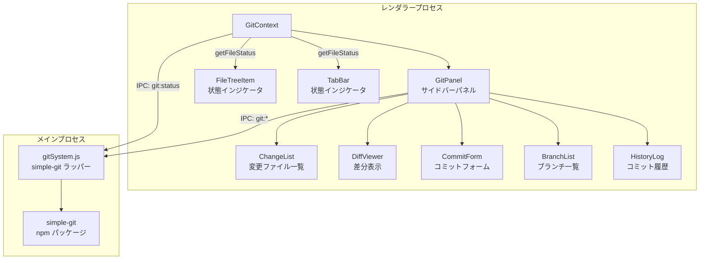

# Git 統合 (Git Integration)

## ステータス
未実装

## 概要
Electron メインプロセスで `simple-git` ライブラリを使用し、プロジェクトフォルダの Git リポジトリ状態の表示、差分確認、ステージング、コミット等の基本的な Git 操作を提供する。VSCode の Source Control パネルに相当する機能をサイドバーに統合する。

## 現状 (As-Is)
- Git に関連する機能は一切未実装
- ファイルツリー (`FileContext.tsx`) はファイルの変更状態を追跡していない
- `electron/fileSystem.js` がファイル操作を担当しているが、Git 操作は含まれていない
- `package.json` に Git 関連の依存パッケージは含まれていない
- サイドバー (`ProjectPanel.tsx`) はファイルツリーとビルドシステムのみ表示
- タブバー (`TabBar.tsx`) はファイルの未保存状態のみ表示（Git 変更状態は非対応）

## 仕様 (Specification)

### 機能要件

#### リポジトリ状態の検出
- プロジェクトフォルダが Git リポジトリかどうかの自動検出
- 現在のブランチ名の表示
- リモートの設定状態（origin 等）の取得
- クリーン / ダーティ状態の表示

#### ファイル変更状態の表示
- Git ステータス（`git status`）に基づくファイル状態の取得
  - Modified (変更済み)
  - Added (新規追加)
  - Deleted (削除済み)
  - Untracked (未追跡)
  - Renamed (リネーム)
  - Conflicted (コンフリクト)
- ファイルツリーの各ファイル名に変更状態インジケータを表示
- タブバーのファイル名にも変更状態を反映
- 変更ファイル数のバッジ表示

#### 差分表示 (Diff View)
- ファイルごとの差分表示（unified diff 形式）
- 追加行 / 削除行のカラーハイライト
- インラインプレビュー（サイドバーパネル内）

#### ステージング操作
- ファイル単位のステージ / アンステージ
- 全ファイルの一括ステージ / アンステージ
- ステージ済みファイルとアンステージファイルの区分表示

#### コミット操作
- コミットメッセージの入力
- ステージ済みファイルのコミット
- コミット履歴の簡易表示（最新 N 件）

#### ブランチ操作 (Phase 2)
- ブランチ一覧の表示
- ブランチの切り替え（チェックアウト）
- 新規ブランチの作成

#### リモート操作 (Phase 3)
- Push
- Pull
- Fetch

### データ構造

```typescript
// src/types/index.ts に追加

export type GitFileStatus =
  | 'modified'     // M - 変更済み
  | 'added'        // A - 新規追加（ステージ済み）
  | 'deleted'      // D - 削除済み
  | 'untracked'    // ? - 未追跡
  | 'renamed'      // R - リネーム
  | 'conflicted'   // U - コンフリクト
  | 'ignored';     // ! - 無視

export interface GitFileChange {
  filePath: string;           // プロジェクトルートからの相対パス
  absolutePath: string;       // 絶対パス
  status: GitFileStatus;
  staged: boolean;            // ステージ済みか
  oldPath?: string;           // リネーム時の旧パス
}

export interface GitBranch {
  name: string;
  current: boolean;
  remote?: string;            // リモートブランチ名（例: "origin/main"）
  commit?: string;            // 先頭コミット SHA（短縮形）
}

export interface GitCommit {
  hash: string;               // 短縮 SHA
  fullHash: string;           // フル SHA
  message: string;
  author: string;
  date: string;               // ISO 8601
  refs?: string;              // ブランチ / タグの参照
}

export interface GitDiff {
  filePath: string;
  hunks: GitDiffHunk[];
}

export interface GitDiffHunk {
  header: string;             // @@ -1,5 +1,7 @@ のような行
  lines: GitDiffLine[];
}

export interface GitDiffLine {
  type: 'add' | 'remove' | 'context';
  content: string;
  oldLineNumber?: number;
  newLineNumber?: number;
}

export interface GitRepositoryState {
  isRepo: boolean;
  branch: string | null;
  remote: string | null;      // リモート URL
  ahead: number;              // リモートより何コミット先か
  behind: number;             // リモートより何コミット後ろか
  changes: GitFileChange[];
  stagedCount: number;
  unstagedCount: number;
  untrackedCount: number;
  isClean: boolean;
}

export interface GitLogEntry {
  commits: GitCommit[];
  total: number;
}
```

### API / インターフェース

#### GitContext (React Context)

```typescript
// src/contexts/GitContext.tsx

interface GitContextValue {
  // 状態
  repoState: GitRepositoryState | null;
  isLoading: boolean;
  error: string | null;
  isGitRepo: boolean;

  // ファイル変更
  changes: GitFileChange[];
  stagedChanges: GitFileChange[];
  unstagedChanges: GitFileChange[];

  // ブランチ
  currentBranch: string | null;
  branches: GitBranch[];

  // コミット履歴
  recentCommits: GitCommit[];

  // 差分
  selectedFileDiff: GitDiff | null;

  // アクション - 状態更新
  refresh: () => Promise<void>;

  // アクション - ステージング
  stageFile: (filePath: string) => Promise<void>;
  unstageFile: (filePath: string) => Promise<void>;
  stageAll: () => Promise<void>;
  unstageAll: () => Promise<void>;

  // アクション - コミット
  commit: (message: string) => Promise<void>;

  // アクション - 差分
  showDiff: (filePath: string, staged: boolean) => Promise<void>;
  closeDiff: () => void;

  // アクション - ブランチ (Phase 2)
  checkoutBranch: (branchName: string) => Promise<void>;
  createBranch: (branchName: string) => Promise<void>;

  // アクション - リモート (Phase 3)
  push: () => Promise<void>;
  pull: () => Promise<void>;
  fetch: () => Promise<void>;

  // ユーティリティ
  getFileStatus: (filePath: string) => GitFileStatus | null;
}
```

#### Electron IPC

```typescript
// ElectronAPI に追加
interface ElectronAPI {
  // ... 既存のAPI ...

  // Git 操作
  gitIsRepo: (dirPath: string) => Promise<boolean>;
  gitStatus: (dirPath: string) => Promise<GitRepositoryState>;
  gitStage: (dirPath: string, filePath: string) => Promise<{ success: boolean; error?: string }>;
  gitUnstage: (dirPath: string, filePath: string) => Promise<{ success: boolean; error?: string }>;
  gitStageAll: (dirPath: string) => Promise<{ success: boolean; error?: string }>;
  gitUnstageAll: (dirPath: string) => Promise<{ success: boolean; error?: string }>;
  gitCommit: (dirPath: string, message: string) => Promise<{ success: boolean; hash?: string; error?: string }>;
  gitDiff: (dirPath: string, filePath: string, staged: boolean) => Promise<GitDiff>;
  gitLog: (dirPath: string, maxCount?: number) => Promise<GitLogEntry>;
  gitBranches: (dirPath: string) => Promise<GitBranch[]>;
  gitCheckout: (dirPath: string, branchName: string) => Promise<{ success: boolean; error?: string }>;
  gitCreateBranch: (dirPath: string, branchName: string) => Promise<{ success: boolean; error?: string }>;
  gitPush: (dirPath: string) => Promise<{ success: boolean; error?: string }>;
  gitPull: (dirPath: string) => Promise<{ success: boolean; error?: string }>;
  gitFetch: (dirPath: string) => Promise<{ success: boolean; error?: string }>;
}
```

```javascript
// electron/main.js に追加する IPC ハンドラ
const gitSystem = require('./gitSystem');

ipcMain.handle('git:isRepo', async (event, dirPath) => {
  return await gitSystem.isRepo(dirPath);
});

ipcMain.handle('git:status', async (event, dirPath) => {
  return await gitSystem.getStatus(dirPath);
});

ipcMain.handle('git:stage', async (event, dirPath, filePath) => {
  return await gitSystem.stageFile(dirPath, filePath);
});

ipcMain.handle('git:unstage', async (event, dirPath, filePath) => {
  return await gitSystem.unstageFile(dirPath, filePath);
});

ipcMain.handle('git:stageAll', async (event, dirPath) => {
  return await gitSystem.stageAll(dirPath);
});

ipcMain.handle('git:unstageAll', async (event, dirPath) => {
  return await gitSystem.unstageAll(dirPath);
});

ipcMain.handle('git:commit', async (event, dirPath, message) => {
  return await gitSystem.commit(dirPath, message);
});

ipcMain.handle('git:diff', async (event, dirPath, filePath, staged) => {
  return await gitSystem.getDiff(dirPath, filePath, staged);
});

ipcMain.handle('git:log', async (event, dirPath, maxCount) => {
  return await gitSystem.getLog(dirPath, maxCount);
});

ipcMain.handle('git:branches', async (event, dirPath) => {
  return await gitSystem.getBranches(dirPath);
});

ipcMain.handle('git:checkout', async (event, dirPath, branchName) => {
  return await gitSystem.checkout(dirPath, branchName);
});

ipcMain.handle('git:createBranch', async (event, dirPath, branchName) => {
  return await gitSystem.createBranch(dirPath, branchName);
});

ipcMain.handle('git:push', async (event, dirPath) => {
  return await gitSystem.push(dirPath);
});

ipcMain.handle('git:pull', async (event, dirPath) => {
  return await gitSystem.pull(dirPath);
});

ipcMain.handle('git:fetch', async (event, dirPath) => {
  return await gitSystem.fetch(dirPath);
});
```

```javascript
// electron/preload.js に追加
gitIsRepo: (dirPath) => ipcRenderer.invoke('git:isRepo', dirPath),
gitStatus: (dirPath) => ipcRenderer.invoke('git:status', dirPath),
gitStage: (dirPath, filePath) => ipcRenderer.invoke('git:stage', dirPath, filePath),
gitUnstage: (dirPath, filePath) => ipcRenderer.invoke('git:unstage', dirPath, filePath),
gitStageAll: (dirPath) => ipcRenderer.invoke('git:stageAll', dirPath),
gitUnstageAll: (dirPath) => ipcRenderer.invoke('git:unstageAll', dirPath),
gitCommit: (dirPath, message) => ipcRenderer.invoke('git:commit', dirPath, message),
gitDiff: (dirPath, filePath, staged) => ipcRenderer.invoke('git:diff', dirPath, filePath, staged),
gitLog: (dirPath, maxCount) => ipcRenderer.invoke('git:log', dirPath, maxCount),
gitBranches: (dirPath) => ipcRenderer.invoke('git:branches', dirPath),
gitCheckout: (dirPath, branchName) => ipcRenderer.invoke('git:checkout', dirPath, branchName),
gitCreateBranch: (dirPath, branchName) => ipcRenderer.invoke('git:createBranch', dirPath, branchName),
gitPush: (dirPath) => ipcRenderer.invoke('git:push', dirPath),
gitPull: (dirPath) => ipcRenderer.invoke('git:pull', dirPath),
gitFetch: (dirPath) => ipcRenderer.invoke('git:fetch', dirPath),
```

### キーボードショートカット

| 操作 | ショートカット |
|------|---------------|
| Git パネルを開く | `Ctrl+Shift+G` |
| 変更の更新 | (パネル内) `R` |
| 全ファイルをステージ | (パネル内) `Cmd+Shift+A` |

## アーキテクチャ

### コンポーネント図



### 状態管理の流れ

```
[初回ロード / フォルダ変更時]
  FileContext.rootPath 変更
    → GitContext が rootPath を監視
    → IPC: git:isRepo → リポジトリ判定
    → true の場合: IPC: git:status → GitRepositoryState を構築
    → changes, branch, ahead/behind を state に反映

[定期的なステータス更新]
  GitContext 内で setInterval（10秒ごと）
    → IPC: git:status → 変更があれば state を更新
    → FileTreeItem / TabBar のインジケータが自動反映

[ステージング操作]
  ユーザーがファイルの "+" ボタンをクリック
    → GitContext.stageFile(filePath)
    → IPC: git:stage → simple-git.add()
    → refresh() で状態を再取得

[コミット操作]
  ユーザーがメッセージ入力 → Commit ボタン
    → GitContext.commit(message)
    → IPC: git:commit → simple-git.commit()
    → refresh() で状態を再取得
    → recentCommits を更新

[差分表示]
  ユーザーが変更ファイルをクリック
    → GitContext.showDiff(filePath, staged)
    → IPC: git:diff → simple-git.diff()
    → diff テキストをパースして GitDiff 構造に変換
    → DiffViewer に表示
```

### Electron IPC の構造

```
[Git ステータス取得]
Renderer                          Main (gitSystem.js)
   |                               |
   |-- git:status --------------->|
   |   (dirPath)                   |--- simpleGit(dirPath).status()
   |                               |--- ステータスを GitRepositoryState に変換
   |<-- GitRepositoryState --------|
   |                               |
   |-- git:diff ----------------->|
   |   (dirPath, filePath, staged) |--- simpleGit(dirPath).diff(['--', filePath])
   |                               |    or .diff(['--cached', '--', filePath])
   |                               |--- diff テキストをパース
   |<-- GitDiff ------------------|
   |                               |
   |-- git:commit --------------->|
   |   (dirPath, message)          |--- simpleGit(dirPath).commit(message)
   |<-- { success, hash } --------|
```

### electron/gitSystem.js の設計

```javascript
// electron/gitSystem.js
const simpleGit = require('simple-git');

// simple-git インスタンスのキャッシュ
let gitInstances = new Map();

function getGit(dirPath) {
  if (!gitInstances.has(dirPath)) {
    gitInstances.set(dirPath, simpleGit(dirPath));
  }
  return gitInstances.get(dirPath);
}

module.exports = {
  async isRepo(dirPath) { /* ... */ },
  async getStatus(dirPath) { /* ... */ },
  async stageFile(dirPath, filePath) { /* ... */ },
  async unstageFile(dirPath, filePath) { /* ... */ },
  async stageAll(dirPath) { /* ... */ },
  async unstageAll(dirPath) { /* ... */ },
  async commit(dirPath, message) { /* ... */ },
  async getDiff(dirPath, filePath, staged) { /* ... */ },
  async getLog(dirPath, maxCount = 50) { /* ... */ },
  async getBranches(dirPath) { /* ... */ },
  async checkout(dirPath, branchName) { /* ... */ },
  async createBranch(dirPath, branchName) { /* ... */ },
  async push(dirPath) { /* ... */ },
  async pull(dirPath) { /* ... */ },
  async fetch(dirPath) { /* ... */ },
};
```

## 既知の課題・制約

### 実装時の注意点
- **simple-git のパッケージング**: `simple-git` は Node.js ネイティブモジュールではないが、Electron のパッケージング時に正しくバンドルされることを確認する必要がある。`electron-builder` の `files` 設定に含まれるか確認
- **Git バイナリの依存**: `simple-git` は環境にインストールされた `git` コマンドを使用する。ユーザーの環境に Git がインストールされていない場合のエラーハンドリングが必要
- **大規模リポジトリでの性能**: 数万ファイルのリポジトリでは `git status` に数秒かかる場合がある。非同期実行 + ローディング表示が必須。ポーリング間隔も調整可能にする
- **ファイルウォッチャーとの連携**: 現在の FileContext は 5 秒間隔で外部変更をポーリングしている。Git 操作（ブランチ切替等）後はファイルツリーの即座の再読み込みが必要
- **コンフリクト処理**: マージコンフリクトの解決 UI は複雑なため、Phase 1 ではコンフリクト状態の表示のみとし、解決は外部ツール（ターミナル等）に委譲
- **未保存ファイルとの関係**: ファイルが未保存状態で `git checkout` を実行すると変更が失われる。ブランチ切替前に未保存ファイルの保存を促すダイアログが必要
- **差分パースの複雑性**: `git diff` の出力パースは行番号の計算、バイナリファイルの判定等を含み複雑。`diff-match-patch` や `diff2html` 等のライブラリの活用を検討

### VSCode / Obsidian との機能差分
- **VSCode**: Source Control パネルでインラインの差分エディタ（サイドバイサイド）を提供。Marginalia では Phase 1 では unified diff の読み取り専用ビューのみ
- **VSCode**: Git Graph 等の拡張で視覚的なブランチグラフを表示。Marginalia ではスコープ外
- **VSCode**: 行ごとの blame 表示、gutter のインジケータ。Marginalia では Phase 3 で検討
- **Obsidian**: Git プラグインは存在するが、Obsidian コア機能ではない。Marginalia ではコアに統合
- **GitLens (VSCode 拡張)**: 高度な blame、コードレンズ、履歴ナビゲーション。Marginalia ではスコープ外

## ロードマップ (To-Be)

### Phase 1: 最小限の実装 (MVP)
- `simple-git` パッケージの追加（`npm install simple-git`）
- `electron/gitSystem.js` の新規作成（isRepo, getStatus, stageFile, unstageFile, stageAll, unstageAll, commit, getDiff）
- `electron/main.js` への IPC ハンドラ追加（`git:*`）
- `electron/preload.js` への API 追加
- `src/types/index.ts` への型定義追加
- `src/contexts/GitContext.tsx` の新規作成（状態管理 + 定期ポーリング）
- `src/components/Sidebar/GitPanel.tsx` の新規作成（変更ファイル一覧 + ステージング + コミットフォーム）
- `src/components/Sidebar/ProjectPanel.tsx` にタブまたはアイコンで Git パネルへの導線を追加
- ファイルツリー (`FileTreeItem.tsx`) に Git 変更状態のインジケータ（色付きドット or テキスト）を追加

### Phase 2: ブランチ操作と差分表示の改善
- `src/components/Git/DiffViewer.tsx` の新規作成（カラーハイライト付き差分表示）
- `src/components/Git/BranchSelector.tsx` の新規作成（ブランチ一覧・切替・作成）
- コミット履歴の表示（最新 50 件、ページネーション）
- ブランチ切替時の未保存ファイル保存ダイアログ
- Git 操作後のファイルツリー自動更新
- ステータスバーへのブランチ名・変更数の常時表示

### Phase 3: リモート操作と高度な機能
- Push / Pull / Fetch の実装
- リモートの設定・管理
- コミットの詳細表示（変更ファイル一覧、差分）
- `git blame` のインライン表示（エディタ Gutter）
- `.gitignore` ファイルの認識とファイルツリーでの表示制御
- Stash 操作（一時退避・復元）
- タグの作成・表示
