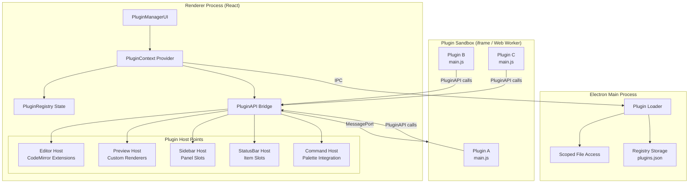

# プラグインシステム

## ステータス
未実装

## 概要
Obsidian風のプラグインアーキテクチャにより、サードパーティおよびユーザ作成のプラグインでMarginaliaの機能を拡張可能にする。各プラグインはサンドボックス内で実行され、マニフェスト駆動のライフサイクル管理によりセキュリティと安定性を担保する。

## 現状 (As-Is)

### 現在の拡張ポイント
- **CodeMirror 6 Extension**: `src/codemirror/completions/` 配下にオートコンプリートプロバイダが個別ファイルとして存在（`markdownSyntax.ts`, `mermaid.ts`, `citations.ts`, `crossReferences.ts` など）。`createMarkdownCompletions()` で束ねて EditorView に渡している
- **Electron IPC Bridge**: `electron/preload.js` で `contextBridge.exposeInMainWorld('electronAPI', {...})` によりメインプロセス機能を公開。チャネル追加で拡張可能
- **Context Provider パターン**: `FileContext`, `AnnotationContext`, `BuildContext`, `SettingsContext`, `TabContext`, `TerminalContext` が独立した Provider として存在。新規 Context の追加は容易
- **ビルドシステム**: `electron/buildSystem.js` がテンプレートとマニフェストベースのビルドパイプラインを提供。テンプレート追加は `catalog.yml` で管理

### 拡張性の課題
- すべての機能がハードコードされており、ユーザがランタイムで機能追加する仕組みがない
- CodeMirror Extension の追加にはソースコード変更とリビルドが必要
- プレビューのカスタムレンダラ（Mermaid, KaTeX）は `AnnotatedPreview.tsx` に直接埋め込まれている
- ビルドテンプレートは `report-build-system/` 内の静的ファイルに依存

### 使用可能なライブラリ
- CodeMirror 6 (`@codemirror/state`, `@codemirror/view`) - Extension / Facet / StateField による拡張機構
- Electron (`contextIsolation: true`, `nodeIntegration: false`) - セキュアな IPC ベース通信
- React 18 - Context / Suspense / lazy による動的コンポーネント読み込み

## 仕様 (Specification)

### 機能要件
1. プラグインの発見・インストール・有効化・無効化・アンインストール
2. サンドボックス内でのプラグインコード実行（ファイルシステム直接アクセス不可）
3. プラグインAPIを通じたエディタ操作、ファイル操作、UI拡張、イベントフック
4. プラグイン間の依存関係解決
5. プラグインマネージャUI（設定パネル内）
6. プラグインの設定永続化

### データ構造

```typescript
// プラグインマニフェスト (plugin.json)
interface PluginManifest {
  id: string;                    // 一意識別子 (例: "marginalia-word-count")
  name: string;                  // 表示名
  version: string;               // semver
  minAppVersion: string;         // 必要な Marginalia バージョン
  author: string;
  description: string;
  main: string;                  // エントリポイント (例: "main.js")
  permissions: PluginPermission[];
  dependencies?: string[];       // 依存プラグインID
}

type PluginPermission =
  | 'editor:read'               // エディタ内容の読み取り
  | 'editor:write'              // エディタ内容の変更
  | 'file:read'                 // ファイルの読み取り（rootPath配下限定）
  | 'file:write'                // ファイルの書き込み（rootPath配下限定）
  | 'annotations:read'          // 注釈データの読み取り
  | 'annotations:write'         // 注釈データの変更
  | 'ui:panel'                  // サイドパネルの追加
  | 'ui:statusbar'              // ステータスバーアイテムの追加
  | 'ui:command'                // コマンドパレットへのコマンド登録
  | 'ui:context-menu'           // コンテキストメニュー項目の追加
  | 'settings:read'             // 設定の読み取り
  | 'settings:write'            // プラグイン固有設定の書き込み
  | 'build:hook'                // ビルドパイプラインへのフック
  | 'network'                   // ネットワークアクセス（制限付き）
  ;

// プラグインの実行時状態
interface PluginInstance {
  manifest: PluginManifest;
  state: 'installed' | 'enabled' | 'disabled' | 'error';
  error?: string;
  settings: Record<string, unknown>;
  loadedAt?: string;             // ISO 8601
}

// プラグインレジストリ（永続化）
interface PluginRegistry {
  plugins: Record<string, {      // key = pluginId
    installed: boolean;
    enabled: boolean;
    version: string;
    path: string;                // プラグインディレクトリのパス
    settings: Record<string, unknown>;
  }>;
  lastUpdated: string;
}

// プラグイン設定スキーマ
interface PluginSettingSchema {
  key: string;
  type: 'string' | 'number' | 'boolean' | 'select' | 'color';
  label: string;
  description?: string;
  default: unknown;
  options?: { value: string; label: string }[];  // type: 'select' の場合
  min?: number;                   // type: 'number' の場合
  max?: number;
}
```

### API / インターフェース

```typescript
// プラグインが実装するインターフェース
interface MarginaliaPlugin {
  onLoad(): Promise<void>;
  onUnload(): Promise<void>;
  onSettingsChange?(settings: Record<string, unknown>): void;
}

// Marginalia がプラグインに提供する API
interface PluginAPI {
  // --- エディタ操作 ---
  editor: {
    getValue(): string;
    setValue(content: string): void;
    getSelection(): { from: number; to: number; text: string } | null;
    replaceSelection(text: string): void;
    insertAt(pos: number, text: string): void;
    getCursorPosition(): { line: number; ch: number };
    setCursorPosition(line: number, ch: number): void;
    // CodeMirror 6 Extension 登録
    registerExtension(extension: Extension): Disposable;
    // Markdown lint ルール登録
    registerLintRule(rule: LintRule): Disposable;
  };

  // --- ファイル操作 ---
  file: {
    getCurrentFile(): string | null;
    getRootPath(): string | null;
    readFile(relativePath: string): Promise<string>;
    writeFile(relativePath: string, content: string): Promise<void>;
    listFiles(relativePath?: string): Promise<FileTreeNode[]>;
    onFileChange(callback: (filePath: string) => void): Disposable;
    onFileOpen(callback: (filePath: string) => void): Disposable;
  };

  // --- 注釈操作 ---
  annotations: {
    getAll(): AnnotationV2[];
    getByStatus(status: AnnotationStatus): AnnotationV2[];
    add(type: AnnotationType, content: string, selection: SelectionInfo): string;
    update(id: string, updates: Partial<AnnotationV2>): void;
    delete(id: string): void;
    onAnnotationChange(callback: (annotations: AnnotationV2[]) => void): Disposable;
  };

  // --- UI 拡張 ---
  ui: {
    addSidebarPanel(config: PanelConfig): Disposable;
    addStatusBarItem(config: StatusBarItemConfig): Disposable;
    addCommand(config: CommandConfig): Disposable;
    addContextMenuItem(config: ContextMenuItemConfig): Disposable;
    showNotification(message: string, type: ToastType, duration?: number): void;
    showModal(config: ModalConfig): Promise<unknown>;
  };

  // --- 設定 ---
  settings: {
    get<T>(key: string): T;
    set(key: string, value: unknown): void;
    getAll(): Record<string, unknown>;
    registerSettingsTab(schema: PluginSettingSchema[]): Disposable;
  };

  // --- ビルドフック ---
  build: {
    registerPreBuildHook(hook: BuildHook): Disposable;
    registerPostBuildHook(hook: BuildHook): Disposable;
    registerOutputTransform(transform: OutputTransform): Disposable;
  };

  // --- イベントバス ---
  events: {
    on(event: string, callback: (...args: unknown[]) => void): Disposable;
    emit(event: string, ...args: unknown[]): void;
  };

  // --- ユーティリティ ---
  app: {
    getVersion(): string;
    getPluginDataPath(): string;   // プラグイン専用データディレクトリ
  };
}

// リソース解放用
interface Disposable {
  dispose(): void;
}

// UI 拡張の設定型
interface PanelConfig {
  id: string;
  title: string;
  icon: string;                   // SVG パスまたは built-in アイコン名
  render: () => HTMLElement;       // パネル描画
  position: 'left' | 'right' | 'bottom';
}

interface StatusBarItemConfig {
  id: string;
  render: () => HTMLElement;
  position: 'left' | 'right';
  priority?: number;
}

interface CommandConfig {
  id: string;
  name: string;
  description?: string;
  shortcut?: string;              // 例: "Mod-Shift-P"
  execute: () => void | Promise<void>;
}

interface ContextMenuItemConfig {
  id: string;
  label: string;
  icon?: string;
  when?: 'editor' | 'preview' | 'sidebar' | 'always';
  execute: (context: { filePath?: string; selection?: string }) => void;
}

// ビルドフック
type BuildHook = (context: {
  projectRoot: string;
  manifestPath: string;
  format: string;
}) => Promise<void>;

type OutputTransform = (output: string, format: string) => Promise<string>;

// Lint ルール
interface LintRule {
  id: string;
  severity: 'error' | 'warning' | 'info';
  check(doc: string): { from: number; to: number; message: string }[];
}
```

### Electron IPC（プラグインシステム用）

```typescript
// preload.js に追加するプラグイン用 IPC チャネル
interface PluginIPC {
  // プラグインの発見・管理
  'plugin:discover': (pluginsDir: string) => Promise<PluginManifest[]>;
  'plugin:install': (sourcePath: string) => Promise<{ success: boolean; pluginId: string }>;
  'plugin:uninstall': (pluginId: string) => Promise<{ success: boolean }>;
  'plugin:load': (pluginId: string) => Promise<{ success: boolean; error?: string }>;
  'plugin:unload': (pluginId: string) => Promise<{ success: boolean }>;

  // プラグインレジストリ
  'plugin:getRegistry': () => Promise<PluginRegistry>;
  'plugin:updateRegistry': (registry: PluginRegistry) => Promise<void>;

  // プラグイン用サンドボックスファイルI/O（rootPath配下限定）
  'plugin:readFile': (pluginId: string, relativePath: string) => Promise<string>;
  'plugin:writeFile': (pluginId: string, relativePath: string, content: string) => Promise<void>;
}
```

### キーボードショートカット
| 操作 | キー |
|------|------|
| コマンドパレットを開く（プラグインコマンド含む）| `Cmd/Ctrl+Shift+P` |
| プラグイン設定を開く | 設定パネル > プラグインタブ |

## アーキテクチャ

### コンポーネント図



### 状態管理の流れ

```
1. 起動時
   Main Process: plugins.json 読み込み → 有効プラグインリスト
   ↓ IPC
   Renderer: PluginContext に反映
   ↓
   各プラグインの main.js をサンドボックス内で require
   ↓
   plugin.onLoad() 呼び出し
   ↓
   プラグインが PluginAPI 経由で Extension / Panel / Command 等を登録
   ↓
   各 Host が動的に反映

2. プラグイン有効化/無効化
   PluginManagerUI → PluginContext.togglePlugin(id)
   ↓
   有効化: サンドボックス生成 → onLoad()
   無効化: onUnload() → 全 Disposable.dispose() → サンドボックス破棄
   ↓
   Registry 更新 → IPC → plugins.json 永続化

3. 設定変更
   PluginManagerUI → PluginContext.updatePluginSettings(id, settings)
   ↓
   plugin.onSettingsChange(settings)
   ↓
   Registry 更新 → 永続化
```

### サンドボックス実行モデル

```
┌─────────────────────────────────────────────────┐
│  Renderer Process                                │
│                                                  │
│  ┌────────────────────┐                         │
│  │  PluginAPI Bridge   │                         │
│  │  (Proxy objects)    │                         │
│  └────────┬───────────┘                         │
│           │ MessagePort / postMessage            │
│  ┌────────▼───────────────────────────────────┐ │
│  │  <iframe sandbox="allow-scripts">          │ │
│  │   ┌─────────────────────────────────────┐  │ │
│  │   │  Plugin Runtime                     │  │ │
│  │   │  - window.marginalia (PluginAPI)    │  │ │
│  │   │  - No DOM access to parent          │  │ │
│  │   │  - No direct fs/network             │  │ │
│  │   │  - Structured clone for data        │  │ │
│  │   └─────────────────────────────────────┘  │ │
│  └────────────────────────────────────────────┘ │
└─────────────────────────────────────────────────┘
```

Phase 1 では `<iframe sandbox="allow-scripts">` を使用し、MessagePort 経由で PluginAPI を公開する。プラグインは直接 DOM にアクセスできず、すべての操作は API 経由のメッセージパッシングで行われる。

Phase 2 以降で Web Worker ベースのサンドボックスや、UI レンダリング用の専用 iframe（`allow-scripts allow-same-origin`）への分離を検討する。

### CodeMirror 6 Extension 統合

現在の `MarkdownEditor.tsx` では `EditorState.create()` 時に拡張を静的に渡している。プラグインシステムでは `Compartment` を活用して動的に追加・削除可能にする。

```typescript
// pluginExtensionCompartment.ts
import { Compartment } from '@codemirror/state';
import { EditorView } from '@codemirror/view';

const pluginCompartment = new Compartment();

// 初期状態（空の拡張）
export const pluginExtensionSlot = pluginCompartment.of([]);

// プラグインが Extension を登録したときに呼ばれる
export function reconfigurePluginExtensions(
  view: EditorView,
  extensions: Extension[]
) {
  view.dispatch({
    effects: pluginCompartment.reconfigure(extensions),
  });
}
```

## 既知の課題・制約

### 実装時の注意点
- **セキュリティ**: iframe サンドボックスでも `allow-same-origin` を付与すると親ウィンドウへのアクセスが可能になる。Phase 1 では `allow-scripts` のみとし、UI レンダリングが必要な場合は専用の通信プロトコルを設計する
- **パフォーマンス**: プラグイン数が増えると MessagePort 通信のオーバーヘッドが蓄積する。頻繁なエディタ操作（キー入力ごとのフック等）にはバッチ処理やデバウンスが必要
- **型安全性**: プラグインは JavaScript で書かれるため、PluginAPI の型チェックはランタイムバリデーションで補完する必要がある
- **CodeMirror Extension の互換性**: サードパーティ Extension はバンドルサイズが大きくなりがち。遅延読み込みと tree-shaking を検討する
- **プラグイン間通信**: 直接の import は不可。`events` API によるイベントバスを介した疎結合な通信に限定する
- **状態復元**: アプリ再起動時にプラグインの状態を復元する仕組みが必要。`PluginAPI.app.getPluginDataPath()` でプラグイン固有のデータディレクトリを提供

### VSCode / Obsidian との機能差分
| 機能 | VSCode | Obsidian | Marginalia (計画) |
|------|--------|----------|-------------------|
| Extension API | 豊富・Language Server Protocol 対応 | Plugin API + Vault API | PluginAPI (エディタ・ファイル・注釈) |
| サンドボックス | Extension Host Process (Node.js) | なし（直接アクセス） | iframe sandbox |
| UI 拡張 | Webview, TreeView, StatusBar 等 | Obsidian API + DOM 操作 | Panel, StatusBar, Command |
| マーケットプレイス | VS Marketplace | Community Plugins | ローカルインストールのみ (Phase 1) |
| ホットリロード | 一部対応 | 対応 | Phase 2 で検討 |

## ロードマップ (To-Be)

### Phase 1: 最小限の実装
- **PluginContext Provider** の作成（`src/contexts/PluginContext.tsx`）
- **プラグインマニフェスト** (`plugin.json`) の読み込み・バリデーション
- **Electron IPC** によるプラグインファイルの発見・読み込み（`~/.marginalia/plugins/` ディレクトリ）
- **PluginAPI の editor サブセット**: `getValue`, `getSelection`, `replaceSelection`, `registerExtension`
- **PluginManagerUI**: 設定パネル内にインストール済みプラグイン一覧・有効/無効トグル
- **CodeMirror Compartment** による動的 Extension 追加・削除
- セキュリティ: `allow-scripts` のみの iframe サンドボックス

### Phase 2: 本格的な実装
- **PluginAPI 全機能**: file, annotations, ui, settings, build, events
- **UI 拡張**: サイドバーパネル、ステータスバー、コンテキストメニュー
- **コマンドパレット統合**: プラグインコマンドの検索・実行
- **プラグイン設定UI**: `PluginSettingSchema` に基づく自動生成フォーム
- **依存関係解決**: プラグイン間の依存関係グラフによる読み込み順序制御
- **ホットリロード**: プラグインコードの変更検知と再読み込み
- **プラグインテンプレート**: `marginalia create-plugin <name>` CLI コマンド

### Phase 3: 高度な機能
- **プラグインマーケットプレイス**: GitHub リポジトリベースの公開・検索・インストール
- **Web Worker サンドボックス**: CPU 負荷の高いプラグイン用の Worker ベース実行環境
- **プラグイン署名**: 信頼されたプラグインの電子署名検証
- **プラグインプロファイリング**: パフォーマンスモニタリングと自動無効化
- **Language Server Protocol 対応**: LSP クライアントプラグインによる言語サポート拡張
- **Theme プラグイン**: CSS 変数ベースのテーマカスタマイズ
- **Preview Renderer プラグイン**: カスタム Markdown レンダラ（Mermaid, KaTeX 以外）の追加
