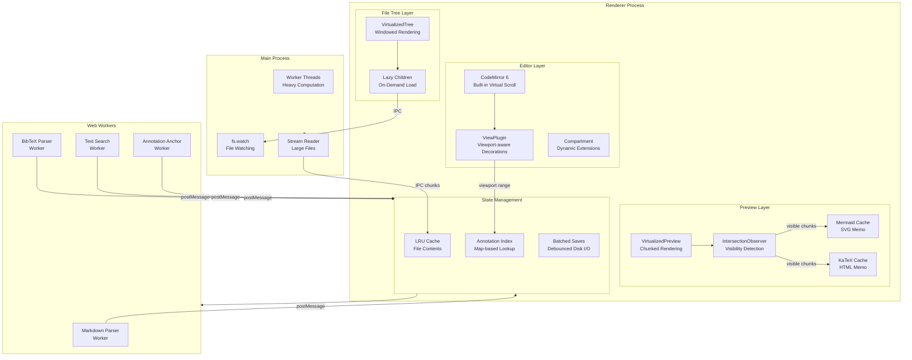

# パフォーマンス・大規模ファイル対応

## ステータス
未実装

## 概要
10万行以上の大規模 Markdown ファイルや、大量のファイルを含むプロジェクトにおいて、エディタ・プレビュー・ファイルツリー・注釈システムが快適に動作するためのパフォーマンス最適化戦略を定義する。

## 現状 (As-Is)

### エディタ (MarkdownEditor.tsx, 1573行)
- **CodeMirror 6** を使用。CodeMirror 自体は仮想スクロール対応で大規模ドキュメントにも対応可能だが、現在のカスタム Extension（注釈デコレーション `annotationField`, `flashHighlightField`）はドキュメント全体を走査して Decoration を生成しており、O(n) のコストが掛かる
- `EditorState.create()` 時に全 Extension を静的に登録。`Compartment` による動的再構成は一部のみ（フォントサイズ、行番号等）
- オートコンプリート（`src/codemirror/completions/`）は入力ごとにトリガーされる。`citations.ts` は BibTeX ファイル全体をパースする

### プレビュー (AnnotatedPreview.tsx, 1720行)
- **react-markdown** + **rehype-raw** + **rehype-katex** + **remark-gfm** + **remark-math** で Markdown を完全に HTML にレンダリング
- ドキュメント全体を一度にレンダリングするため、大規模ファイルではレンダリングコストが高い
- カスタム rehype プラグイン（`rehypeSourceMap`, `rehypePreservePositions`）が全テキストノードを走査してソースマップ用 data 属性を付与
- Mermaid ブロック（`MermaidBlock.tsx`）は個別に SVG レンダリング。複数の Mermaid ブロックがあるとシーケンシャルに処理される
- KaTeX レンダリングもブロック単位で DOM を生成

### ファイルツリー (ProjectPanel.tsx / FileTreeItem.tsx)
- `readDirectory` IPC で再帰的に全ディレクトリを読み込み、React ステートとして保持
- FileTreeItem は各ノードに対して React コンポーネントをレンダリング。数千ファイルのプロジェクトではコンポーネント数が膨大になる
- 注釈バッジ表示のために、各ファイルの `.marginalia` をチェックしている

### 注釈システム (AnnotationContext.tsx)
- `AnnotationV2[]` を配列で保持。フィルタリング（`orphanedAnnotations`, `activeAnnotations` 等）は `useMemo` でメモ化済み
- `anchorAnnotation()` によるテキストマッチングはドキュメント変更のたびに全注釈に対して実行される可能性がある
- 注釈の自動保存（`saveMarginalia`）は `annotations` / `history` の変更のたびにディスク書き込みを行う

### ファイルキャッシュ (FileContext.tsx)
- `contentCache: Record<string, FileContentCache>` でオープン中のファイル内容をメモリに保持
- キャッシュエビクション戦略は手動（タブを閉じたとき `EVICT_CACHE`）のみ。LRU 等の自動管理なし
- 外部変更検出は 5 秒ポーリング（`setInterval` ベース）

### メモリ管理
- `useReducer` ベースの State に全データを保持。大規模な annotations 配列のイミュータブル更新（スプレッド構文）はメモリアロケーションコストが高い
- Mermaid の SVG レンダリング結果がキャッシュされていない（再レンダリングのたびに再生成）

### 使用可能なライブラリ
- CodeMirror 6: 組み込みの仮想スクロール、`RangeSet` による効率的な Decoration 管理、`ViewPlugin` による viewport ベースの更新
- React 18: `React.memo`, `useMemo`, `useCallback`, `React.lazy`, `Suspense`, `startTransition`
- Electron: `Worker Threads`, `child_process`, `SharedArrayBuffer`

## 仕様 (Specification)

### 機能要件
1. 10万行以上の Markdown ファイルを開いても、エディタの入力遅延が 16ms (60fps) 以内に収まること
2. プレビューの初期レンダリングが 1 秒以内、スクロール時の追加レンダリングが 100ms 以内
3. 1万ファイル以上のプロジェクトでファイルツリーがスムーズにスクロールできること
4. 注釈が 500 件以上あるファイルでも、注釈パネルの操作がスムーズなこと
5. メモリ使用量が 512MB 以下に収まること（通常利用時）

### データ構造

```typescript
// パフォーマンスモニタリング
interface PerformanceMetrics {
  editorInputLatency: number;     // ms - エディタ入力遅延
  previewRenderTime: number;      // ms - プレビューレンダリング時間
  fileTreeRenderTime: number;     // ms - ファイルツリーレンダリング時間
  memoryUsage: {
    heapUsed: number;             // bytes
    heapTotal: number;
    external: number;
  };
  annotationCount: number;
  documentLineCount: number;
  openFileCount: number;
}

// Virtualized List のアイテム
interface VirtualItem {
  index: number;
  offset: number;
  size: number;
}

// チャンクベースのプレビューレンダリング
interface PreviewChunk {
  id: string;
  startLine: number;
  endLine: number;
  markdown: string;
  rendered?: React.ReactNode;     // レンダリング済みのキャッシュ
  isVisible: boolean;
  height: number;                 // 推定高さ (px)
}

// Worker メッセージプロトコル
type WorkerMessage =
  | { type: 'parse-markdown'; id: string; content: string }
  | { type: 'parse-bibtex'; id: string; content: string }
  | { type: 'search-text'; id: string; query: string; content: string }
  | { type: 'anchor-annotations'; id: string; docText: string; annotations: AnnotationV2[] }
  ;

type WorkerResponse =
  | { type: 'parsed-markdown'; id: string; ast: unknown }
  | { type: 'parsed-bibtex'; id: string; entries: unknown[] }
  | { type: 'search-results'; id: string; matches: { from: number; to: number }[] }
  | { type: 'anchored-annotations'; id: string; results: { id: string; range: { from: number; to: number } | null }[] }
  ;

// LRU キャッシュ
interface LRUCache<K, V> {
  get(key: K): V | undefined;
  set(key: K, value: V): void;
  delete(key: K): boolean;
  clear(): void;
  readonly size: number;
  readonly maxSize: number;
}
```

### API / インターフェース

```typescript
// パフォーマンスコンテキスト
interface PerformanceContextValue {
  metrics: PerformanceMetrics;
  isLargeFile: boolean;           // 1万行以上で true
  isLargeProject: boolean;        // 1000ファイル以上で true
  degradedMode: boolean;          // パフォーマンス劣化時の自動制限モード
}

// Worker プール
interface WorkerPool {
  execute<T>(task: WorkerMessage): Promise<T>;
  terminate(): void;
}

// 仮想スクロール
interface VirtualScrollConfig {
  itemCount: number;
  estimatedItemSize: number;
  overscan: number;               // viewport 外に先読みするアイテム数
  getItemSize?: (index: number) => number;
}
```

### キーボードショートカット
| 操作 | キー |
|------|------|
| パフォーマンスモニター表示 | `Cmd/Ctrl+Shift+I` (DevTools内) |

## アーキテクチャ

### コンポーネント図



### 最適化戦略の詳細

#### 1. エディタ (CodeMirror 6) の最適化

**注釈デコレーションの Viewport 制限**

現在の `annotationField` は全ドキュメントの注釈位置を計算して `Decoration` を生成しているが、`ViewPlugin` に変更して表示中の viewport 範囲のみ計算する。

```typescript
// 現在: StateField (全ドキュメント走査)
const annotationField = StateField.define<DecorationSet>({
  create() { return Decoration.none; },
  update(deco, tr) {
    // 全注釈を走査して Decoration を再構築
  }
});

// 改善: ViewPlugin (viewport のみ)
const annotationPlugin = ViewPlugin.fromClass(class {
  decorations: DecorationSet;

  constructor(view: EditorView) {
    this.decorations = this.buildDecorations(view);
  }

  update(update: ViewUpdate) {
    if (update.docChanged || update.viewportChanged) {
      this.decorations = this.buildDecorations(update.view);
    }
  }

  buildDecorations(view: EditorView) {
    const { from, to } = view.viewport;
    // viewport 範囲内の注釈のみ処理
    const visible = annotations.filter(a =>
      a.range.from <= to && a.range.to >= from
    );
    // ...
  }
}, { decorations: v => v.decorations });
```

**オートコンプリートのデバウンス**

```typescript
// BibTeX パース結果のキャッシュ
const bibCache = new Map<string, { mtime: number; entries: BibEntry[] }>();

// CompletionSource にデバウンスを適用
const debouncedCitationSource: CompletionSource = (context) => {
  // キャッシュがあればそこから返す
  // キャッシュミス時のみ非同期パース
};
```

#### 2. プレビューの遅延レンダリング

```
┌──────────────────────────────────┐
│  VirtualizedPreview              │
│                                  │
│  ┌────────────────────────────┐  │
│  │ Chunk 1 (line 1-50)       │  │  ← rendered (above viewport)
│  ├────────────────────────────┤  │
│  │ Chunk 2 (line 51-100)     │  │  ← rendered (visible)
│  ├────────────────────────────┤  │
│  │ Chunk 3 (line 101-150)    │  │  ← rendered (visible)
│  ├────────────────────────────┤  │
│  │ Chunk 4 (line 151-200)    │  │  ← placeholder (below viewport)
│  ├────────────────────────────┤  │
│  │ ...                       │  │  ← placeholder
│  └────────────────────────────┘  │
└──────────────────────────────────┘
```

- ドキュメントを見出しレベル（`## `）または固定行数（50行）でチャンクに分割
- `IntersectionObserver` で各チャンクの可視性を監視
- 可視チャンクのみ `react-markdown` でレンダリング、非可視チャンクはプレースホルダ（推定高さの div）
- レンダリング済みチャンクの結果をキャッシュ。ドキュメント変更時は変更されたチャンクのみ再レンダリング

```typescript
// チャンク分割
function splitIntoChunks(markdown: string, maxLines: number = 50): PreviewChunk[] {
  const lines = markdown.split('\n');
  const chunks: PreviewChunk[] = [];
  let start = 0;

  for (let i = 0; i < lines.length; i++) {
    // 見出し行、または maxLines 到達でチャンク境界
    const isHeading = /^#{1,6}\s/.test(lines[i]);
    const isMaxLines = (i - start) >= maxLines;

    if ((isHeading || isMaxLines) && i > start) {
      chunks.push({
        id: `chunk-${start}`,
        startLine: start,
        endLine: i - 1,
        markdown: lines.slice(start, i).join('\n'),
        isVisible: false,
        height: (i - start) * 24,  // 推定 24px/line
      });
      start = i;
    }
  }

  // 残り
  if (start < lines.length) {
    chunks.push({
      id: `chunk-${start}`,
      startLine: start,
      endLine: lines.length - 1,
      markdown: lines.slice(start).join('\n'),
      isVisible: false,
      height: (lines.length - start) * 24,
    });
  }

  return chunks;
}
```

#### 3. ファイルツリーの仮想化

```typescript
// 仮想化ファイルツリー
// フラット化されたノードリスト + 仮想スクロール

interface FlatTreeNode {
  node: FileTreeNode;
  depth: number;
  isExpanded: boolean;
  parentPath: string | null;
}

// 表示中のノードのみレンダリング
function VirtualizedFileTree({ nodes, containerHeight }: Props) {
  const ITEM_HEIGHT = 28;
  const visibleCount = Math.ceil(containerHeight / ITEM_HEIGHT) + 2;
  const [scrollTop, setScrollTop] = useState(0);
  const startIndex = Math.floor(scrollTop / ITEM_HEIGHT);

  const visibleNodes = nodes.slice(startIndex, startIndex + visibleCount);

  return (
    <div
      style={{ height: nodes.length * ITEM_HEIGHT, position: 'relative' }}
      onScroll={(e) => setScrollTop(e.currentTarget.scrollTop)}
    >
      {visibleNodes.map((node, i) => (
        <FileTreeItem
          key={node.node.path}
          node={node}
          style={{
            position: 'absolute',
            top: (startIndex + i) * ITEM_HEIGHT,
            height: ITEM_HEIGHT,
          }}
        />
      ))}
    </div>
  );
}
```

#### 4. Worker Thread によるバックグラウンド処理

```
Main Process                    Worker Thread
    │                               │
    │  spawn worker                 │
    │ ─────────────────────────────>│
    │                               │
    │  { type: 'parse-markdown',    │
    │    content: '...' }           │
    │ ─────────────────────────────>│
    │                               │ parse...
    │  { type: 'parsed-markdown',   │
    │    ast: {...} }               │
    │ <─────────────────────────────│
    │                               │
```

- **Markdown パース**: 大規模ファイルの AST 生成を Worker で実行
- **BibTeX パース**: 参考文献データベースのパースを Worker で実行
- **全文検索**: ファイル横断検索を Worker で並列実行
- **注釈アンカリング**: `anchorAnnotation()` の一括実行を Worker で処理

### React コンポーネントのメモ化戦略

```typescript
// 1. FileTreeItem: path をキーにメモ化
const FileTreeItem = React.memo(({ node, depth, onSelect }: Props) => {
  // ...
}, (prev, next) => prev.node.path === next.node.path && prev.depth === next.depth);

// 2. AnnotationCard: id + updatedAt でメモ化
const AnnotationCard = React.memo(({ annotation }: Props) => {
  // ...
}, (prev, next) =>
  prev.annotation.id === next.annotation.id &&
  prev.annotation.updatedAt === next.annotation.updatedAt
);

// 3. PreviewChunk: チャンクの markdown hash でメモ化
const PreviewChunkComponent = React.memo(({ chunk }: Props) => {
  // ...
}, (prev, next) => prev.chunk.id === next.chunk.id && prev.chunk.markdown === next.chunk.markdown);

// 4. Context の分割による不要な再レンダリング防止
// 現在: FileContext が全状態を一つの value オブジェクトで提供
// 改善: 頻繁に変わる状態と安定した状態を分離

const FileStateContext = createContext(null);    // content, isModified 等
const FileActionsContext = createContext(null);   // openFile, saveFile 等（参照安定）
```

### メモリ管理

```
メモリバジェット (512MB 目標)
├── Electron Main Process: ~100MB
│   ├── Node.js runtime
│   └── File I/O buffers
├── Renderer Process: ~350MB
│   ├── React component tree: ~50MB
│   ├── CodeMirror document: ~50MB (10万行)
│   ├── File content cache (LRU, 10 files): ~100MB
│   ├── Annotation data: ~20MB
│   ├── Preview DOM: ~80MB
│   └── Mermaid/KaTeX cache: ~50MB
└── Workers: ~62MB
    ├── Markdown parser: ~20MB
    ├── BibTeX parser: ~10MB
    ├── Search worker: ~16MB
    └── Annotation worker: ~16MB
```

```typescript
// LRU キャッシュ実装
class LRUCacheImpl<K, V> implements LRUCache<K, V> {
  private cache = new Map<K, V>();

  constructor(public readonly maxSize: number) {}

  get(key: K): V | undefined {
    const value = this.cache.get(key);
    if (value !== undefined) {
      // アクセスしたら先頭に移動
      this.cache.delete(key);
      this.cache.set(key, value);
    }
    return value;
  }

  set(key: K, value: V): void {
    if (this.cache.has(key)) {
      this.cache.delete(key);
    } else if (this.cache.size >= this.maxSize) {
      // 最も古いエントリを削除
      const firstKey = this.cache.keys().next().value;
      this.cache.delete(firstKey);
    }
    this.cache.set(key, value);
  }

  delete(key: K): boolean { return this.cache.delete(key); }
  clear(): void { this.cache.clear(); }
  get size(): number { return this.cache.size; }
}

// ファイルキャッシュの LRU 化
const fileContentCache = new LRUCacheImpl<string, FileContentCache>(10);
const annotationCache = new LRUCacheImpl<string, AnnotationCacheEntry>(20);
const mermaidSvgCache = new LRUCacheImpl<string, string>(50);  // hash → SVG
```

### 注釈の自動保存デバウンス

```typescript
// 現在: annotations/history 変更のたびに即時保存
useEffect(() => {
  if (currentFile && !state.isLoading) {
    saveMarginalia();  // 毎回ディスクI/O
  }
}, [state.annotations, state.history]);

// 改善: デバウンスによるバッチ保存
const debouncedSave = useMemo(
  () => debounce((file: string, annotations: AnnotationV2[], history: HistoryEntryV2[]) => {
    const data: MarginaliaFileV2 = {
      _tool: 'marginalia',
      _version: '2.0.0',
      filePath: file,
      fileName: file.split('/').pop() || '',
      lastModified: new Date().toISOString(),
      annotations,
      history,
    };
    window.electronAPI.writeMarginalia(file, data);
  }, 1000),  // 1秒デバウンス
  []
);

useEffect(() => {
  if (currentFile && !state.isLoading) {
    debouncedSave(currentFile, state.annotations, state.history);
  }
}, [state.annotations, state.history, currentFile, state.isLoading]);
```

## 既知の課題・制約

### 実装時の注意点
- **CodeMirror 6 の制約**: `ViewPlugin` の `update` メソッドは同期的に実行される必要がある。非同期の注釈アンカリング結果は `requestAnimationFrame` 後に `view.dispatch()` で反映する
- **react-markdown の制約**: チャンク分割でプレビューを分けると、見出しのアンカーリンクや相互参照が壊れる可能性がある。チャンク境界をまたぐ要素（テーブル、コードブロック等）の処理が必要
- **IntersectionObserver のオーバーヘッド**: 監視対象が多すぎると逆にパフォーマンスが劣化する。チャンクサイズを適切に設定して監視対象を 100 個以下に抑える
- **Worker Thread の制限**: Electron の Renderer Process からは Web Worker のみ利用可能。Node.js の `worker_threads` は Main Process 側で使用し、IPC 経由で結果を返す
- **イミュータブル更新のコスト**: 大規模な annotations 配列のスプレッド構文はメモリと CPU の両方にコストがかかる。`immer` の導入、または Map ベースのデータ構造への変更を検討する
- **スクロール同期**: エディタ↔プレビューのスクロール同期がチャンクベースのプレビューで正確に動作するには、チャンクの実際の描画高さを計測する必要がある

### VSCode / Obsidian との機能差分
| 項目 | VSCode | Obsidian | Marginalia (現状) | Marginalia (計画) |
|------|--------|----------|-------------------|-------------------|
| 大規模ファイル | Monaco の仮想スクロール | CM6 仮想スクロール | CM6 (部分活用) | CM6 + viewport-aware decorations |
| プレビュー | 拡張のWebview | チャンクレンダリング | 全体レンダリング | チャンクベース遅延レンダリング |
| ファイルツリー | 仮想化 TreeView | 仮想化 | 非仮想化 | 仮想化リスト |
| バックグラウンド処理 | Extension Host (別プロセス) | Web Worker | なし | Web Worker + IPC Worker Thread |
| メモリ管理 | プロセス分離 | 手動GC | キャッシュ手動管理 | LRU + メモリバジェット |

## ロードマップ (To-Be)

### Phase 1: 最小限の実装
- **注釈デコレーションの ViewPlugin 化**: `annotationField` を `ViewPlugin` に変更し、viewport 範囲のみ処理
- **注釈保存のデバウンス**: 1秒デバウンスによるディスク I/O 削減
- **ファイルキャッシュの LRU 化**: `contentCache` を LRU キャッシュ（上限 10 ファイル）に変更
- **React.memo の適用**: `FileTreeItem`, `AnnotationCard` 等の高頻度レンダリングコンポーネントにメモ化適用
- **Context 分割**: `FileContext` を state / actions に分離して不要な再レンダリングを削減
- **Mermaid SVG キャッシュ**: 同一コードの Mermaid ブロックの SVG をキャッシュ

### Phase 2: 本格的な実装
- **プレビューのチャンクベース遅延レンダリング**: `IntersectionObserver` + チャンク分割
- **ファイルツリーの仮想化**: フラット化 + 仮想スクロール
- **Web Worker による BibTeX パース**: メインスレッドのブロッキング回避
- **Web Worker による全文検索**: ファイル横断検索のバックグラウンド実行
- **オートコンプリートのキャッシュ**: BibTeX, テンプレート変数等のパース結果キャッシュ
- **パフォーマンスメトリクス収集**: 開発者設定パネルにパフォーマンスモニター追加

### Phase 3: 高度な機能
- **degraded mode の自動切替**: ドキュメントサイズに応じてプレビュー・注釈機能の自動制限
- **Main Process Worker Thread**: 大規模ファイルのストリーミング読み込み、注釈アンカリングの並列処理
- **SharedArrayBuffer**: Worker 間のゼロコピーデータ共有（大規模テキスト処理用）
- **増分パース**: ドキュメント変更時に変更箇所のみ再パース（CodeMirror の `ChangeSet` 活用）
- **注釈データの Map 化**: `AnnotationV2[]` から `Map<string, AnnotationV2>` への移行で O(1) ルックアップ
- **メモリプロファイリング**: `process.memoryUsage()` ベースの自動メモリ監視とキャッシュ自動削減
- **大規模プレビューの Canvas レンダリング**: DOM ベースのプレビューが限界に達した場合の代替手段として検討
