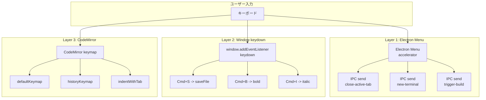
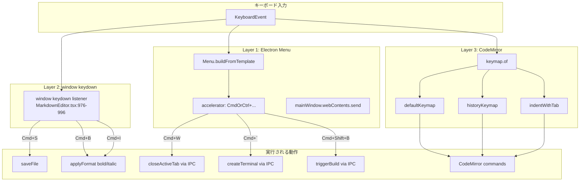

# キーバインド体系

## ステータス
部分実装

## 概要
Marginalia のキーボードショートカット体系を定義する。現在は Electron メニュー、エディタ内イベントハンドラ、CodeMirror デフォルトキーマップの 3 層でキーバインドが分散定義されている。統一的な管理基盤とユーザーカスタマイズ機能は未実装。

## 現状 (As-Is)

### 実装済みのキーバインド

#### Electron メニュー定義 (`electron/main.js:74-158`)

| ショートカット | 動作 | メニューラベル |
|---|---|---|
| `Cmd+W` | アクティブタブを閉じる | Close Tab |
| `Cmd+\`` (バッククォート) | 新規ターミナル作成 | New Terminal |
| `Cmd+Shift+B` | ビルド実行 | Build |
| `Cmd+Z` | 元に戻す | Undo (role) |
| `Cmd+Shift+Z` | やり直し | Redo (role) |
| `Cmd+X` | カット | Cut (role) |
| `Cmd+C` | コピー | Copy (role) |
| `Cmd+V` | ペースト | Paste (role) |
| `Cmd+A` | 全選択 | Select All (role) |
| `Cmd+R` | リロード | Reload (role) |
| `Cmd+Shift+R` | 強制リロード | Force Reload (role) |
| `Cmd+Alt+I` | DevTools トグル | Toggle DevTools (role) |
| `Cmd+0` | ズームリセット | Reset Zoom (role) |
| `Cmd+=` | ズームイン | Zoom In (role) |
| `Cmd+-` | ズームアウト | Zoom Out (role) |
| `Ctrl+Cmd+F` | フルスクリーン切替 | Toggle Fullscreen (role) |
| `Cmd+M` | ウィンドウ最小化 | Minimize (role) |

> 注: `role` ベースのショートカットは Electron / OS が自動的にアクセラレータを割り当てる。上記は macOS のデフォルトキーバインド。Windows/Linux では `Cmd` が `Ctrl` に置換される。

#### エディタ内キーバインド (`src/components/Editor/MarkdownEditor.tsx:976-996`)

| ショートカット | 動作 | 定義行 |
|---|---|---|
| `Cmd+S` | ファイル保存 | 978行 |
| `Cmd+B` | 太字 (`**text**`) | 983行 |
| `Cmd+I` | 斜体 (`*text*`) | 988行 |

これらは `window.addEventListener('keydown', ...)` で捕捉され、`e.preventDefault()` でブラウザのデフォルト動作を抑制する。

#### CodeMirror デフォルトキーマップ (`@codemirror/commands`)

CodeMirror 6 の `defaultKeymap` と `historyKeymap` が `MarkdownEditor.tsx:659` で登録されている。

##### defaultKeymap から提供される主要キーバインド

| ショートカット | 動作 |
|---|---|
| `Cmd+Z` | Undo |
| `Cmd+Shift+Z` / `Cmd+Y` | Redo |
| `Cmd+A` | 全選択 |
| `Cmd+D` | 次の一致を選択 |
| `Cmd+Shift+K` | 行削除 |
| `Alt+ArrowUp` | 行を上に移動 |
| `Alt+ArrowDown` | 行を下に移動 |
| `Shift+Alt+ArrowUp` | 行を上にコピー |
| `Shift+Alt+ArrowDown` | 行を下にコピー |
| `Cmd+[` | インデント減 |
| `Cmd+]` | インデント増 |
| `Cmd+/` | 行コメント切替 |
| `Cmd+Enter` | 下に空行挿入 |
| `Cmd+Shift+Enter` | 上に空行挿入 |
| `Escape` | 選択解除 / フォーカス解除 |
| `Cmd+Shift+\` | 対応する括弧にジャンプ |

##### historyKeymap

| ショートカット | 動作 |
|---|---|
| `Cmd+Z` | Undo |
| `Cmd+Shift+Z` | Redo |
| `Cmd+U` | Undo Selection |
| `Cmd+Shift+U` | Redo Selection |

##### indentWithTab

| ショートカット | 動作 |
|---|---|
| `Tab` | インデント（選択中は全体インデント） |
| `Shift+Tab` | インデント解除 |

#### ツールバー経由のフォーマット操作（キーバインドなし）

以下はツールバーボタンからのみ実行可能で、独自のキーバインドは未割当。

| 操作 | ツールバーアイコン |
|---|---|
| 取消線 (`~~text~~`) | S |
| 見出し1〜3 | H1 / H2 / H3 |
| 箇条書き | - |
| 番号リスト | 1. |
| タスク | チェックボックス |
| 引用 | " |
| インラインコード | <> |
| コードブロック | { } |
| リンク | リンクアイコン |
| 画像 | 画像アイコン |
| 表 | テーブルアイコン |
| 数式（インライン/ブロック） | 数式アイコン |
| 色付きテキスト | カラーアイコン |

### 関連ファイル一覧

| ファイル | 行数 | キーバインド定義箇所 |
|---|---|---|
| `electron/main.js` | 432行 | 74-158行 (Menu template + accelerator) |
| `src/components/Editor/MarkdownEditor.tsx` | 1573行 | 659行 (CodeMirror keymap), 976-996行 (window keydown) |
| `electron/preload.js` | 106行 | IPC イベント受信 (onCloseActiveTab, onNewTerminal, onTriggerBuild) |

### データフロー図

## 仕様 (Specification)

### 機能要件

1. **3 層キーバインド**: Electron メニュー、window イベント、CodeMirror キーマップ
2. **プラットフォーム対応**: `CmdOrCtrl` マクロによる macOS/Windows 両対応（Electron メニュー）
3. **コンフリクト回避**: `Cmd+W` はウィンドウクローズではなくタブクローズにオーバーライド
4. **Markdown フォーマット**: `Cmd+B` (太字), `Cmd+I` (斜体) のインラインフォーマット

### 全キーバインド一覧（カテゴリ別）

#### ファイル操作

| ショートカット (Mac) | ショートカット (Win/Linux) | 動作 | 定義層 |
|---|---|---|---|
| `Cmd+S` | `Ctrl+S` | ファイル保存 | Window keydown |
| `Cmd+W` | `Ctrl+W` | アクティブタブを閉じる | Electron Menu |

#### 編集（テキスト操作）

| ショートカット (Mac) | ショートカット (Win/Linux) | 動作 | 定義層 |
|---|---|---|---|
| `Cmd+Z` | `Ctrl+Z` | 元に戻す | CodeMirror / Electron |
| `Cmd+Shift+Z` | `Ctrl+Shift+Z` | やり直し | CodeMirror / Electron |
| `Cmd+X` | `Ctrl+X` | カット | Electron |
| `Cmd+C` | `Ctrl+C` | コピー | Electron |
| `Cmd+V` | `Ctrl+V` | ペースト | Electron |
| `Cmd+A` | `Ctrl+A` | 全選択 | CodeMirror / Electron |
| `Cmd+D` | `Ctrl+D` | 次の一致を選択 | CodeMirror |
| `Cmd+Shift+K` | `Ctrl+Shift+K` | 行削除 | CodeMirror |
| `Alt+Up` | `Alt+Up` | 行を上に移動 | CodeMirror |
| `Alt+Down` | `Alt+Down` | 行を下に移動 | CodeMirror |
| `Shift+Alt+Up` | `Shift+Alt+Up` | 行を上にコピー | CodeMirror |
| `Shift+Alt+Down` | `Shift+Alt+Down` | 行を下にコピー | CodeMirror |
| `Cmd+[` | `Ctrl+[` | インデント減 | CodeMirror |
| `Cmd+]` | `Ctrl+]` | インデント増 | CodeMirror |
| `Tab` | `Tab` | インデント | CodeMirror |
| `Shift+Tab` | `Shift+Tab` | インデント解除 | CodeMirror |
| `Cmd+/` | `Ctrl+/` | コメント切替 | CodeMirror |
| `Cmd+U` | `Ctrl+U` | 選択のUndo | CodeMirror |
| `Cmd+Shift+U` | `Ctrl+Shift+U` | 選択のRedo | CodeMirror |

#### Markdown フォーマット

| ショートカット (Mac) | ショートカット (Win/Linux) | 動作 | 定義層 |
|---|---|---|---|
| `Cmd+B` | `Ctrl+B` | 太字 (`**text**`) | Window keydown |
| `Cmd+I` | `Ctrl+I` | 斜体 (`*text*`) | Window keydown |

#### ターミナル

| ショートカット (Mac) | ショートカット (Win/Linux) | 動作 | 定義層 |
|---|---|---|---|
| `` Cmd+` `` | `` Ctrl+` `` | 新規ターミナル | Electron Menu |

#### ビルド

| ショートカット (Mac) | ショートカット (Win/Linux) | 動作 | 定義層 |
|---|---|---|---|
| `Cmd+Shift+B` | `Ctrl+Shift+B` | ビルド実行 | Electron Menu |

#### ウィンドウ / 表示

| ショートカット (Mac) | ショートカット (Win/Linux) | 動作 | 定義層 |
|---|---|---|---|
| `Cmd+R` | `Ctrl+R` | リロード | Electron (role) |
| `Cmd+Shift+R` | `Ctrl+Shift+R` | 強制リロード | Electron (role) |
| `Cmd+Alt+I` | `Ctrl+Shift+I` | DevTools 切替 | Electron (role) |
| `Cmd+0` | `Ctrl+0` | ズームリセット | Electron (role) |
| `Cmd+=` | `Ctrl+=` | ズームイン | Electron (role) |
| `Cmd+-` | `Ctrl+-` | ズームアウト | Electron (role) |
| `Ctrl+Cmd+F` | `F11` | フルスクリーン | Electron (role) |
| `Cmd+M` | - | ウィンドウ最小化 | Electron (role) |

### VSCode との比較表

| 操作 | VSCode | Marginalia | 差分 |
|---|---|---|---|
| ファイル保存 | `Cmd+S` | `Cmd+S` | 同一 |
| タブを閉じる | `Cmd+W` | `Cmd+W` | 同一 |
| 新規ターミナル | `` Ctrl+` `` (トグル) / `` Ctrl+Shift+` `` (新規) | `` Cmd+` `` (新規) | トグル/新規の区別なし |
| ビルド | `Cmd+Shift+B` | `Cmd+Shift+B` | 同一 |
| 太字 | `Cmd+B` (拡張機能依存) | `Cmd+B` | 同一 |
| 斜体 | `Cmd+I` (拡張機能依存) | `Cmd+I` | 同一 |
| 取消線 | `Alt+S` (拡張機能依存) | なし | **未実装** |
| 見出し切替 | なし (拡張機能依存) | なし | 両方なし |
| コマンドパレット | `Cmd+Shift+P` | なし | **未実装** |
| ファイル検索 | `Cmd+P` | なし | **未実装** |
| テキスト検索 | `Cmd+F` | なし (CodeMirror 標準のみ) | **未実装** |
| 全ファイル検索 | `Cmd+Shift+F` | なし | **未実装** |
| サイドバー切替 | `Cmd+B` | なし (衝突) | **未実装** |
| パネル切替 | `` Cmd+` `` | `` Cmd+` `` (新規のみ) | トグルなし |
| 設定を開く | `Cmd+,` | なし | **未実装** |
| キーバインド設定 | `Cmd+K Cmd+S` | なし | **未実装** |
| 折り返し切替 | `Alt+Z` | なし | **未実装** |
| ターミナル内検索 | `Cmd+F` | なし | **未実装** |
| マルチカーソル | `Cmd+D` / `Cmd+Alt+Up/Down` | `Cmd+D` のみ | **部分実装** |

### Obsidian との比較表

| 操作 | Obsidian | Marginalia | 差分 |
|---|---|---|---|
| 太字 | `Cmd+B` | `Cmd+B` | 同一 |
| 斜体 | `Cmd+I` | `Cmd+I` | 同一 |
| 取消線 | `Cmd+Shift+X` | なし | **未実装** |
| インラインコード | `` Cmd+` `` | なし (ターミナルと衝突) | **衝突** |
| リンク挿入 | `Cmd+K` | なし | **未実装** |
| コマンドパレット | `Cmd+P` | なし | **未実装** |
| クイックスイッチャー | `Cmd+O` | なし | **未実装** |
| 設定を開く | `Cmd+,` | なし | **未実装** |
| ホットキー設定 | 設定 > ホットキー | なし | **未実装** |
| 見出しレベル変更 | なし (コミュニティ) | なし | 両方なし |
| 折り畳み切替 | `Cmd+Shift+.` / `Cmd+Shift+,` | なし | **未実装** |

### API / インターフェース

現在、統一的なキーバインド管理 API は存在しない。各層が独立して定義を持っている。

### キーボードショートカット

本ドキュメント全体がキーバインドの仕様書である。

## アーキテクチャ

### コンポーネント図

### イベント伝搬と優先順位

1. **Electron Menu accelerator** - OS レベルで最優先。メニューが捕捉するとイベントは Renderer に到達しない
2. **window keydown listener** - Renderer プロセスの `window` レベル。`e.preventDefault()` でブラウザデフォルトを抑制
3. **CodeMirror keymap** - エディタにフォーカスがある場合のみ。CodeMirror が処理するとイベントは上位に伝搬しない

#### 既知のコンフリクト

| キー | 競合 | 現在の動作 |
|---|---|---|
| `Cmd+B` | VSCode ではサイドバー切替 | Marginalia では太字フォーマット |
| `` Cmd+` `` | Obsidian ではインラインコード | Marginalia では新規ターミナル |
| `Cmd+Z` | Electron Menu (role) と CodeMirror | CodeMirror がフォーカス時に優先 |

## 既知の課題・制約

1. **キーバインド管理基盤なし**: 3 つの層に分散定義されており、統一的な登録・解決機構がない
2. **ユーザーカスタマイズ不可**: ショートカットの変更・追加・削除を行う UI や設定ファイルがない
3. **Markdown フォーマットの不足**: 太字・斜体のみ。取消線、見出し、リンク、コード等のキーバインドが未定義
4. **コマンドパレット未実装**: `Cmd+Shift+P` によるコマンド検索・実行ができない
5. **検索系ショートカット未実装**: `Cmd+F` (ファイル内検索), `Cmd+P` (ファイル検索), `Cmd+Shift+F` (全体検索) がない
6. **ターミナルトグル未実装**: `` Cmd+` `` は新規作成のみで、パネルの表示/非表示トグルができない
7. **設定を開くショートカットなし**: `Cmd+,` で設定パネルを開く機能がない
8. **キーバインドのドキュメントなし**: ユーザー向けのショートカット一覧画面がアプリ内にない
9. **コンテキスト依存のキーバインドなし**: エディタフォーカス時とサイドバーフォーカス時で異なる動作をする仕組みがない

## ロードマップ (To-Be)

### Phase 1: 最小限の改善
- 追加 Markdown フォーマットのキーバインド定義
  - `Cmd+Shift+X`: 取消線
  - `Cmd+K`: リンク挿入
  - `` Cmd+E `` or `` Cmd+Shift+` ``: インラインコード
- `` Cmd+` ``: ターミナルパネルのトグル（表示/非表示切替）に変更。新規ターミナルは `` Cmd+Shift+` `` に移動
- `Cmd+,`: 設定パネルを開く
- `Cmd+\`: サイドバーのトグル

### Phase 2: 本格的な実装
- 統一キーバインド管理基盤の構築
  - コマンドレジストリ（全アクションの登録）
  - キーバインドリゾルバ（コンテキスト依存の解決）
  - デフォルトキーマップ定義ファイル
- ユーザーカスタマイズ UI（設定パネル内のホットキータブ）
- `keybindings.json` による設定ファイルベースのカスタマイズ
- コマンドパレット (`Cmd+Shift+P`)
  - 全コマンド検索・実行
  - 最近使ったコマンド
  - キーバインドの表示

### Phase 3: 高度な機能
- Vim / Emacs キーバインドモード（CodeMirror 拡張の活用）
- キーバインドのコンテキスト条件（`when` 式、VSCode 形式）
  - 例: `editorFocus`, `terminalFocus`, `sidebarFocus`
- マクロ記録・再生（キーストロークの記録と再実行）
- チートシート表示（`Cmd+K Cmd+S` でキーバインド一覧をオーバーレイ表示）
- キーバインドのプロファイル（VSCode / Obsidian / Sublime 互換プリセット）
